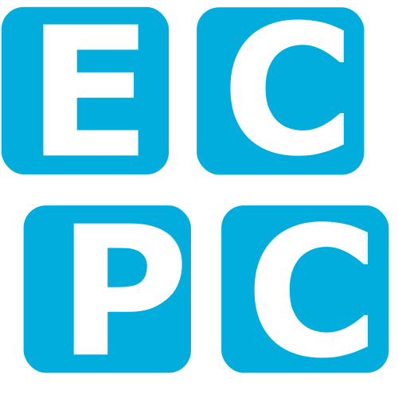

# Basisscript voor het experiment

Het experiment wat je gaat uitvoeren is het bepalen van de $I,U$-karakteristiek van een LED. Omdat de Arduino alleen getallen tussen 0 en 1023 kan sturen en ontvangen moet je nadenken over de analoog-digitaalconversie voordat je een zinnige $I,U$-karakteristiek kunt maken. 


## Analoog-digitaalconversie (ADC)

De Arduino kan getallen tussen 0 en 1023 sturen en ontvangen. Wat is precies de betekenis van deze getallen? Daarvoor moeten we dieper ingaan op hoe de Arduino &mdash; en computers in het algemeen &mdash; getallen omzet in een spanning en hoe spanningen door de Arduino worden gemeten.

Een _analoog_ signaal is continu in zowel de tijd als de waardes die het signaal aan kan nemen.[^analoog] Een _digitaal_ signaal is echter discreet: op vaste tijdstippen is er een waarde bekend en het signaal kan maar een beperkt aantal verschillende waardes aannemen.[^discreet] 

[^analoog]: Een vallende bal is een continu proces. De bal heeft op elk willekeurig moment een positie. Je zou de positie kunnen meten op het tijdstip $t$ = 2.0 s, maar ook op $t$ = 2.1, 2.01, 2.001 of 2.0001 s. Ook kun je de positie net zo nauwkeurig bepalen als je wilt.[^nauwkeurigheid]

[^nauwkeurigheid]: Uiteraard afhankelijk van de nauwkeurigheid van je meetinstrument.

[^discreet]: De natuur is analoog,[^natuur] maar moderne computers zijn digitaal en dus discreet. Als je een foto op je computer te ver inzoomt zie je blokjes. Je kunt verder inzoomen, maar je gaat niet meer detail zien. De hoeveelheid informatie is beperkt.

[^natuur]: Totdat je het domein van de kwantummechanica betreedt, dan blijkt de natuur ook een discrete kant te hebben.

_Bemonsteren_ of _sampling_ is het proces waarbij een analoog signaal wordt <q>uitgelezen</q> en wordt omgezet in een digitaal signaal. Zo wordt een audiosignaal al sinds eind jaren '70 van de vorige eeuw gewoonlijk bemonsterd met een frequentie van 44.1 kHz en een resolutie van 16 bits. Dus 44100 keer per seconde wordt er gekeken wat de waarde van het geluidssignaal is en dat wordt opgeslagen als een getal van 16 bits en kan dus $2^{16} = 65536$ verschillende waardes aannemen. Dit is nauwkeuriger dan het menselijk gehoor kan onderscheiden.

<br>
<div class="range-wrap" style="width:100%"><span class="range_labels">0</span>&emsp;<input type="range" min="0" max="100" value="50" class="range" step="0.01" id="continuous_slider" oninput="syncSliders('continuous_slider')"><output class="bubble"></output>&emsp;<span class="range_labels">3.3 V</span></div>

<div class="range-wrap" style="width:100%"><span class="range_labels">0</span>&emsp;<input type="range" min="0" max="15" value="8" class="range" step="1" id="discrete_slider" oninput="syncSliders('discrete_slider')"><output class="bubble bubble_below"></output>&emsp;<select id="max_discrete_slider" oninput="updateMax()" class="range_labels">
<option value=15>15</option>
<option value=63>63</option>
<option value=1023>1023</option>
</select></div>
<br>

!!! opdracht-basis-thuis "ADC resolutie"
    === "opdracht"
        De schuifjes hierboven zijn aan elkaar gekoppeld, zij laten de koppeling zien tussen analoge voltages en digitale waardes en visa versa. Het bovenste schuifje laat het analoge voltage zien. Het onderste schuifje is de bijbehorende digitale waarde. 

        1. Zet het digitale signaal op een resolutie van 4-bit (16 stapjes). Stel je meet een digitale waarde van 6, wat zijn dan de mogelijke voltages die daarbij horen? Wat is dan de nauwkeurigheid?
        2. Zet het digitale signaal op een resolutie van 6-bit (64 stapjes). Stel je meet een digitale waarde van 28, wat zijn dan de mogelijke voltages die daarbij horen? Wat is dan de nauwkeurigheid?
        3. Zet het digitale signaal op een resolutie van 10-bit (1024 stapjes). Stel je meet een digitale waarde van 768, wat zijn dan de mogelijke voltages die daarbij horen? Wat is dan de nauwkeurigheid?

        Je ziet dat naarmate het aantal bits omhoog gaat de resolutie beter wordt en daarmee ook de nauwkeurigheid. 
    
    === "check"
        **Projecttraject**

        - [x] ADC resolutie
        - [ ] ADC conversie

De conversie van een analoog signaal naar een digitaal signaal (en andersom!) is de reden dat de spanningen die je kiest en de metingen die je doet niet alle mogelijke waardes kunnen aannemen, maar <q>stapjes</q> maken.

{: style="width:75%"}

De omzetting van een analoog signaal naar een digitaal signaal gebeurt als volgt. De ADC (_analog-to-digital converter_) in dit voorbeeld ondersteunt 16 niveaus (4-bits) in een bereik van 0 V tot 3.3 V (groen gearceerd). Lagere of hogere spanningen kunnen niet gemeten worden (rood gearceerd). Op gezette tijden wordt een meting gedaan (rode punten), waarbij de uitkomst van de meting het discrete niveau is dat het dichtst bij de analoge waarde ligt. Als het signaal te groot wordt kan de ADC als het ware <q>vastlopen</q> op het hoogste niveau. In de rechterflank is waar te nemen dat als het analoge signaal langzaam verandert, het digitale signaal duidelijk sprongsgewijs verandert. Hoe meer niveau's een ADC heeft en hoe vaker het signaal bemonsterd kan worden, hoe nauwkeuriger het digitale signaal het analoge signaal benadert.

{: style="width:75%"}

De digitale metingen die je programma krijgt van de ADC is hierboven weergegeven. De onzekerheid is gelijk aan de halve afstand tot het volgende niveau. In lichtgrijs zie je het oorspronkelijke analoge signaal. De meting benadert het signaal dus maar gedeeltelijk. 

De Arduino die je gebruikt heeft een bereik van 0 V tot 3.3 V en &mdash; in tegenstelling tot het voorbeeld hierboven &mdash; een resolutie van 10 bits, dus $2^{10} = 1024$ niveaus. Als je een experiment ontwerpt is het van belang te weten dat je nooit kunt meten met een nauwkeurigheid kleiner dan de stapgrootte. Voor het experiment dat je gaat uitvoeren is deze resolutie prima.

!!! opdracht-basis-thuis "ADC conversie"
    === "opdracht"
        Je hebt gezien dat de Arduino werkt met getallen van 0 tot en met 1023 én dat de Arduino een bereik heeft van 0 V tot 3.3 V. Je schrijft de formule op om een ADC waarde naar een spanning in Volt om te rekenen en omgekeerd. Je controleert of je formules logische antwoorden geven door de spanning te berekenen die hoort bij een ADC waarde van 700. Ook bereken je de ADC waarde behorende bij 2.28 V. 

    === "code"
        **Pseudo-code**
        ``` py
        # raw_value to voltage
        # voltage = something with raw_value

        # voltage to raw_value
        # raw_value = something with voltage
        ```
    === "check"
        **Checkpunten**

        - [ ] Een ADC waarde van 0 geeft een spanning van 0 V en omgekeerd.  
        - [ ] Een ADC waarde van 1023 geeft een spanning van 3.3 V en omgekeerd.
        - [ ] Een ADC waarde van 700 is ongeveer tweederde van 1023, dus dat moet een spanning geven in de buurt van 2.2 V.
        - [ ] Een spanning van 2.28 V is ongeveer 70% van 3.3 V, dus dat moet een ADC waarde geven in de buurt van 720.

        **Projecttraject:**

        - [x] ADC resolutie
        - [x] ADC conversie

???+ meer-leren "Binair Talstelsel"

    ### Binair Talstelsel

    Wij schrijven onze getallen op in een _decimaal_ (tientallig) talstelsel. We hebben tien verschillende cijfers (0 t/m 9) en plakken bij grotere getallen de tientallen, honderdtallen, etcetera aan elkaar. Computers werken met _binaire_ getallen &mdash; een tweetallig talstelsel. Dat betekent dat computers het getal 0 en 1 zonder problemen kunnen opslaan, maar bij het getal 2 wordt het al lastig. Zij moeten dan al met <q>tientallen</q> werken en schrijven het getal 2 op als 10. Het getal 3 is dan 11. Voor het getal 4 zijn de cijfers alweer op en moet je overschakelen naar <q>honderdtallen</q>, dus 4 is 100, 5 is 101, enzovoorts. Zie onderstaande tabel voor nog een paar voorbeelden. 
    
    De cijfers noem je _bits_ en het getal 5 (101 binair) bestaat dus uit 3 bits. Als je maar 3 bits tot je beschikking hebt, kun je $2^3 = 8$ verschillende getallen opslaan, dus 0 t/m 7. Een groepje van 8 bits (256 mogelijkheden) bleek een handige hoeveelheid en kun je op computers individueel opslaan. Zo'n groepje noem je een _byte_. Bestanden bestaan uit bytes, kilobytes (duizend bytes), megabytes (miljoen bytes) of gigabytes (miljard bytes). Wanneer je een signaal nauwkeurig wilt verwerken met een computer dan is het belangrijk om zoveel mogelijk bits tot je beschikking te hebben. Hoe meer bits, hoe meer verschillende waardes je kunt opslaan en hoe nauwkeuriger je signaal wordt bewaard.

    Voorbeelden van het binair talstelsel:

    | decimaal getal | binair getal |
    |----------------|--------------|
    | 0              | 0            |
    | 1              | 1            |
    | 2              | 10           |
    | 3              | 11           |
    | 4              | 100          |
    | 5              | 101          |
    | 6              | 110          |
    | 7              | 111          |
    | 8              | 1000         |
    | 9              | 1001         |
    | &hellip;       | &hellip;     |
    | 205            | 11001101     |


## De $I,U$-karakteristiek van een LED

Je hebt op de middelbare school ongetwijfeld de $I,U$-karakteristiek van een ohmse weerstand onderzocht. Je neemt een <q>gewone</q> weerstand en zet daar een steeds hogere spanning op. Je meet de stroomsterkte en ook die neemt toe &mdash; rechtevenredig zelfs! Door $I$ tegen $U$ uit te zetten in een grafiek en de beste lijn door je metingen te trekken vind je met de richtingscoëfficiënt de inverse van de weerstand, $R^{-1}$, zie onderstaand figuur.

{: style="width:75%"}

Een LED is een lichtgevende diode &mdash; en een diode gedraagt zich _heel_ anders. Met de schakeling die je hebt gebouwd in de [opdracht Schakeling bouwen](communicatie.md#opd:schakeling), kun je de $I,U$-karakteristiek van een LED bepalen. Voor meer informatie over de fysica achter diodes, zie de [appendix Diodes](diodes.md).

!!! opdracht-basis-thuis "$I,U$-karakteristiek van een LED"
    === "opdracht"
        <iframe src="https://drive.google.com/file/d/1BcYJaCm3Er1hQyqQtCRx9umI5d2Q3V-m/preview" width="620" height="349" style="border:none;"></iframe>
    
        Maak een schets van hoe je denkt dat de grafiek van de stroom $I$ tegen de spanning $U$ van een LED eruit zal zien.

    === "check"
        **Projecttraject**

        - [x] $I,U$-karakteristiek van een LED
        - [ ] Arduino heeft geen stroommeter
        - [ ] Arduino pinnetjes
        - [ ] Arduino op breadboard
        - [ ] Kanalen van de Arduino

!!! opdracht-basis-thuis "Arduino heeft geen stroommeter"
    === "opdracht"
        <iframe src="https://drive.google.com/file/d/10FwUnWe7CPjygzoRhVIJLE44qlwUo78Z/preview" width="620" height="349" style="border:none;"></iframe>
    
        Schrijf op hoe je de spanning $U$ over de LED en de stroom $I$ door de LED berekent in termen van de spanningsmeters $U_1$ en $U_2$ en de bekende weerstand $R$.
    
    === "check"
        **Projecttraject**

        - [x] $I,U$-karakteristiek van een LED
        - [x] Arduino heeft geen stroommeter
        - [ ] Arduino pinnetjes
        - [ ] Arduino op breadboard
        - [ ] Kanalen van de Arduino

!!! opdracht-basis-thuis "Arduino pinnetjes"
    === "opdracht"
        <iframe src="https://drive.google.com/file/d/1PTzd6aY-yCLK-ubxJ1is0g58YeJrD-PL/preview" width="620" height="349" style="border:none;"></iframe>
    
        Kijk aan de onderkant van de Arduino of je de pinnetjes A0, A1, A2 en GND kan vinden.
        
        ??? info "Klik hier als je geen Arduino[^bronArduino] bij de hand hebt"
            <script type="module" src="https://ajax.googleapis.com/ajax/libs/model-viewer/3.5.0/model-viewer.min.js"></script>
            <model-viewer id="model" style="width: 100%; height: 700px;" alt="Arduino" src="../assets/circuit/Arduino.glb" ar shadow-intensity="1" camera-controls touch-action="pan-y" poster="../assets/circuit/Arduino_top_view.png" camera-orbit="0rad 0.39269908169872414rad 4.718948223475571m" autoplay exposure="0.6"></model-viewer>

        [^bronArduino]: Dit model bevat een 3D model die is gecreëerd door AppliedSBC en is gedeeld onder CC-BY-SA licentie. Het originele model is te vinden via [Arduino Nano 33 IoT](https://sketchfab.com/3d-models/arduino-nano-33-iot-f57fd7f5485a47a8b71f8604872fd78c). Het model is voorzien van een Arduino texture. Dit 3D model heeft een CC-BY-SA licentie.
    
    === "check"
        **Projecttraject**

        - [x] $I,U$-karakteristiek van een LED
        - [x] Arduino heeft geen stroommeter
        - [x] Arduino pinnetjes
        - [ ] Arduino op breadboard
        - [ ] Kanalen van de Arduino

!!! opdracht-basis-thuis "Arduino op breadboard"
    === "opdracht"
        <iframe src="https://drive.google.com/file/d/1n98Q6s0T8YfBO2xoTT5t0Os98hUwNwSh/preview" width="620" height="349" style="border:none;"></iframe>
    
        Vergelijk de schakeling op het breadboard met de theoretische schakeling. Welke lijnen in de theoretische schakeling komen overeen met de vier draadjes (rood, blauw, groen, oranje) op het breadboard?

    === "check"
        **Projecttraject**

        - [x] $I,U$-karakteristiek van een LED
        - [x] Arduino heeft geen stroommeter
        - [x] Arduino pinnetjes
        - [x] Arduino op breadboard
        - [ ] Kanalen van de Arduino

!!! opdracht-basis-thuis "Kanalen van de Arduino"
    === "opdracht"
        <iframe src="https://drive.google.com/file/d/1K2KiB21YAMYnVWdrEgYUB_x8v6ikK_9i/preview" width="620" height="349" style="border:none;"></iframe>
    
        Bekijk de [documentatie van de firmware](firmware.md) en schrijf het commando op om de maximale uitvoerspanning op kanaal 0 te zetten. Schrijf ook de commando's op om de waardes van $U_1$ en $U_2$ uit te lezen.

    === "check"
        **Projecttraject**

        - [x] $I,U$-karakteristiek van een LED
        - [x] Arduino heeft geen stroommeter
        - [x] Arduino pinnetjes
        - [x] Arduino op breadboard
        - [x] Kanalen van de Arduino

!!! opdracht-inlever "Pythondaq: repository"
    === "opdracht"
        Omdat je met een belangrijk project aan de slag gaat, namelijk een inleveropdracht, ga je gelijk goed beginnen door een repository aan te maken. 

        1. Open Github Desktop en ga naar het dropdownmenu **File**. Kies hier voor `New repository ...`. Geef de repository de naam `pythondaq` en zet de repository in de map {{folder}}`ECPC`. De mappenstructuur ziet er dan als volgt uit:   
        {{folder}} ECPC  
        {{T}} {{github}} pythondaq  
        {{tab}} {{L}} {{dots}}  
        {{L}} {{dots}}  
        2. Vink `Initialize this repository with a README` aan.
        3. Kies bij `Git ignore` voor <q>Python</q>.
        4. Open de repository {{github}}`pythondaq` via GitHub Desktop. Ga hiervoor naar het dropdownmenu **Repository** en kies voor `Open in Visual Studio Code`.
        5. Nu kun je aan de slag. Vergeet tijdens het werken niet regelmatig te committen!

    === "check"
        **Checkpunten**

        - [ ] De repository {{github}}`pythondaq` zit in de map {{folder}}`ECPC`.
        - [ ] In de repository {{github}}`pythondaq` bevinden zich de bestanden {{file}}`README.md`, {{file}}`.gitattributes` en {{file}}`.gitignore`.
        - [ ] De repository {{github}}`pythondaq` is geopend in Visual Studio Code.

        **Projecttraject**

        - [x] Pythondaq: repository
        - [ ] Pythondaq: start script
        - [ ] Pythondaq: quick 'n dirty meting
        - [ ] Pythondaq: onzekerheid
        - [ ] Pythondaq: schildpad of raket?
        - [ ] Pythondaq: herhaalmetingen
        - [ ] Pythondaq: CSV

{: id="easterEggImage" style="width:1.5%" data-message="Pssst met 'CTRL' + 'SHIFT' + 'A'  kun je vanuit GitHub Desktop de repository in Visual Studio Code openen. Probeer maar eens!"}

!!! opdracht-inlever "Pythondaq: start script"
    === "opdracht"
    
        <div class="grid-tree" markdown>
            <div>
            Je maakt een bestand {{file}}`diode-experiment.py` aan in de nieuwe repository {{github}} `pythondaq`, waarin je de spanning over de LED laat oplopen van nul tot de maximale waarde. Tijdens het oplopen van de spanning over de LED lees je de verschillende spanningen uit. Je print steeds een regel met: ruwe waarde spanning over LED, voltage over LED, ruwe waarde spanning over weerstand, voltage over weerstand.
            </div>
            <div>
            {{folder}} `ECPC`  
            {{T}} {{github}} `oefenopdrachten`  
            {{L}} {{github}} `pythondaq`  
            {{tab}} {{T}} {{new_file}} `diode-experiment.py`  
            {{tab}} {{L}} {{dots}}  
            </div>
        </div>
    === "code"
        **Pseudo-code**
        ``` py title="diode-experiment.py"
        # connect to Arduino

        # set output voltage from 0 to max
            # measure voltages
            # calculate voltage LED 
            # calculate voltage resistor
            # print LED: raw_voltage_LED (voltage_LED V) Resistor: raw_voltage_resistor (voltage_resistor V)
        ```
    === "check"
        **Checkpunten**

        - [ ] Je laat de spanning oplopen van nul tot de maximale waarde.
        - [ ] De LED licht vertraagd op en gaat dus steeds feller branden. 
        - [ ] Commit! {{feesttoeter}}
        - [ ] De ruwe waardes over de LED en de weerstand zijn zoals verwacht.
        - [ ] Commit! {{feesttoeter}}
        - [ ] De omrekening van ruwe waardes naar voltages levert uitkomsten op die je kunt verwachten.
        - [ ] Commit! {{feesttoeter}}

        **Projecttraject**

        - [x] Pythondaq: repository
        - [x] Pythondaq: start script
        - [ ] Pythondaq: quick 'n dirty meting
        - [ ] Pythondaq: onzekerheid
        - [ ] Pythondaq: schildpad of raket?
        - [ ] Pythondaq: herhaalmetingen
        - [ ] Pythondaq: CSV

Je kunt de meetgegevens kopiëren en plakken naar een tekstbestand, spreadsheetprogramma, Python notebook of iets dergelijks. Maar dat is wel veel werk, zeker als je metingen wilt herhalen. Op dit moment heb je ook alleen nog maar _ruwe_ metingen. En je gaat nog voorbij aan het feit dat je graag de stroomsterkte $I$ door de LED wilt uitzetten tegen de spanning $U$ over de LED.

!!! info
    In de volgende opdracht ga je een grafiek maken. Installeer Matplotlib in de conda environment `pythondaq`. Belangrijk: zorg dat deze geactiveerd is! {{lightbulb}}
    ``` ps1 title="Terminal"
    conda install --channel conda-forge matplotlib
    ```

<div id="opd:quickndirty-meting"></div>
!!! opdracht-inlever "Pythondaq: quick 'n dirty meting"
    === "opdracht"
        Je code berekent de spanning over en de stroomsterkte door de LED terwijl de spanning over het circuit oploopt van nul tot de maximale waarde. De resultaten worden geprint én in een grafiek weergegeven. Aan het einde van alle metingen wordt de LED uitgezet.

    === "code"
        **Pseudo-code**
        ``` py title="diode-experiment.py"
        # connect to Arduino

        # set output voltage from 0 to max
            # measure voltages
            # calculate voltage LED
            # calculate current LED
            # print voltage: voltage_LED V (raw_voltage_LED) current: current_LED A

        # plot current_LED vs voltage_LED
        ```

    === "check"
        **Checkpunten**

        - [ ] Je laat de spanning oplopen van nul tot de maximale waarde.
        - [ ] De spanning $U$ over de LED wordt berekend.
        - [ ] De stroom $I$ door de LED wordt berekend. 
        - [ ] De spanning $U$ en de stroom $I$ worden geprint in de terminal. 
        - [ ] De waardes zijn fysisch correct.
        - [ ] De verschillende waardes voor de spanning worden in een lijst gezet.
        - [ ] De verschillende waardes voor de stroom worden in een lijst gezet.
        - [ ] De stroomsterkte $I$ wordt tegen de spanning $U$ uitgezet in een grafiek.
        - [ ] Je vergelijkt het resultaat met een buurmens. Je bespreekt of de verkregen grafiek fysisch correct is. 
        - [ ] De LED wordt uitgezet na de meting.
        - [ ] Tussendoor heb je gecommit!

        **Projecttraject**

        - [x] Pythondaq: repository
        - [x] Pythondaq: start script
        - [x] Pythondaq: quick 'n dirty meting
        - [ ] Pythondaq: onzekerheid
        - [ ] Pythondaq: schildpad of raket?
        - [ ] Pythondaq: herhaalmetingen
        - [ ] Pythondaq: CSV

Omdat je never nooit niet je conclusies gaat baseren op een enkele meetserie ga je de meting herhalen en foutenvlaggen toevoegen. Je moet misschien wel weer even hard nadenken over hoe je deze foutenvlaggen bepaald. Pak daarom eerst pen en papier (voordat je verder code gaat toevoegen), stoot je buurmens aan en ga samen nadenken over hoe jullie in dit experiment de onzekerheid kunnen bepalen.

!!! opdracht-basis "Pythondaq: onzekerheid"
    === "opdracht"
        <iframe src="https://drive.google.com/file/d/1-26rnvYwTZ_I7PgUX85Don21qevgHLv0/preview" width="620" height="349" style="border:none;"></iframe>
    
        Bekijk bovenstaande video. In deze video wordt een meting van de spanning $x_n$ keer herhaald. De groene rechthoek geeft de onzekerheid op een individuele meting weer. Het gemiddelde van alle metingen wordt weergegeven met een roze lijn. De roze rechthoek geeft de onzekerheid op het gemiddelde weer.  

        1. Wat gebeurt er met de onzekerheid op een individuele meting als je de meting vaker herhaalt?
        2. Wat gebeurt er met de onzekerheid op het gemiddelde als je een meting vaker herhaalt? 
        3. Heb je voor jouw experiment straks de onzekerheid op een individuele meting nodig? Of de onzekerheid op het gemiddelde? Hoe bepaal je deze onzekerheid?

    === "check"
        **Projecttraject**

        - [x] Pythondaq: repository
        - [x] Pythondaq: start script
        - [x] Pythondaq: quick 'n dirty meting
        - [x] Pythondaq: onzekerheid
        - [ ] Pythondaq: schildpad of raket?
        - [ ] Pythondaq: herhaalmetingen
        - [ ] Pythondaq: CSV

!!! opdracht-basis "Pythondaq: schildpad of raket?"
    === "opdracht"
        In het experiment ga je straks de metingen een aantal keer herhalen. Je kunt dan op twee manieren het gemiddelde van de benodigde grootheden bepalen en de bijbehorende onzekerheden. 
        
        1. Je kunt dit stap voor stap doen, als een schildpad. Bij elke waarde van $U_0$ meet je een aantal keer de waardes van $U_1$ en $U_2$, waarna je een gemiddelde en de bijbehorende onzekerheid berekent. Daarna doe je hetzelfde voor de volgende waarde van $U_0$. 
        2. Je kunt ook eerst voor het hele bereik van $U_0$ de waardes van $U_1$ en $U_2$ bepalen, als een raket. Dit herhaal je daarna een aantal keer. Pas nadat je álle metingen gedaan hebt, ga je een gemiddelde en de bijbehorende onderzekerheid berekenen.
        
        Bespreek met je buurmens de voor- en nadelen van beide manieren. Maak hierin onderscheid tussen het experimentele gebied en het programmeergebied.

    === "check"
        **Projecttraject**

        - [x] Pythondaq: repository
        - [x] Pythondaq: start script
        - [x] Pythondaq: quick 'n dirty meting
        - [x] Pythondaq: onzekerheid
        - [x] Pythondaq: schildpad of raket?
        - [ ] Pythondaq: herhaalmetingen
        - [ ] Pythondaq: CSV

<div id="opd:herhaalmetingen"></div>
!!! opdracht-inlever "Pythondaq: herhaalmetingen"
    === "opdracht"
        Je gaat nu de code zo aanpassen dat je daadwerkelijk iets kunt zeggen over de onzekerheid op de spanning over de LED en de stroom door de LED. Dit doe je door een meting meerdere keren te herhalen. Je kijkt eerst naar de opbouw van de code en maakt aantekeningen over wat er waar en hoe in de code aangepast moet worden. Daarna kijk je naar je repository {{github}}`pythondaq` en controleer je dat de nu-nog-werkende-code gecommit is. Vervolgens ga je stap voor stap &mdash; en commit na commit &mdash; de code aanpassen. Als je klaar bent, run je {{file}}`diode-experiment.py` met het aantal herhaalmetingen op 3 en zie je in de grafiek foutenvlaggen op de metingen voor de stroom en de spanning staan. Je kijkt op het beeldscherm van je buurmens en ziet daar ook foutenvlaggen verschijnen. Met een grijs kijken jullie elkaar aan en geven jullie elkaar een high five {{feesttoeter}}

    === "code"
        **Pseudo-code**
        ```py title="diode-experiment.py"
        # connect to Arduino

        # set output voltage from 0 to max
          # set number of repeated measurements
            # measure voltages
            # calculate voltage LED
            # calculate current LED
                
          # calculate average voltage LED and uncertainty
          # calculate average current LED and uncertainty

          # print average voltage: average_voltage_LED +/- err_average_voltage_LED V  average current: average_current_LED +/- err_average_current_LED A

        # plot average_current_LED vs average_voltage_LED
        ```      

    === "check"
        **Checkpunten**

        - [ ] Er worden herhaalmetingen gedaan.
        - [ ] De gemiddelde spanning $U_{avg}$ over de LED wordt berekend.
        - [ ] De bijbehorende onzekerheid wordt correct bepaald.
        - [ ] De gemiddelde stroom $I_{avg}$ door de LED wordt berekend. 
        - [ ] De bijbehorende onzekerheid wordt correct bepaald. 
        - [ ] De gemiddelde spanning $U_{avg}$ en de gemiddelde stroom $I_{avg}$ worden met de bijbehorende onzekerheden geprint in de terminal. 
        - [ ] De gemiddelde stroom $I_{avg}$ wordt tegen de gemiddelde spanning $U_{avg}$ uitgezet in een grafiek.
        - [ ] Op de datapunten zijn foutenvlaggen zichtbaar.
        - [ ] De foutenvlaggen zijn gekoppeld aan de juiste grootheid.
        - [ ] De LED wordt uitgezet na de meting.
        - [ ] Tussendoor heb je gecommit!

        **Projecttraject**

        - [x] Pythondaq: repository
        - [x] Pythondaq: start script
        - [x] Pythondaq: quick 'n dirty meting
        - [x] Pythondaq: onzekerheid
        - [x] Pythondaq: schildpad of raket?
        - [x] Pythondaq: herhaalmetingen
        - [ ] Pythondaq: CSV

## Bewaren van meetgegevens

Het is fijn dat je script de meetgegevens op het scherm kan printen en er een grafiek van maakt, maar als je echt bezig bent met een onderzoek is een grafiek alleen niet voldoende. Je wilt dat de data bewaard blijft, zodat je die later nog kunt gebruiken voor nieuwe analyses. Ook is het zo dat data steeds vaker beschikbaar moet zijn voor andere wetenschappers die jouw onderzoek willen controleren. Steeds meer wetenschappelijke tijdschriften vragen auteurs niet alleen hun grafieken, maar ook hun onderliggende data beschikbaar te maken en te publiceren. Op die manier is het veel moeilijker om fraude te plegen; iets dat in de wetenschap helaas soms nog voor komt.

Er zijn ontzettend veel verschillende bestandsformaten waarin je data kunt bewaren. Er zijn grofweg twee categorieën: tekstbestanden en binaire bestanden. De eerste zijn te lezen met ieder willekeurig programma. Sommige zijn heel eenvoudig (bijvoorbeeld CSV), andere kunnen complexe datastructuren en extra informatie opslaan (bijvoorbeeld JSON en XML). Binaire bestanden bevatten alle mogelijke karakters &mdash; niet alleen letters, cijfers, leestekens, maar ook _stuurcodes_ zoals _carriage return_ en de _line feed_, oorspronkelijk opdrachten voor bijvoorbeeld printers. Ze hebben vaak een strak formaat: zoveel bytes voor dit stukje informatie, zoveel bytes voor dat stukje, enzovoorts. Met binaire karakters hoef je je dus niet te beperken tot letters, cijfers en leestekens en kunnen de bestanden wat kleiner zijn. Ook zorgen de vaste afspraken ervoor dat de lees- en schrijfroutines eenvoudiger kunnen zijn. Getallen worden in het interne geheugen van de computers ook binair opgeslagen dus het is vaak copy/paste vanuit of naar het bestand. Wel leiden kleine fouten vaak tot onbruikbare bestanden. Voor grote databestanden wordt vrijwel altijd gekozen voor een binair formaat, of het nou gaat om audio/video, databases of klimaatmodellen. Het uitwisselen van kleinere bestanden gebeurt echter vaak in een tekstformaat.


### Comma-separated values (CSV)

Het CSV-bestand is het werkpaard van de wetenschap. Als je data wilt overzetten van het ene naar het andere programma of wanneer je wetenschappelijke gegevens van een website wilt downloaden, dan is het CSV-bestand vaak de beste keuze. Het formaat bestaat uit kolommen met getallen, gescheiden door een komma. De eerste regels kunnen commentaar (bijvoorbeeld uitleg over de kolommen) en de namen van de kolommen bevatten. Een voorbeeld van een CSV-bestand is hieronder gegeven. In dit voorbeeld wordt de afstand $s$ van een vallend voorwerp gedurende 10 s opgeslagen, welke gegeven wordt door $s = \frac{1}{2} g t^2$. Het CSV-bestand heeft kolommen $t$ en $s$. De getallen hebben een punt als decimaal scheidingsteken en de komma wordt gebruikt om de kolommen te scheiden.

```
t,s
0.0,0.0
1.0,4.9
2.0,19.6
3.0,44.1
4.0,78.4
5.0,122.50000000000001
6.0,176.4
7.0,240.10000000000002
8.0,313.6
9.0,396.90000000000003
10.0,490.00000000000006
```

 Je kunt CSV-bestanden schrijven en lezen met de modules `#!py csv`, `#!py numpy` of `#!py pandas`. De eerste is altijd meegeleverd met Python en is speciaal geschreven voor het bestandsformaat,[@csv-module] maar NumPy[@numpy;@numpy-paper] en Pandas[@pandas;@pandas-paper] bevatten veel meer functionaliteiten op het gebied van wiskunde en data-analyse. Als je deze modules toch al gebruikt, hoef je niet te kiezen voor de <q>kale</q> `csv`-module.

#### De functie `#!py zip()`

Het viel je misschien op dat in bovenstaand CSV-bestand op iedere regel een waarde voor de tijd en voor de afstand staat. Als je een lijst met tijden en een lijst met afstanden hebt dan bevat de eerste regel het eerste element uit beide lijsten, de tweede regel het tweede element, etcetera. Je kunt een `#!py for`-loop schrijven die Python's indexnotatie gebruikt om de twee lijsten om te zetten naar een CSV-formaat: `#!py t[i]`, `#!py s[i]`. Het kan óók &mdash; makkelijker &mdash; met de `#!py zip()`-functie. Hieronder vind je een voorbeeld waarin beide methodes gebruikt worden. In het voorbeeld wordt uitgegaan van een lijst `A` en een lijst `B`[^meer-dan-twee].
=== "with_zip.py"
    <div class="code-box"><button type="button" name="with_zip.py_suffix" onclick="runScript('with_zip.py_suffix')" class="run">{{ run }}</button><button type="button" name="with_zip.py_suffix" onclick="runScript('with_zip.py_suffix')" class="reload invisible">{{ reload }}</button> with_zip.py
    ``` py
    --8<-- "scripts/with_zip.py"
    ```
    <pre>
    <code>(ecpc) > python with_zip.py
    <span class="invisible" name="with_zip.py_suffix">1 1
    2 4
    3 9
    4 16</span>
    </code></pre></div>
=== "with_indexing.py"
    <div class="code-box"><button type="button" name="with_indexing.py_suffix" onclick="runScript('with_indexing.py_suffix')" class="run">{{ run }}</button><button type="button" name="with_indexing.py_suffix" onclick="runScript('with_indexing.py_suffix')" class="reload invisible">{{ reload }}</button> with_indexing.py
    ``` py
    --8<-- "scripts/with_indexing.py"
    ```
    <pre>
    <code>(ecpc) > python with_indexing.py
    <span class="invisible" name="with_indexing.py_suffix">1 1
    2 4
    3 9
    4 16</span>
    </code></pre></div>
Vergelijk beide methodes goed. In het geval van `#!py zip()` hoef je niet de lengte van de lijst op te zoeken en krijg je meteen de losse elementen zonder dat je ze zelf uit de lijst hoeft te plukken met indexnotatie.

[^meer-dan-twee]: Je kunt net zoveel lijsten in `#!py zip()` gooien als je wilt: `#!py for a, b, c, d, e in zip(A, B, C, D, E)` is bijvoorbeeld geen probleem.

!!! opdracht-basis "Oefenen met `#!py zip()`"
    === "opdracht"
        Je hebt een lijst met krachten en een lijst met afstanden, zie het [tabblad code](#__tabbed_15_2). Loop over de lijsten heen en print voor iedere iteratie de kracht $F$, de afstand $s$ en de arbeid $W$. Maak hierbij gebruik van de `#!py zip`-functie.

    === "code"
        **Pseudo-code**
        ``` py
        F = [1.2, 1.8, 2.4, 2.7, 3.1] # N
        s = [0.3, 0.4, 0.6, 0.8, 1.0] # m 

        # repeat
        #   print F, s, W
        ```

    === "check"
        **Checkpunten**

        - [ ] De `#!py for`-loop maakt gebruik van `#!py zip()` om de elementen uit de lijst op te vragen.
        - [ ] De variabelen hebben logische namen (en dus niet `a` en `b`). 
        - [ ] De gegeven arbeid is correct berekend.

        **Projecttraject**

        - [x] Oefenen met zip


#### Het gebruik van de `#!py csv`-module

Wanneer je de `#!py csv`-module wilt gebruiken moet je éérst een bestand openen om in te schrijven, daarna een <q>writer</q> object aanmaken en dat object daarna gebruiken om regels te schrijven. Als laatste moet het bestand netjes afgesloten worden, zodat het bestand ook echt naar de schijf weggeschreven wordt. Het openen en sluiten van een bestand kun je Python het beste laten doen met het `#!py with`-statement:[^context-manager]

``` py hl_lines="1"
with open('metingen.csv', 'w', newline='') as csvfile:
    # csvfile is nu een bestandsobject
    ...
    # na dit blok sluit Python automatisch het bestand
```

Bij `#!py open()` geef je eerst de naam van het bestand, dan `#!py 'w'` om aan te geven dat het bestand <q>writeable</q> moet zijn (gebruik `#!py 'r'` om te lezen) en `#!py newline=''` om Python niet zelf regeleindes te laten schrijven &mdash; dat doet de `#!py csv`-module. Op de volgende manier schrijf je dan de CSV-data weg:

``` py hl_lines="1 4-8"
import csv

with open('metingen.csv', 'w', newline='') as csvfile:
    writer = csv.writer(csvfile)
    writer.writerow(['t', 's'])
    writer.writerow([0.0, 0.0])
    writer.writerow([1.0, 4.9])
    writer.writerow([2.0, 19.6])
    ...
```
Je kunt het wegschrijven van de regels natuurlijk vervangen door een `#!py for`-loop.

[^context-manager]: Hier is `#!py open()` een zogeheten <q>context manager</q>: een functie die je kunt gebruiken met een `#!py with`-statement en dat bij de start iets doet &mdash; hier een bestand openen &mdash; en bij het eind iets doet &mdash; hier het bestand weer netjes afsluiten. Je kunt zelf ook context managers schrijven, als je wilt.

<div id="opd:quickndirty-csv"></div>
!!! opdracht-inlever "Pythondaq: CSV"
    === "opdracht"
        Je breidt je code verder uit. De metingen worden nu ook als CSV-bestand weggeschreven. In de code wordt hiervoor gebruik gemaakt van de `#!py zip`-functie en de `csv`-module.

    === "code"
        **Pseudo-code**
        ``` py title="diode-experiment.py"
        # connect to Arduino

        # set output voltage from 0 to max
          # set number of repeated measurements
            # measure voltages
            # calculate voltage LED
            # calculate current LED
                
          # calculate average voltage LED and uncertainty
          # calculate average current LED and uncertainty

          # print average voltage: average_voltage_LED +/- err_average_voltage_LED V  average current: average_current_LED +/- err_average_current_LED A

        # create csv-file
        # plot average_current_LED vs average_voltage_LED
        ```

    === "check"
        **Checkpunten**

        - [ ] Je script heeft nog steeds dezelfde functionaliteiten als bij de opdrachten [Pythondaq: quick 'n dirty meting](#opd:quickndirty-meting) en [Pythondaq: herhaalmetingen](#opd:herhaalmetingen). 
        - [ ] Je loopt over de verschillende lijsten heen met behulp van de `#!py zip`-functie.
        - [ ] Het CSV-bestand bevat alle belangrijke data.
        - [ ] De waardes in het CSV-bestand komen overeen met de verwachte waardes.
        - [ ] Het CSV-bestand heeft op de eerste regel informatie over de kolommen staan (denk aan: grootheid en eenheid).

        **Projecttraject**

        - [x] Pythondaq: repository
        - [x] Pythondaq: start script
        - [x] Pythondaq: quick 'n dirty meting
        - [x] Pythondaq: onzekerheid
        - [x] Pythondaq: schildpad of raket?
        - [x] Pythondaq: herhaalmetingen
        - [x] Pythondaq: CSV

???+ meer-leren "`Git ignore`"
    Het kan wenselijk zijn om niet alle bestanden mee te nemen voor versiebeheer in je repository. Soms wil je een specifiek bestand uitsluiten en soms wil je een bepaald bestandstype uitsluiten. Om GitHub te laten weten welke bestanden niet gecommit hoeven te worden, is er een bestand {{file_lines}}`.gitignore`. Let op de punt voor de bestandsnaam: dit betekent dat het om een verborgen bestand gaat en mogelijk zie je het daarom niet in je repository staan.
    
    ???+ opdracht-meer "CSV-bestanden uitsluiten van versiebeheer"
        Stel je wilt alle CSV-bestanden uitsluiten van versiebeheer, dan kun je dat als volgt doen:

        1. Ga naar GitHub Desktop.
        2. Ga naar het tabblad _Changes_. 
        3. Rechtermuisklik op het bestand wat je wilt negeren (ervan uitgaande dat je dit bestand nog niet hebt gecommit).
        4. Maak een keuze tussen `Ignore file` of `Ignore all .csv files`.
        5. Commit.

???+ opdracht-meer "CSV bestandsnaam"
    Pas de code zodanig aan dat een CSV-bestand nooit wordt overschreven. Je kunt bijvoorbeeld controleren of het bestand al bestaat en aan de bestandsnaam een oplopend getal toevoegen (`data-001.csv`, `data-002.csv`, etcetera), net zo lang totdat je uitkomt bij een bestandsnaam die nog niet bestaat. Wees er zeker van dat je programma ook echt geen data overschrijft.

???+ meer-leren "HDF5, PyTables"
    
    ### HDF5, PyTables

    Een populair binair formaat in de wetenschappelijke wereld is HDF5.[^HDF5] [@hdf5] Je kunt hiermee verschillende datasets bewaren in één bestand. Je kunt een soort boomstructuur aanbrengen en zo verschillende datasets groeperen. Daarnaast kun je er ook nog extra informatie (_metadata_) aanhangen, zoals de datum van de meting, een beschrijving van de condities, etcetera. Je kunt een meetserie opslaan als reeks die in één keer in en uit het bestand wordt geladen, maar ook als tabel. Die laatste biedt de mogelijkheid om &mdash; net als in een database &mdash; data te selecteren en alleen die data in te laden uit het bestand. Op die manier is het mogelijk om met datasets te werken die groter zijn dan het geheugen van je computer.[^HDF-blog] Meer informatie lees je in de [tutorial](http://www.pytables.org/usersguide/tutorials.html) van PyTables.[@pytables]

    [^HDF5]: Hierarchical Data Format Version 5 is in gebruik bij bijvoorbeeld de LOFAR radiotelescoop, het IceCube neutrino-observatorium en de LIGO zwaartekrachtsgolvendetector.

    [^HDF-blog]: Lees bijvoorbeeld [deze korte blogpost](https://www.hdfgroup.org/2015/03/hdf5-as-a-zero-configuration-ad-hoc-scientific-database-for-python/) over het gebruik van HDF5.

    PyTables[@pytables] is een Python bibliotheek die het werken met HDF5-bestanden makkelijker maakt. Er zijn uiteraard functies om de bestanden aan te maken en uit te lezen, maar ook om _queries_ uit te voeren. Pandas kan &mdash; via PyTables &mdash; ook werken met HDF5-bestanden. 

    !!! opdracht-meer "HDF5 tutorial"
        Download de <a href="hdf5_tutorial.ipynb">HDF5 tutorial</a>. Open de tutorial in Visual Studio Code en bestudeer de stappen die daar staan beschreven nauwkeurig.

    !!! opdracht-meer "PyTables"
         Pas je script aan zodat de meetserie van de LED wordt opgeslagen in een HDF5-bestand. Vraag hulp als je uitleg wilt over wat een `UInt16` voor een ding is. Gebruik één bestand en maak daarin een nieuwe dataset voor iedere meetserie. Bewaar ook wat metadata (bijvoorbeeld tijdstip van de meting). Iedere keer dat je je script runt wordt er aan _hetzelfde_ databestand een nieuwe dataset toegevoegd.
