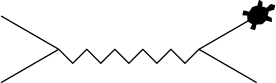
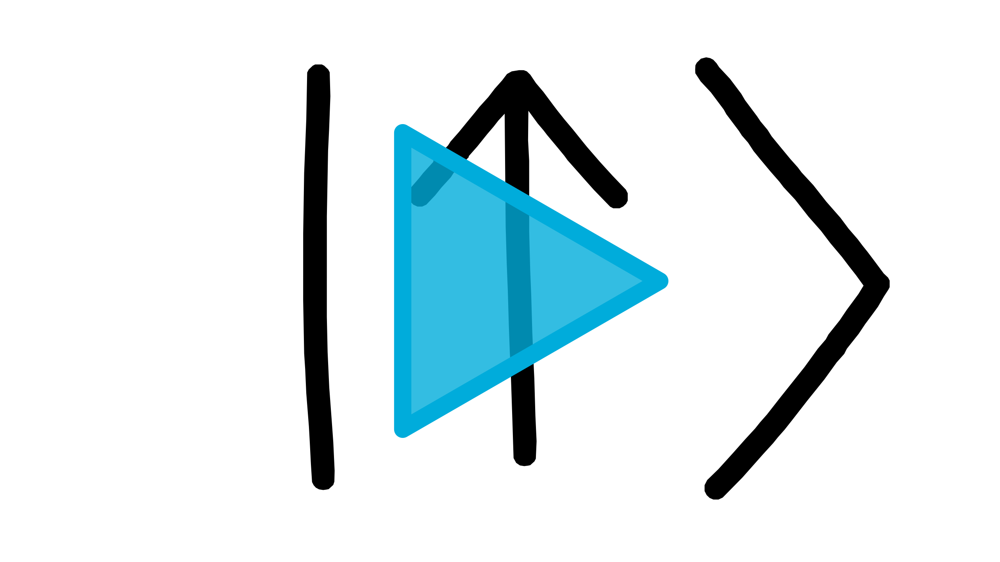

# Classes

Voor een snelle meting is het script dat je geschreven hebt bij [opdracht _Pythondaq: quick 'n dirty meting_](basisscript.md#opd:quickndirty-meting), [opdracht _Pythondaq: herhaalmetingen_](basisscript.md#opd:herhaalmetingen) en [opdracht _Pythondaq: CSV_](basisscript.md#opd:quickndirty-csv) prima! Maar als de meetapparatuur ingewikkelder wordt (meer verschillende commando's) of je wilt meer aanpassingen doen, dan is het wel lastig dat je op allerlei plekken de commando's opnieuw moet programmeren &mdash; en eerst moet opzoeken. Als je een nieuw script schrijft moet je opnieuw goed opletten dat je de goede _terminator characters_ gebruikt, etc. Het is wat werk, maar toch heel handig, om je code op te splitsen en een _class_ te schrijven.

Een class is eigenlijk een groep functies die je bij elkaar pakt en die met elkaar gegevens kunnen delen. Zodra een programma wat complexer wordt merk je dat het fijn kan zijn om variabelen op te sluiten in geïsoleerde omgevingen. We gaan eerst kijken hoe we een class gebruiken met behulp van de class `Turtle`. Met deze class kan je een tekening maken in Python, met behulp van functies geef je aan hoe de pen over het papier moet bewegen.

## Aanroepen van een class

Het aanroepen van een class lijkt veel op het aanroepen van een functie:

--8<-- "docs/assets/comparison/compare_function_class_instance.html"

Stel je hebt de functie `#!py def calculate_squares_up_to(max_number):`. Dan roep je die aan met `#!py result = calculate_squares_up_to(5)`. Hierbij is `calculate_squares_up_to` de naam van de functie en `result` de variabele waar de uitkomst heen gaat. Achter de naam van de functie, `calculate_squares_up_to`, komen tussen ronde haakjes de variabelen te staan die worden meegegeven aan de functie, in dit geval `#!py 5`. Hierdoor wordt het kwadraat tot het getal 5 uitgerekend.

Bij het aanroepen van een class doe je iets soortgelijks. In de variabele `master_oogway` gaat de <q>uitkomst</q> van de class, dat is in dit geval een collectie van functies &mdash; de zogeheten _methods_ van de class &mdash; (en variabelen). De variabele `master_oogway` noem je een _instance_ van de class `Turtle`. Achter de naam van de class, `Turtle`, komen tussen ronde haakjes de parameters te staan die worden meegegeven aan de class, in dit geval `#!py "turtle"`. Hierdoor heeft de pen de vorm van een schildpad in plaats van een pijl.


???+ meer-leren "Meerdere instances"
    Net zoals je een functie vaker kunt aanroepen, kan je ook meerdere instances van een class aanmaken.
    Je kunt meerdere instances hebben van dezelfde class, bijvoorbeeld voor verschillende schildpadden:
    ``` py
    class Turtle:
        ...

    turtle_1247 = Turtle()
    ...
    turtle_1428 = Turtle()
    ...
    ```

De class `#!py Turtle` is een verzameling van methods waaronder `#!py forward()` en `#!py left()`. Zoals hierboven staat beschreven zijn deze methods als <q>uitkomst</q> van de class meegegeven aan de instance `master_oogway`. Je kunt daarom de methods aanroepen met de instance `master_oogway`:
```py
master_oogway = Turtle("turtle")

master_oogway.forward(50)
master_oogway.left(30)
master_oogway.forward(50)
```

Hierin is `50` het aantal stappen en `30` de hoek in graden die de schildpad tegen de klok in draait. {: id="easterEggImage" style="width:1.5%" data-message="Pssst met 'ALT' + '↑' (pijltje omhoog) kun je stukken geselecteerde code omhoog en met '↓' naar beneden verplaatsen. Probeer maar eens!"}
   
!!! opdracht-basis "De class `#!py Turtle`"
    === "opdracht"

        <div class="grid-tree" markdown>
            <div>
            Je bent inmiddels nieuwsgierig geworden naar de schildpad. De class `#!py Turtle` zit standaard in Python, daarom kan je deze importeren met `#!py from turtle import Turtle`. Je opent in GitHub Desktop de repository {{github}}`oefenopdrachten` en opent deze repository in Visual Studio Code. Je maakt een bestand {{new_file}} `Feynman.py` aan. Aangezien er nog geen environment gekoppeld is aan deze repository maak je eerst een virtual environment aan (zie [opdracht Virtual environment aanmaken](communicatie.md#opd:venv)). Teken nu met een schildpad met de instancenaam `master_oogway` een Feynman diagram. 
            </div>
            <div>
            {{folder}} `ECPC`  
            {{T}} {{github}} `oefenopdrachten`  
            {{tab}} {{T}} {{new_file}} `Feynman.py`  
            {{tab}} {{L}} {{dots}}  
            {{L}} {{github}} `pythondaq`  
            {{tab}} {{L}} {{dots}}  
            </div>
        </div>

        !!! info "Scherm met schildpad verdwijnt"
            Na het uitvoeren van het script sluit Python het scherm van de schildpad. Voeg de regel `#!py master_oogway.screen.mainloop()` toe om het scherm te laten staan en handmatig af te sluiten. 
    === "code"
        **Pseudo-code**
        ``` py
        from turtle import Turtle

        # create instance of class Turtle
        master_oogway = Turtle("turtle")

        # use forward() and left() to create a Feynman diagram
        ```
        **Voorbeeld uitkomst**  
        
    === "check"
        **Checkpunten**

        - [ ] De class `Turtle` wordt geïmporteerd uit de module `turtle`.
        - [ ] De instance is van de class `Turtle` met hoofdletter T.
        - [ ] De naam van de instance is `master_oogway`.
        - [ ] Om de schildpad te laten bewegen roep je de method `#!py forward()` of `#!py left()` van de instance aan.

        **Projecttraject**

        - [x] De class `Turtle`
        - [ ] De method `#!py __init__(self)`
        - [ ] Een class maken
        - [ ] `self` = instance
        - [ ] Opbouw van een class

## Het maken van een class
We hebben een class nu _gebruikt_, maar hoe _maak_ je zelf een class? De class `Turtle` is behoorlijk complex en het gaat te ver om de class hier helemaal te bespreken. Voor een goed begrip van classes ga je daarom kijken naar een versimpelde weergave van de class `Turtle`.

Een class maak je aan met de regel `#!py class Turtle:`.[^ClassTitle] Daaronder komt ingesprongen de inhoud van de class. De class bestaat uit methods (de 'functies' van een class). De eerste method `#!py __init__()` is een speciale method (voor meer informatie zie: [dunder methods](vervolg-python.md#dunder-methods)), dit is de _initializer_ waarin alle taken staan die uitgevoerd worden zodra de class gebruikt wordt. 

[^ClassTitle]: Wanneer je de Google Style Guide[@google_style_guide] volgt schrijf je de naam van de class in CapWords of CamelCase. 

``` py
class Turtle:
    def __init__(self, shape):
        # transform turtle into shape

    def forward(self, distance):
        # move turtle by distance

    def left(self, angle):
        # turn turtle counterclockwise
        # by angle in degrees
```

De eerste parameter van de `#!py __init__()`-method en van alle andere methods is `#!py self`, daarna komen &mdash; indien nodig &mdash; andere parameters die in de method nodig zijn. Verder op in dit hoofdstuk leer je meer over [de speciale parameter `#!py self`](classes.md#de-speciale-parameter-self).

Het aanmaken van een class lijkt in een aantal opzichten op het aanmaken van een functie:

--8<-- "docs/assets/comparison/compare_function_class.html"

!!! opdracht-basis "De method `#!py __init__(self)`"
    === "opdracht"
        
        Achter de naam van de class: `Turtle`, komen tussen ronde haakjes de variabelen die worden meegegeven aan de  `#!py __init__()`-method (`#!py self` niet meegerekend), de parameter `#!py shape` krijgt dus de variabele `#!py "turtle"` toegewezen.

        Stel dat de `#!py __init__()`-method geen extra parameters mee krijgt, zoals in onderstaand geval. Hoe maak je dan een instance aan van de class? 
        ```py
        class Turtle:
            def __init__(self):
                # initialize class
        
            def forward(self, distance):
                # move turtle by distance

            def left(self, angle):
                # turn turtle counterclockwise
                # by angle in degrees
        ```
    
        ??? uitwerkingen
            ```py
            master_oogway = Turtle()
            ```
    
    === "check"        
        **Projecttraject**

        - [x] De class `Turtle`
        - [x] De method `#!py __init__(self)`
        - [ ] Een class maken
        - [ ] `self` = instance
        - [ ] Opbouw van een class

!!! opdracht-basis "Een class maken"
    === "opdracht"

        <div class="grid-tree" markdown>
            <div>
            Je gaat de versimpelde weergave van de `Turtle` class gebruiken om een werkende class te maken die weliswaar geen schildpad laat lopen maar wel tekst print!
            </br></br>
            Maak een bestand {{new_file}} `fake-turtle.py` waarin je zelf een class `Turtle` maakt. Zodra de class `Turtle` gebruikt wordt, print je tekst die aangeeft welke vorm de pen heeft. Wanneer de methods `forward` en `left` worden aangeroepen print je een tekst die aangeeft hoeveel stappen de turtle zet of hoeveel graden de turtle draait.
            </div>
            <div>
            {{folder}} `ECPC`  
            {{T}} {{github}} `oefenopdrachten`  
            {{tab}} {{T}} {{new_file}} `fake-turtle.py`  
            {{tab}} {{T}} {{file}} `Feynman.py`  
            {{tab}} {{L}} {{dots}}  
            {{L}} {{github}} `pythondaq`  
            {{tab}} {{L}} {{dots}}  
            </div>
        </div>
    === "code"
        **Pseudo-code**
        ``` py
        class Turtle:
            def __init__(self, shape):
                # print the shape of the turtle

            def forward(self, distance):
                # print the distance that the turtle moves

            def left(self, angle):
                # print the angle that the turtle turns counterclockwise
        ```
        **Testcode**
        <div class="code-box"><button type="button" name="fake_turtle" onclick="runScript('fake_turtle')" class="run">{{ run }}</button><button type="button" name="fake_turtle" onclick="runScript('fake_turtle')" class="reload invisible">{{ reload }}</button> fake_turtle.py
        ``` py
        master_oogway = Turtle("turtle")

        master_oogway.forward(50)
        master_oogway.left(30)
        master_oogway.forward(50)
        ```
        <pre>
        <code>(ECPC) > python fake_turtle.py
        <span class="invisible" name="fake_turtle">transform shape to... turtle
        move with 50 steps
        turn turtle counterclockwise by 30 degrees
        move with 50 steps</span>
        </code></pre></div>

    === "check"
        **Checkpunten**

        - [ ] Wanneer je een instance aanmaakt van de class `Turtle` moet je een parameter meegeven.
        - [ ] Wanneer je een instance aanmaakt van de class `Turtle` wordt in de terminal geprint welke vorm de turtle heeft.
        - [ ] Wanneer je de method `#!py forward()` aanroept, moet je een parameter meegeven.
        - [ ] Wanneer je de method `#!py forward()` aanroept, wordt in de terminal geprint hoeveel stappen de turtle zet.
        - [ ] Wanneer je de method `#!py left()` aanroept, moet je een parameter meegeven.
        - [ ] Wanneer je de method `#!py left()` aanroept, wordt in de terminal geprint hoeveel graden de turtle draait.

        **Projecttraject**

        - [x] De class `Turtle`
        - [x] De method `#!py __init__(self)`
        - [x] Een class maken
        - [ ] `self` = instance
        - [ ] Opbouw van een class

## De speciale parameter `#!py self`
Een class method is vrijwel gelijk aan een normale functie, behalve dat een class method als eerste de parameter `#!py self` verwacht. Aan deze parameter wordt de eigen instance van de class meegegeven wanneer je de method aanroept. Laten we kijken naar wat die instance van de class eigenlijk is. De instance van een class is de collectie van methods (en variabelen). 

--8<-- "docs/assets/comparison/compare_function_class_body.html"

Als je de functie `#!py calculate_squares_up_to(max_number)` aanroept met `#!py result = calculate_squares_up_to(5)`, dan komt hetgeen dat teruggegeven wordt, `#!py squares`, in de variabele `#!py result` terecht. Bij een class is er geen `#!py return`-statement maar komt de hele inhoud van de class, dus _alle methods (en variabelen)_, in de instance `#!py master_oogway` terecht.

Gelukkig hoef je de instance niet steeds zelf mee te geven aan een method. Wanneer je een method aanroept wordt impliciet de instance als eerste parameter meegegeven. 
Maar waarom zou je die instance meegeven aan een method als je die aanroept? Omdat de instance alle methods en variabele bevat, kan je de informatie die daarin is opgeslagen in elke method gebruiken. 

Stel je maakt een nieuwe method `#!py do_kungfu_move` waarin je `#!py forward()` en `#!py left()` willen gebruiken:

``` py
class Turtle:
    def __init__(self, shape):
        # transform turtle into shape

    def forward(self, distance):
        # move turtle by distance

    def left(self, angle):
        # turn turtle counterclockwise
        # by angle in degrees

    def do_kungfu_move(self):
        # do kungfu move
        self.forward(130)
        self.left(350)
        self.forward(60)
```

Als je de method `#!py do_kungfu_move` aanroept met `#!py master_oogway.do_kungfu_move()`, dan geeft python automatisch de instance `#!py master_oogway` mee aan de method. De parameter `#!py self` is dus nu gelijk aan de instance `#!py master_oogway`, daarmee doet `#!py self.forward(130)` hetzelfde als `#!py master_oogway.forward(130)`. 

!!! opdracht-basis "`self` = instance"
    === "opdracht"
        Het begrip `self` is een vaag begrip, maar je kunt met print-statements zien wat `self` is. Voeg aan {{file}}`fake_turtle.py` de method `do_kungfu_move()` toe. En voeg aan de method ook een print-statement toe om de variabele `self` te printen. Gebruik hiervoor: `#!py print(f"{self=}")`. Gebruik de instance `master_oogway` om de method `do_kungfu_move` aan te roepen. De variabele `self` is, als het goed is, gelijk aan de instance `master_oogway`. Om dit te controleren voeg je ook een print-statement toe om `master_oogway` te printen: `#!py print(f"{master_oogway=}")`.
        </br></br>
        Je hebt nu twee keer een object geprint. Dat ziet er misschien wat gek uit, maar je kunt er wel nuttige informatie uithalen. Aan het eind zie je getallen met letters staan, dat is het geheugenadres waar het object is opgeslagen. Als je het geheugenadres van de instance `master_oogway` vergelijkt met die van de variabele `self` dan zie je dat deze hetzelfde zijn. Dat betekent dat de objecten ook dezelfde objecten zijn, `self` is dus gelijk aan `master_oogway`!
        </br></br>
        `self` is de instance zelf. Met andere woorden: als je een andere instance gebruikt, dan verandert `self` mee. Om dit te testen maak je een instance `toby` aan, de tweede instance. Roep de method `do_kungfu_move` aan met `toby`. Je ziet dat het geheugenadres van de variabele `self` nu anders is dan de vorige `self`. Je controleert of het geheugenadres overeenkomt met het geheugenadres van de instance `toby`.
    === "code"
        **Pseudo-code**
        ``` py
        class Turtle:
            def __init__(self, shape):
                # transform turtle into shape
                ...

            def forward(self, distance):
                # move turtle by distance
                ...

            def left(self, angle):
                # turn turtle counterclockwise
                # by angle in degrees
                ...

            def do_kungfu_move(self):
                # do kungfu move
                self.forward(130)
                self.left(350)
                self.forward(60)
                # print self
                print(f"{self=}")
        ```
        **Testcode**
        <div class="code-box"><button type="button" name="fake_turtle_self" onclick="runScript('fake_turtle_self')" class="run">{{ run }}</button><button type="button" name="fake_turtle_self" onclick="runScript('fake_turtle_self')" class="reload invisible">{{ reload }}</button> fake_turtle.py
        ``` py
        master_oogway = Turtle("turtle")
        print(f"{master_oogway=}")
        master_oogway.do_kungfu_move()

        toby = Turtle("turlte")
        print(f"{toby=}")
        toby.do_kungfu_move()
        ```
        <pre>
        <code>(ECPC) > python fake_turtle.py
        <span class="invisible" name="fake_turtle_self">master_oogway=<\__main__.Turtle object at 0x10530b890>
        self=<\__main__.Turtle object at 0x10530b890>
        toby=<\__main__.Turtle object at 0x103377980>
        self=<\__main__.Turtle object at 0x103377980></span>
        </code></pre></div>
        

    === "check"
        **Checkpunten**

        - [ ] Het geheugenadres van `master_oogway` is gelijk aan het geheugenadres van `self`.
        - [ ] `master_oogway` is niet gelijk aan `self` als de method met een andere instance wordt aangeroepen.

        **Projecttraject**

        - [x] De class `Turtle`
        - [x] De method `#!py __init__(self)`
        - [x] Een class maken
        - [x] `self` = instance
        - [ ] Opbouw van een class


### Instance attribute
De instance van een class bevat niet alleen alle methods, maar kan ook variabelen bevatten. In het voorbeeld hieronder voegen we de variabele `#!py quote` toe in de `#!py __init__`-method en daarmee ook aan de instance. Dit wordt een _instance attribute_ genoemd.

``` py
class Turtle:
    def __init__(self, shape):
        # transform turtle into shape
        self.quote = "Yesterday is history, Tomorrow is a mystery, but Today is a gift. That is why it is called the present"

    ...
```
De instance attribute `#!py quote` is nu onderdeel van de instance. We kunnen die oproepen binnen elke method met `#!py self.quote` maar ook buiten de class:

<div class="code-box"><button type="button" name="turtle_quote" onclick="runScript('turtle_quote')" class="run">{{ run }}</button><button type="button" name="turtle_quote" onclick="runScript('turtle_quote')" class="reload invisible">{{ reload }}</button> turtles.py
``` py
...
master_oogway = Turtle("turtle")

print(master_oogway.quote)
```
<pre>
<code>(ECPC) > python turtles.py
<span class="invisible" name="turtle_quote">"Yesterday is history, Tomorrow is a mystery, but Today is a gift. That is why it is called the present"</span>
</code></pre></div>

!!! opdracht-basis "Opbouw van een class"
    === "opdracht"
        Bekijk onderstaande code. Wat doet deze code precies? Verplaats daarna de onderdelen naar de juiste plek in de code. Twijfel je of je nog weet wat een module is kijk dan voor meer informatie in de [paragraaf modules](vervolg-python.md#modules).

        <iframe src="https://h5plti.avwebs.nl/h5p/82/embed" width="740" height="830" frameborder="0" allowfullscreen="allowfullscreen" lang="en" scrolling="no"></iframe>

    === "check"
        **Projecttraject**

        - [x] De class `Turtle`
        - [x] De method `#!py __init__(self)`
        - [x] Een class maken
        - [x] `self` = instance
        - [x] Opbouw van een class
    

???+ meer-leren "Classes importeren"

    Wat is nu het praktisch nut van classes en methods gebruiken in plaats van functies? Want in plaats van
    ``` py
    forward(master_oogway, distance=50)
    ```
    heb je nu
    ``` py
    master_oogway.forward(distance=50)
    ```
    en dat is even lang. Het grote voordeel ontstaat pas wanneer de class ingewikkelder wordt en meer data gaat bewaren. Ook kun je de class in een ander pythonbestand (bijvoorbeeld {{file}}`animals.py`) zetten en alle functionaliteit in één keer importeren met:
    ``` py
    from animals import Turtle

    master_oogway = Turtle()
    ...
    ```
    Op deze manier kun je code ook makkelijker delen en verspreiden. Zodra je een class definieert zal Visual Studio Code tijdens het programmeren je code automatisch aanvullen. Zodra je typt `#!py master_oogway.f` hoef je alleen maar op ++tab++ te drukken en Visual Studio Code vult de rest aan.


!!! opdracht-basis "Class `Particle`"
    === "opdracht"
        
        
        <div class="grid-tree" markdown>
            <div>
            Je hebt een class `#!py Particle` gemaakt in een niew bestand {{file}} `particle.py`. Als je een instance aanmaakt van de class `#!py Particle` kun je de naam van het deeltje meegeven en de spin (bijvoorbeeld: 0.5). De instance attributes van deze class zijn 'name' en 'spin'. Er is ook een method `#!py is_up_or_down()` om op te vragen wat de spin van het deeltje op dat moment is (spin omhoog/positief of spin omlaag/negatief). Door de method `#!py flip()` op te roepen wordt de spin van het deeltje omgekeerd.
            </div>
            <div>
            {{folder}} `ECPC`  
            {{T}} {{github}} `oefenopdrachten`  
            {{tab}} {{T}} {{new_file}} `particle.py`  
            {{tab}} {{L}} {{dots}}  
            {{L}} {{github}} `pythondaq`  
            {{tab}} {{L}} {{dots}}  
            </div>
        </div>

    === "code"
        **Pseudo-code**
        ``` py
        # class Particle:
        #   def __init__(self, name, spin):
        #       make instance attribute from name
        #       make instance attribute from spin
        #
        #   def is_up_or_down():
        #       print up when spin is positive
        #       print down when spin is negative
        #       ...
        #
        #   def flip():
        #       make spin positive if spin is negative
        #       make spin negative if spin is positive
        #       ...
        ```
        **Testcode**
        <div class="code-box"><button type="button" name="particle" onclick="runScript('particle')" class="run">{{ run }}</button><button type="button" name="particle" onclick="runScript('particle')" class="reload invisible">{{ reload }}</button> <b>particle.py</b>
        ``` py
        proton = Particle('mooi proton', 0.5)
        proton.is_up_or_down()
        proton.flip()
        proton.is_up_or_down()
        print(f"{proton.spin=}")
        print(f"{proton.name=}")
        ```
        <pre>
        <code>(ECPC) > python particle.py
        <span class="invisible" name="particle">up
        down
        proton.spin=-0.5
        proton.name='mooi proton'</span>
        </code></pre></div>
    === "check"
        **Checkpunten**

        - [ ] Naam en spin worden aan instance meegegeven.
        - [ ] Naam en spin zijn instance attributes en kunnen zowel binnen een method als buiten de class opgeroepen worden.
        - [ ] Method `#!py is_up_or_down()` print 'up' als de spin positief is en 'down' als het negatief is.
        - [ ] Method `#!py flip()` maakt de spin positief als de spin negatief is, en negatief als de spin positief is.

        **Projecttraject**

        - [x] Class `Particle`
        - [ ] Class `Temperature`
        - [ ] Class `PointMass`

!!! opdracht-basis "Class `Temperature`"
    === "opdracht"        
        <div class="grid-tree" markdown>
            <div>
            Je hebt een class `#!py Temperature` gemaakt in een nieuw bestand {{new_file}} `temperature.py`. Als je een instance aanmaakt van de class `#!py Temperature` kun je de temperatuur in ºC meegeven. De instance kun je dan bijvoorbeeld beschouwen als een _temperatuurmeting_. Je kunt de waarde van de temperatuur terugvragen in verschillende eenheden (ºC, ºF, K) met de methods `#!py to_celsius()`, `#!py to_fahrenheit()` en `#!py to_kelvin()`. Met de method `#!py update_temperature()` kun je een nieuwe temperatuurswaarde bewaren.
            </div>
            <div>
            {{folder}} `ECPC`  
            {{T}} {{github}} `oefenopdrachten`  
            {{tab}} {{T}} {{file}} `particle.py`  
            {{tab}} {{T}} {{new_file}} `temperature.py`  
            {{tab}} {{L}} {{dots}}  
            {{L}} {{github}} `pythondaq`  
            {{tab}} {{L}} {{dots}}  
            </div>
        </div>

    === "code"
        **Pseudo-code**

        Vervang de `#!py pass`-statements door jouw code.
        ``` py
        class Temperature:
            def __init__(self, temperature_celsius):
                pass

            def to_celsius(self):
                pass
            
            def to_kelvin(self):
                # K = C + 273.15
                pass
            
            def to_fahrenheit(self):
                # F = C * 9/5 + 32
                pass
            
            def update_temperature(self, temperature_celsius):
                # update the stored temperature
                pass
        ```
        **Testcode**
        <div class="code-box"><button type="button" name="temperature" onclick="runScript('temperature')" class="run">{{ run }}</button><button type="button" name="temperature" onclick="runScript('temperature')" class="reload invisible">{{ reload }}</button> <b>temperature.py</b>
        ``` py
        t1 = Temperature(37)
        print(f"{t1.temperature=}")
        print(f"{t1.to_celsius()=}")
        print(f"{t1.to_kelvin()=}")
        print(f"{t1.to_fahrenheit()=}")
        print()

        t1.update_temperature(21)
        print(f"{t1.to_celsius()=}")
        print(f"{t1.to_kelvin()=}")
        print(f"{t1.to_fahrenheit()=}")
        ```
        <pre>
        <code>(ECPC) > python temperature.py
        <span class="invisible" name="temperature">t1.temperature=37
        t1.to_celsius()=37
        t1.to_kelvin()=310.15
        t1.to_fahrenheit()=98.6        
        t1.to_celsius()=21
        t1.to_kelvin()=294.15
        t1.to_fahrenheit()=69.8</span>
        </code></pre></div>
    === "check"
        **Checkpunten**

        - [ ] Temperatuur wordt aan instance meegegeven.
        - [ ] De temperatuur is een instance attribute en kan zowel binnen een method als buiten de class opgeroepen worden.
        - [ ] Method `#!py to_celsius()` geeft de temperatuur in graden Celisus terug.
        - [ ] Method `#!py to_kelvin()` rekent de temperatuur uit in Kelvin en geeft die waarde terug.
        - [ ] Method `#!py to_fahrenheit()` rekent de temperatuur uit in Fahrenheit en geeft die waarde terug.
        - [ ] Method `#!py update_temperature()` vervangt de eerdere temperatuurmeting met een nieuwe temperatuurswaarde. 

        **Projecttraject**

        - [x] Class `Particle`
        - [x] Class `Temperature`
        - [ ] Class `PointMass`


!!! opdracht-basis "Class `PointMass`"
    === "opdracht"        
        <div class="grid-tree" markdown>
            <div>
            Je hebt een class `#!py PointMass` gemaakt in een nieuw bestand {{new_file}} `point_mass.py`. Als je een instance aanmaakt van de class `#!py PointMass` kun je de positie en de snelheid in twee dimensies meegeven. De instance kun je dan beschouwen als een puntmassa waarvan je de plaats en snelheid kent en kunt simuleren. Je hebt gezorgd voor een method om de snelheid aan te passen, en een method om de beweging van het deeltje te simuleren: waar is de puntmassa over 1 seconde? Ook zijn er methods om de kinetische energie en de impuls uit te rekenen.
            </div>
            <div>
            {{folder}} `ECPC`  
            {{T}} {{github}} `oefenopdrachten`  
            {{tab}} {{T}} {{file}} `particle.py`  
            {{tab}} {{T}} {{file}} `temperature.py`  
            {{tab}} {{T}} {{new_file}} `point_mass.py`  
            {{tab}} {{L}} {{dots}}  
            {{L}} {{github}} `pythondaq`  
            {{tab}} {{L}} {{dots}}  
            </div>
        </div>

    === "code"
        Je bent helemaal vrij om de namen van de attributes en methods te kiezen.

    === "check"
        **Checkpunten**

        - [ ] Positie en snelheid (in twee dimensies) kunnen aan instance worden meegegeven.
        - [ ] De positie is/zijn instance attribute(s) en kan/kunnen zowel binnen een method als buiten de class opgeroepen worden.
        - [ ] Er is een method om de snelheid aan te passen.
        - [ ] Er is een method om de puntmassa te laten 'bewegen' door een tijdstap te zetten.
        - [ ] Er zijn methods om de kinetische energie en de impuls uit te rekenen en terug te geven.

        **Projecttraject**

        - [x] Class `Particle`
        - [x] Class `Temperature`
        - [x] Class `PointMass`


!!! opdracht-inlever "Class `ProjectileMotion`"
    === "opdracht"

        <div class="grid-tree" markdown>
            <div>
            Maak een nieuwe repository voor deze inleveropdracht. Je gaat een waterraket een aantal keer wegschieten met steeds een andere beginsnelheid en lanceerhoek. Je hebt een instance aangemaakt van de class `#!py ProjectileMotion`. De beginsnelheid en de lanceerhoek bewaar je steeds met de method `#!py add_launch_parameters()`. Om in een keer alle beginsnelheden op te vragen gebruik je de method `#!py get_initial_velocities()`. Om alle lanceerhoeken op te vragen gebruik je de method `#!py get_launch_angles()`. Op basis van de gegevens (en door de luchtweerstand te verwaarlozen) bepaal je de vluchtduur en het bereik van de raket. Je kunt de vluchtduur van alle vluchten opvragen met de method `#!py get_time_of_flights()` en het bereik van alle vluchten met `#!py get_flight_ranges()`. Zie het [tabblad check](#__tabbed_9_3) voor de nodige vergelijkingen.
            </div>
            <div>
            {{folder}} `ECPC`  
            {{T}} {{github}} `oefenopdrachten`  
            {{tab}} {{L}} {{dots}}  
            {{T}} {{github}} `pythondaq`  
            {{tab}} {{L}} {{dots}}  
            {{L}} {{github}} `projectile-motion`  
            {{tab}} {{T}} {{new_file}} `water-rocket.py`  
            {{tab}} {{L}} {{dots}}  
            </div>
        </div>
    
    === "code"
        **Pseudo-code**
        ``` py
        # class ProjectileMotion
        #    ...
        #    __init__
        #       ...
        #    add_launch_parameters
        #       ...
        #    get_initial_velocities
        #       ...
        #    get_launch_angles
        #       ...
        #    get_time_of_flights
        #       ...
        #    get_flight_ranges
        #       ...
        ```
        **Testcode**
        <div class="code-box"><button type="button" name="water_rocket" onclick="runScript('water_rocket')" class="run">{{ run }}</button><button type="button" name="water_rocket" onclick="runScript('water_rocket')" class="reload invisible">{{ reload }}</button> <b>water_rocket.py</b>
        ``` py
        speedy = ProjectileMotion()
        speedy.add_launch_parameters(v=28, angle=68)
        speedy.add_launch_parameters(v=11, angle=15)

        v = speedy.get_initial_velocities()
        angles = speedy.get_launch_angles()
        x = speedy.get_flight_ranges()
        t = speedy.get_time_of_flights()

        print(f"{v=}")
        print(f"{angles=}")
        print(f"{x=}")
        print(f"{t=}")

        ```
        <pre>
        <code>(ECPC) > python water_rocket.py
        <span class="invisible" name="water_rocket">v=[28, 11]
        angles=[68, 15]
        x=[55.51602063607072, 6.167176350662587]
        t=[5.292792645845066, 0.5804300705663054]</span>
        </code></pre></div>
        
        
    === "check"
        **Checkpunten**

        - [ ] De code bevindt zich in een nieuwe GitHub-repository {{lightbulb}}.
        - [ ] De method `#!py add_launch_parameters` verwacht een beginsnelheid in meter per seconde en een lanceerhoek in graden.
        - [ ] De method `#!py get_initial_velocities` geeft een lijst terug met alle beginsnelheden van de ingevoerde parameters.
        - [ ] De method `#!py get_launch_angles` geeft een lijst terug met alle lanceerhoeken van de ingevoerde parameters.
        - [ ] De time-of-flight wordt berekend met 2 * v_y / g.
        - [ ] De beginsnelheid in de y-richting wordt berekend met v_y = v * sin(lanceerhoek).
        - [ ] Het bereik wordt berekend met time_of_flight * v_x.
        - [ ] De beginsnelheid in de x-richting wordt berekend met v_x = v * cos(lanceerhoek).
        - [ ] De lanceerhoek wordt in radialen meegegeven aan de trigonometrische functies.
        - [ ] De method `#!py get_time_of_flights` geeft een lijst terug met de vluchtduur in seconden corresponderend met de ingevoerde parameters. 
        - [ ] De method `#!py get_flight_ranges` geeft een lijst terug met het bereik in meters corresponderend met de ingevoerde parameters.


        **Projecttraject**

        - [x] Class `ProjectileMotion`

!!! opdracht-meer "Raise exception"
    Het is niet logisch om een lanceerhoek boven een bepaalde waarde in te voeren of om een negatieve beginsnelheid mee te geven. Zorg dat in die gevallen een error afgegeven wordt. Meer informatie hierover vind je in de [paragraaf Exceptions](vervolg-python.md#exceptions).

???+ meer-leren "Subclass"
    ## Subclasses

    Je kunt behalve een class ook een _subclass_ aanmaken. De class `#!py Turtle` heeft hele handige methods maar je kunt een specifiekere class `#!py GiantTortoise` maken.

    ```py
    class GiantTortoise(Turtle):
        def __init__(self):
            super().__init__()
            self.shape("turtle")
            self.color("dark green")
            self.turtlesize(5)
            self.speed(1)

        def move(self, distance):
            steps = range(0, distance, 5)
            i = 1
            for step in steps:
                self.tiltangle(i * 5)
                self.forward(step)
                time.sleep(1)
                i = i * -1
    ```
    
    Door de parentclass `#!py Turtle` tussen ronde haakjes mee te geven aan de nieuwe subclass `#!py GiantTortoise` krijgt de subclass alle functionaliteit mee van de parentclass, waaronder alle methods zoals `#!py forward()`. Als je in de `#!py __init__()`-method van de subclass methods of attributes wilt gebruiken van de parentclass, moet je ervoor zorgen dat de parentclass is geïnitialiseerd . Dit doe je met `#!py super().__init__()`. Hierbij verwijst `#!py super()` naar de parentclass en met `#!py __init__()` voer je de `#!py __init__()`-method van de parentclass uit. Nadat je in de `#!py __init__()`-method van de subclass de eigenschappen van de reuzenschildpad hebt gedefinieerd, kun je extra functionaliteit gaan toevoegen, bijvoorbeeld de manier van bewegen met de method `#!py move()`. 

    !!! opdracht-meer "`#!py super().__init__()`"
        1. Maak een bestand aan waarin je de subclass `GiantTortoise` aanmaakt.
        1. Zorg dat de volgende voorbeeldcode werkt:
        ```py
        t = GiantTortoise()
        t.move(50)
        ```
        1. Wat gebeurt er als je `#!py super().__init__()` weglaat?
    

    !!! opdracht-meer "Hawksbill turtle"
        1. Maak een subclass aan voor de Hawksbill turtle.
        1. De Hawksbill turtle is een zeeschildpad. Maak de omgeving van de schildpad standaard blauw met `#!py self.screen.bgcolor("cyan")`.
        1. Schrijf een method `#!py swim()` die de schildpad over het scherm laat bewegen. 
    