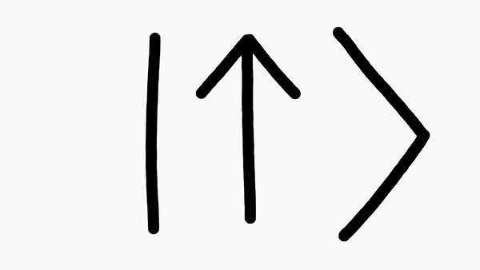

# Classes

Voor een snelle meting is het script dat je geschreven hebt bij [opdracht _quick 'n dirty_ meting](basisscript.md#opd:quickndirty-meting) en [opdracht _Pythondaq: CSV_](basisscript.md#opd:quickndirty-csv) prima! Maar als de meetapparatuur ingewikkelder wordt (meer verschillende commando's) of je wilt meer aanpassingen doen, dan is het wel lastig dat je op allerlei plekken de commando's opnieuw moet programmeren &mdash; en eerst moet opzoeken. Als je een nieuw script schrijft moet je opnieuw goed opletten dat je de goede _terminator characters_ gebruikt, etc. Het is wat werk, maar toch heel handig, om je code op te splitsen en een _class_ te schrijven.

Een class is eigenlijk een groep functies die je bij elkaar pakt en die met elkaar gegevens kunnen delen. Zodra een programma wat complexer wordt merk je dat het fijn kan zijn om variabelen op te sluiten in geïsoleerde omgevingen. 


## Aanmaken van een class
Een class is een verzameling functies. Hieronder staat een versimpelde weergave van de class `Turtle`. Een class maak je aan met de regel `#!py class Turtle:` [^ClassTitle] Daaronder komt ingesprongen de inhoud van de class. De class bestaat uit een collectie van fucnties &mdash; de zogeheten _methods_ van de class. De eerste method `#!py __init__()` is speciaal (voor meer informatie zie: [dunder methods](vervolg-python.md#dunder-methods) ), dit is de _initializer_ waarin alle taken staan die uitgevoerd worden zodra de class gebruikt wordt. 

[^ClassTitle]: Wanneer je de Google Style Guide[@google_style_guide] volgt schrijf je de naam van de class in CapWords of CamelCase. 

``` py
class Turtle:
    def __init__(self, shape):
        # transform turtle into shape

    def forward(self, distance):
        # move turtle by distance

    def left(self, angle):
        # turn turtle counterclockwise
        # by angle in degrees
```

De eerste parameter van de `#!py __init__()`-method en van alle andere methods, is `#!py self`, daarna komen &mdash;indien nodig&mdash; andere parameters die in de method nodig zijn. Later meer over [de speciale parameter self](classes.md#de-speciale-parameter-self), eerst gaan we kijken hoe je een class gebruikt. 

## Aanroepen van een class

Het aanroepen van een class lijkt veel op het aanroepen van een functie:

--8<-- "docs/assets/comparison/compare_function_class.html"

Stel we hebben de functie `#!py calculate_squares_up_to(max_number)`. Dan roep je die aan met `#!py result = calculate_squares_up_to(5)`. Hierbij is `calculate_squares_up_to(5)` de naam van de functie en `result` de variabele waar de uitkomst heen gaat. Bij het aanroepen van een class doe je iets soortgelijks. In de variabele `master_oogway` gaat de 'uitkomst' van de class, dat is in dit geval een collectie van methods (en variabelen). De variabele `master_oogway` noemen we een _instance_ van de class `Turtle`. Net zoals je een functie vaker kunt aanroepen, kan je ook meerdere instances van een class aanmaken. Achter de naam van de class: `Turtle`, komen tussen ronde haakjes de variabelen die worden meegegeven aan de  `#!py __init__()`-method (`#!py self` niet meegerekend), de parameter `#!py shape` krijgt dus de variabele `#!py "turtle"` toegewezen.


???+ meer-leren "Meerdere instances"
    Je kunt meerdere instances hebben van dezelfde class, bijvoorbeeld voor verschillende schildpadden:
    ``` py
    class Turtle:
        ...

    turtle_1247 = Turtle()
    ...
    turtle_1428 = Turtle()
    ...
    ```

!!! opdracht-basis "`#!py __init__(self)`"
    Stel dat de init-method geen extra parameters mee krijgt, zoals in het volgende geval:
    ```py
    class Turtle:
        def __init__(self):
            # initialiseer class
        
        def forward(self, distance):
            # move turtle by distance

        def left(self, angle):
            # turn turtle counterclockwise
            # by angle in degrees
    ```
    hoe maak je dan een instance aan van de class?
    ??? uitwerkingen
        ```py
        master_oogway = Turtle()
        ```

Omdat de instance `master_oogway` alle methods bevat kunnen we deze methods aanroepen:
```py
master_oogway = Turtle("turtle")

master_oogway.forward(50)
master_oogway.left(30)
master_oogway.forward(50)
```
   
!!! opdracht-basis "turtle"
    === "opdracht"
        Je bent inmiddels nieuwschierig geworden naar de schildpad en schrijft een script die een schildpad met de instancenaam `master_oogway` laat lopen en draaien.

        !!! info "Schildpad verdwijnt"
            Na het uitvoeren van het script sluit Python het scherm van de schildpad. Voeg de regel `#!py master_oogway.screen.mainloop()` toe om het scherm te laten staan en handmatig af te sluiten. 
    === "code"
        **Pseudo-code**
        ``` py
        from turtle import Turtle

        # create instance of class Turtle
        master_oogway = Turtle("turtle")

        # move turtle forward with 50 steps
        ...
        # turn turtle left with 30 degrees
        ...
        ```
    === "check"
        **Checkpunten:**

        - [ ] De instance is van de class `Turtle` met hoofdletter T
        - [ ] Om de schildpad te laten bewegen roep je de method `#!py forward()` of `#!py lef()` van de instance aan

        **Projecttraject:**

        - [x] turtle

## De speciale parameter `#!py self`
Een class method is vrijwel gelijk aan een normale functie, behalve dat een class method als eerste de parameter `#!py self` verwacht. Aan deze parameter wordt de eigen instance van de class meegegeven wanneer je de method aanroept. 

Laten we kijken naar wat die instance van de class eigenlijk is. De instance van een class is de collectie van methods (en variabelen). 

--8<-- "docs/assets/comparison/compare_function_class_body.html"

Als we de functie `#!py calculate_squares_up_to(max_number)` aanroepen met `#!py result = calculate_squares_up_to(5)`, dan komt hetgeen we teruggeven, `#!py squares`, in de variabele `#!py result` terecht. Bij een class is er geen `#!py return`-statement maar komt de hele inhoud van de class _alle methods (en variabelen)_ in de instance `#!py master_oogway` terecht.

Gelukkig hoef je de instance niet steeds zelf mee te geven aan een method. Wanneer je een method aanroept wordt impliciet de instance als eerste parameter meegegeven. 
Maar waarom zou je die instance meegeven aan een method als je die aanroept? Omdat de instance alle methods en variabele bevat, kan je de informatie die daarin is opgeslagen in elke method gebruiken. 

Stel we maken een nieuwe method `#!py do_kungfu_move` waarin we `#!py forward()` en `#!py left()` willen gebruiken:

``` py
class Turtle:
    def __init__(self, shape):
        # transform turtle into shape

    def forward(self, distance):
        # move turtle by distance

    def left(self, angle):
        # turn turtle counterclockwise
        # by angle in degrees

    def do_kungfu_move(self):
        # Do kungfu move
        self.forward(130)
        self.left(350)
        self.forward(60)
```

Als we de method `#!py do_kungfu_move` aanroepen met `#!py master_oogway.do_kungfu_move()` geeft python automatisch de instance `#!py master_oogway` mee aan de method. De parameter `#!py self` is dus nu gelijk aan de instance `#!py master_oogway`, daarmee doet `#!py self.forward(130)` hetzelfde als `#!py master_oogway.forward(130)`. 


### Instance attribute
De instance van een class bevat niet alleen alle methods, maar kan ook variabele hebben. In het voorbeeld hieronder voegen we de variabele `#!py quote` toe in de init-method aan de instance, daarmee wordt het een _instance attribute_.

``` py
class Turtle:
    def __init__(self, shape):
        # transform turtle into shape
        self.quote = "Yesterday is history, Tomorrow is a mystery, but Today is a gift. That is why it is called the present"

    ...
```
De instance attribute `#!py quote` is nu onderdeel van de instance. We kunnen die oproepen binnen elke method met `#!py self.quote` maar ook buiten de class:

```py
master_oogway = Turtle("turtle")

print(master_oogway.quote)
# "Yesterday is history, Tomorrow is a mystery, but Today is a gift. That is why it is called the present"
```

!!! opdracht-basis "Opbouw van een class"
    1. Beschouw de onderstaande code
    1. Bespreek met elkaar wat de code precies doet en verplaast de onderdelen naar de juiste plek in de code. 
    Twijfel je of je nog weet wat een module is kijk dan voor meer informatie in de [paragraaf modules](vervolg-python.md#modules).

    <iframe src="https://h5plti.avwebs.nl/h5p/82/embed" width="740" height="830" frameborder="0" allowfullscreen="allowfullscreen" lang="en" scrolling="no"></iframe>
    

???+ meer-leren "Classes importeren"

    Wat is nu het praktisch nut van classes en methods gebruiken in plaats van functies? Want in plaats van
    ``` py
    forward(master_oogway, distance=50)
    ```
    hebben we nu
    ``` py
    master_oogway.forward(distance=50)
    ```
    en dat is even lang. Het grote voordeel ontstaat pas wanneer de class ingewikkelder wordt en meer data gaat bewaren. Ook kun je de class in een ander pythonbestand (bijvoorbeeld {{file}}`animals.py`) zetten en alle functionaliteit in één keer importeren met:
    ``` py
    from animals import Turtle

    master_oogway = Turtle()
    ...
    ```
    Op deze manier kun je code ook makkelijker delen en verspreiden. Zodra je een class definieert zal Visual Studio Code tijdens het programmeren je code automatisch aanvullen. Zodra je typt `#!py master_oogway.f` hoef je alleen maar op ++tab++ te drukken en VS Code vult de rest aan.


!!! opdracht-basis "Class Particle"
    === "opdracht"
        {style="width:128px;height:72px;" align=right}
        
        Je maakt een instance van de class `#!py Particle` aan voor een proton, naast de naam geeft je ook mee dat de spin 0.5 is. Je gebruikt de method `#!py is_up_or_down()` om terug op te vragen wat de spin van het deeltje op dat moment is (spin omhoog/positief of spin omlaag/negatief). Met de method `#!py flip()` keer je de spin van het deeltje om. 
    === "code"
        **Pseudo-code**
        ``` py
        # Class Particle:
            # def __init__(self, name, spin):
                ...
            # def is_up_or_down
                # print up when spin is positive
                # print down when spin is negative
                ...
            # def flip
                # Make spin positive if spin is negative
                # Make spin negative if spin is positive
                ...

        ```
        **Testcode**
        <div class="code-box"><button type="button" name="particle" onclick="runScript('particle')" class="run">{{ run }}</button><button type="button" name="particle" onclick="runScript('particle')" class="reload invisible">{{ reload }}</button> <b>particle.py</b>
        ``` py
        proton = Particle('mooi proton', 0.5)
        proton.is_up_or_down()
        proton.flip()
        proton.is_up_or_down()
        print(proton.spin)
        print(proton.name)
        ```
        <pre>
        <code>(ecpc) > python.exe particle.py
        <span class="invisible" name="particle">up
        down
        -0.5
        mooi proton</span>
        </code></pre></div>
    === "check"
        **Checkpunten:**

        - [ ] Naam en spin toestand worden aan instance meegegeven.
        - [ ] Method `#!py is_up_or_down()` print 'up' als de spin positief is en 'down' als het negatief is.
        - [ ] Method `#!py flip()` maakt de spin positief als de spin negatief is, en negatief als de spin positief is.

        **Projecttraject:**

        - [x] Class Particle

!!! opdracht-inlever "Class ProjectileMotion"
    === "opdracht"
        Je gaat een waterraket een aantal keer wegschieten met steeds een andere beginsnelheid en lanceerhoek. Je hebt een instance aangemaakt van de class `#!py ProjectileMotion`. De metingen van de beginsnelheid en de lanceerhoek bewaar je steeds met de method `#!py add_measurement()`. Om in een keer alle beginsnelheden op te vragen gebruik je de method `#!py get_initial_velocities()`. Om alle lanceerhoeken op te vragen gebruik je de method `#!py get_launch_angles()`. Op basis van de gegevens (en door de luchtweerstand te verwaarlozen) bepaal je de vluchtduur en het bereik van de raket. Je kunt de vluchtduur van alle vluchten opvragen met de method `#!py get_time_of_flights()` en het bereik van alle vluchten met `#!py get_flight_ranges()`.
    === "code"
        **Pseudo-code**
        ``` py
        # class ProjectileMotion
            ...
            # __init__
                ...
            # add_measurement
                ...
            # get_initial_velocities
                ...
            # get_launch_angles
                ...
            # get_time_of_flights
                ...
            # get_flight_ranges
                ...
        ```
        **Testcode**
        <div class="code-box"><button type="button" name="water_rocket" onclick="runScript('water_rocket')" class="run">{{ run }}</button><button type="button" name="water_rocket" onclick="runScript('water_rocket')" class="reload invisible">{{ reload }}</button> <b>water_rocket.py</b>
        ``` py
        speedy = ProjectileMotion()
        speedy.add_measurement(v=28, angle=68)
        speedy.add_measurement(v=11, angle=15)

        v = speedy.get_initial_velocities()
        angles = speedy.get_launch_angles()
        x = speedy.get_flight_ranges()
        t = speedy.get_time_of_flights()

        print(f"{v=}")
        print(f"{angles=}")
        print(f"{x=}")
        print(f"{t=}")

        ```
        <pre>
        <code>(ecpc) > python.exe water_rocket.py
        <span class="invisible" name="water_rocket">v=[28, 11]
        angles=[68, 15]
        x=[55.51602063607072, 6.167176350662587]
        t=[5.292792645845066, 0.5804300705663054]</span>
        </code></pre></div>
        
        
    === "check"
        **Checkpunten:**

        - [ ] De code bevindt zich in een GitHub-repository.
        - [ ] De method `#!py add_measurment` verwacht een beginsnelheid in meter per seconde en een lanceerhoek in graden
        - [ ] De method `#!py get_initial_velocities` geeft een lijst terug met beginsnelheden van alle ingevoerde metingen.
        - [ ] De method `#!py get_launch_angles` geeft een lijst terug met alle lanceerhoeken van de ingevoerde metingen.
        - [ ] De time-of-flight wordt berekent met 2 * v_y / g
        - [ ] De beginsnelheid in de y-richting: v_y = v * sin(lanceerhoek)
        - [ ] Het bereik wordt berekent met time_of_flight * v_x
        - [ ] De beginsnelheid in de x-richting: v_x = v * cos(lanceerhoek)
        - [ ] De lanceerhoek wordt in radialen meegegeven aan de trigonomische functies
        - [ ] De method `#!py get_time_of_flights` geeft een lijst terug met de vluchtduur in seconden corresponderend met de ingevoerde metingen. 
        - [ ] De method `#!py get_flight_ranges` geeft een lijst terug met het bereik in meters die correspondeerd met de ingevoerde metingen.


        **Projecttraject:**

        - [x] Class ProjectileMotion

???+ meer-leren "Subclass"
    ## Subclasses

    Je kunt behalve een class ook een _subclass_ aanmaken. De class `#!py Turtle` heeft hele handige methods maar je kunt een specifiekere class `#!py GiantTortoise` maken.

    ```py
    class GiantTortoise(Turtle):
    def __init__(self):
        super().__init__()
        self.shape("turtle")
        self.color("dark green")
        self.turtlesize(5)
        self.speed(1)

    def move(self, distance):
        steps = range(0, distance, 5)
        i = 1
        for step in steps:
            self.tiltangle(i * 5)
            self.forward(step)
            time.sleep(1)
            i = i * -1
    ```
    
    Door de parentclass `#!py Turtle` tussen ronde haakjes mee te geven aan de nieuwe subclass `#!py GiantTortoise` krijgt de subclass alle functionaliteit mee van de parentclass, waaronder alle methods zoals `#!py forward()`. Als je in de init-method van de subclass methods of attributes wilt gebruiken van de parentclass, moet je ervoor zorgen dat de parentclass is geïnitialiseerd . Dit doe je met `#!py super().__init__()` hierbij verwijst `#!py super()` naar de parentclass en met `#!py __init__()` voer je de init-method van de parentclass uit. 
    Nadat we in de init-method van de subclass de eigenschappen van de Reuzenschildpad hebben gedefinieerd, kunnen we extra functionaliteit gaan toevoegen bijvoorbeeld de manier van bewegen met de method `#!py move()`. 

    !!! opdracht-meer "`#!py super().__init__()`"
        1. Maak een bestand aan waarin je de subclass `GiantTortoise` aanmaakt.
        1. Zorg dat de volgende voorbeeldcode werkt:
        ```py
        t = GiantTortoise()
        t.move(50)
        ```
        1. Wat gebeurd er als je `#!py super().__init__()` weglaat?
    

    !!! opdracht-meer "Hawksbill turtle"
        1. Maak een subclass aan voor de Hawksbill turtle.
        1. De Hawksbill turtle is een zeeschildpad. Maak de omgeving van de schildpad standaard blauw met `#!py self.screen.bgcolor("cyan")`.
        1. Schrijf een method `#!py swim()` die de schildpad over het scherm laat bewegen. 
    