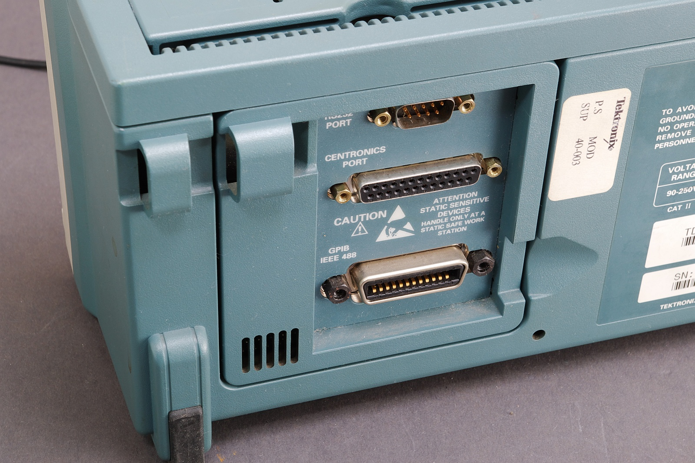

# Communicatie met een meetinstrument

Het hart van ieder experiment wordt gevormd door de _metingen_ die worden uitgevoerd. Meetinstrumenten vervullen daarom een belangrijke rol bij het automatiseren van een experiment. De eerste stap die we zullen zetten tijdens het ontwikkelen van een applicatie is het communiceren met ons meetinstrument. We hebben gekozen voor een Arduino Nano 33 IoT,[@arduino_device] een zeer compact stukje elektronica rondom een ARM-microcontroller. Naast het uitvoeren van analoge spanningsmetingen kan dit model ook analoge spanningen afgeven dat voor ons heel nuttig gaat blijken. We hebben, speciaal voor dit vak, een stukje _firmware_[^firmware] ontwikkeld.[@arduino_visa_firmware]

[^firmware]: Firmware is software die in hardware is geprogrammeerd. Bijvoorbeeld het <q>computerprogramma</q> dat ervoor zorgt dat je magnetron reageert op de knoppen en je eten verwarmd.


## Microcontrollers

Computers &mdash; zoals de meesten van ons die kennen &mdash; zijn zeer krachtig en ontworpen om zo flexibel mogelijk te zijn. Ze draaien games, e-mail of rekenen klimaatmodellen door. Ze komen in veel vormen: desktops, laptops, tablets en <q>telefoons</q>. Ze bevatten daarom veel losse componenten: snelle processor (CPU), veel geheugen (RAM), veel permanente opslag (SSD), complexe interfaces (HDMI, USB) en een besturingssysteem waarmee je verschillende programma's kunt opstarten en de computer kunt beheren. Computers zijn behoorlijk prijzig.

Een microcontroller daarentegen is veel eenvoudiger. Ze zijn ontworpen voor een beperkte en specifieke taak. Ze hebben veel verschijningsvormen &mdash; de meeste onherkenbaar. Je vindt microcontrollers in de vaatwasser, de magnetron, een draadloos toetsenbord en auto's (letterlijk tientallen verspreid over de hele auto). Ze hebben dan een beperkte taak: ze reageren op de knopjes op je dashboard om het klimaat te regelen of een raam te openen en ze sturen de kleppen in een verbrandingsmotor aan. Microcontrollers bevatten CPU, RAM en <q>SSD</q> vaak in één chip en hebben beperkte interfaces (vaak letterlijk losse pinnetjes die je moet verbinden). De CPU is relatief gezien traag en de hoeveelheid geheugen klein. Voor de beperkte taak is dat niet erg. Een besturingssysteem is niet nodig: als je hem aanzet draait hij meteen het enige programma dat ooit ingeladen is (dit heet dan _firmware_). Microcontrollers zijn goedkoop en daarom ook uitermate geschikt voor hobbyprojecten.

Een Arduino is zo'n microcontroller. Vaak wordt een Arduino vergeleken met een Raspberry Pi &mdash; een andere goedkope computer. Maar een Raspberry Pi is écht een computer (en daarmee ook complex). Daarmee is een Raspberry Pi veel veelzijdiger, maar ook duurder en is het complexer om een eenvoudig programma te draaien. Apparatuur zoals frequentiegeneratoren en oscilloscopen hebben vaak een microcontroller ingebouwd, maar soms ook een microcomputer analoog aan een Raspberry Pi. Dat maakt voor ons weinig verschil zolang we maar weten hoe we het instrument kunnen aansturen.


## Communicatieprotocol

Hoe praat je eigenlijk met hardware? Voor fabrikanten zijn er een paar opties:

1. Je maakt gebruik van een al bestaand protocol (een bestaande _standaard_ en je schrijft vervolgens documentatie specifiek voor jouw instrument (bijvoorbeeld de VISA-standaard [@VISA], o.a. gebruikt door _Tektronix_ digitale oscilloscopen [@tektronix])
1. Je schrijft een _proprietary_[^proprietary] protocol en een bijbehorende bibliotheek die software-ontwikke\-laars moeten gebruiken.[^drivers] Voorbeelden zijn instrumenten van _National Instruments_ [@national_instruments] of de _PicoScope_ digitale oscilloscopen[^picoscope] [@picoscope].

[^proprietary]: _Proprietary_ betekent dat een bedrijf of individu exclusieve de rechten heeft over het protocol of de software en anderen geen toegang geeft tot de details.
[^drivers]: Niet zelden zijn dergelijke bibliotheken maar op een paar besturingssystemen beschikbaar als _driver_. Gebruik je MacOS in plaats van Windows en het wordt alleen op Windows ondersteund? Dan kun je je dure meetinstrument dus niet gebruiken totdat je overstapt.
[^picoscope]: Die overigens op vrijwel alle platforms en voor veel programmeertalen bibliotheken leveren.

De VISA-standaard is veelgebruikt, maar helaas komen _proprietary_ protocollen veel voor. Dat is jammer, want in het laatste geval moet je het doen met de software die geleverd wordt door de fabrikant. Als die jouw besturingssysteem of favoriete programmeertaal niet ondersteunt heb je simpelweg pech.

Wij gaan gebruik maken van de VISA-standaard. VISA staat voor _Virtual Instrument Software Architecture_ en is héél breed en definieert protocollen om te communiceren via allerlei verouderde computerpoorten en kabels. Hieronder zie je een voorbeeld van verschillende poorten zoals RS232 en GPIB aan de achterkant van een Tektronix TDS210 oscilloscoop.


Bron: [Wikimedia Commons](https://commons.wikimedia.org/wiki/File:Digitaloszilloskop_Schnittstellen_IMGP1974_WP.jpg).

Maar gelukkig ook via internet en USB, waarvan wij gebruik zullen maken. Onderdeel van VISA is de SCPI standaard [@SCPI], wat staat voor _Standard Commands for Programmable Instruments_. Dit onderdeel definieert een bepaald formaat voor commando's die we naar ons instrument zullen sturen. De lijst met commando's die door de firmware van onze Arduino worden ondersteund is gegeven in de [appendix](firmware.md).


## Eerste stappen

!!! waarschuwing
    Let op dat je de weerstand van 220 Ω gebruikt! Een te grote weerstand zorgt ervoor dat je nauwelijks iets kunt meten, maar een te kleine weerstand zorgt ervoor dat de stroomsterkte door de Arduino te groot wordt. In dat geval zul je de Arduino onherstelbaar beschadigen. De kleurcodes voor weerstanden vind je in de [appendix](kleurcodes.md).

!!! opdracht-basis "Schakeling bouwen"
    Als je geen kant-en-klare schakeling bij je werkplek hebt liggen, druk de Arduino in het breadboard en bouw een schakeling met een LED op de manier die is weergegeven in de figuur hieronder. De weerstand heeft een waarde van 220 &Omega;. De LED heeft aan één zijde een platte kant in de dikkere ring onderaan de plastic behuizing (goed kijken!); schakel die aan de kant van de aarde (de zwarte draad), dus aan de kant van de weerstand en _niet_ aan de kant van de rode draad naar de Arduino. Als de pootjes van de LED niet afgeknipt zijn, dan zit het korte pootje aan de platte zijde van de LED. Het heeft geen zin om naar het plaatje te kijken hoe het er ín de LED uitziet &mdash; dat verschilt per type LED.

    

In de figuur hierboven is een Arduino Nano 33 IoT op een 400-punt breadboard geschakeld met een LED en een weerstand van 220 &Omega;. In een breadboard zijn in iedere rij alle kolommen A t/m E met elkaar verbonden (zo ook kolommen F t/m J). Draadjes die naast elkaar zijn geprikt zijn dus met elkaar verbonden. Zo zie je in de figuur &mdash; als je inzoomt &mdash; dat het rode draadje een verbinding maakt tussen pin A0 van de Arduino en de bovenste pin van de LED. De onderste pin van de LED is verbonden met de weerstand. De kleurcodes voor weerstanden vind je in de [appendix](kleurcodes.md). De kleur van de draden is niet belangrijk. Kies altijd draden met een handige lengte. De platte zijde in de ring van de LED wordt richting aarde geschakeld. De Arduino kan met deze schakeling een variabele spanning aanbrengen over de LED met weerstand, en de spanning meten over alleen de weerstand. 

Het equivalente circuit zoals je dat zou bouwen met twee losse voltmeters is hieronder weergegeven. De cijfers 0, 1 en 2 bij $U_0$, $U_1$ en $U_2$ zijn de _kanalen_ waarmee de Arduino spanningen kan sturen of uitlezen. Dat wordt zometeen belangrijk.

<div id="fig:LED-schakeling"></div>


!!! info
    Om met Python via het VISA-protocol te kunnen communiceren met apparaten hebben we specifieke packages nodig. Die gaan we installeren in een _conda environment_. Voor meer informatie over conda environments zie [Conda environments](software-tools.md#conda-environments).

<div id="opd:condaenv"></div>
!!! opdracht-basis "Environment aanmaken"
    Omdat meerdere studenten gedurende de week achter dezelfde computer werken en environments aan gaan maken kun je het beste je initialen toevoegen aan de naam van je environment. Zo zit niemand elkaar in de weg. In dit voorbeeld gebruiken we <q>IK</q> als initialen. Maak de environment en installeer de juiste packages door een terminal te openen[^terminal] en in te typen (_zonder_ het dollarteken aan het begin):

    ``` ps1 title="Terminal"
    conda create -n pythondaq -c conda-forge python pyvisa-py
    ```
    Om de conda environment daadwerkelijk te gebruiken moet je die altijd eerst _activeren_ met:
    ``` ps1 title="Terminal"
    conda activate pythondaq
    ```

[^terminal]: Start de applicatie `Anaconda Powershell Prompt` of start een terminal binnen Visual Studio Code met het menu \menu{Terminal > New Terminal}.

!!! opdracht-basis "Pyvisa in terminal"
    Sluit de Arduino met de USB-kabel aan op de computer. Om de communicatie met de Arduino te testen maken we gebruik van `pyvisa-shell`. Open een terminal, zorg dat het goede conda environment actief is en type `help`:
    ``` ps1con title="Terminal"
    PS> pyvisa-shell -b py

    Welcome to the VISA shell. Type help or ? to list commands.

    (visa) help

    Documented commands (type help <topic>):
    ========================================
    EOF  attr  close  exit  help  list  open  query  read  termchar  timeout  write

    (visa) help list
    List all connected resources.
    (visa) exit
    ```

!!! info
    We maken hier gebruik van de optie `-b py`, wat staat voor _gebruik backend: python_. Het kan namelijk dat er, naast `pyvisa-py`, ook andere _backends_, of _drivers_, geïnstalleerd staan op het systeem die de VISA-communicatie kunnen verzorgen. Als je bijvoorbeeld LabVIEW geïnstalleerd hebt, dan heb je de drivers van National Instruments. Maar de verschillende backends geven de aangesloten apparaten andere namen. Ook ondersteunen niet alle drivers alle types apparaten en moet je ze apart downloaden en installeren. Daarom maken we liever gebruik van de beschikbare Python drivers.

Om verbinding te maken met onze Arduino gebruik je eerst `list` om te kijken welke apparaten aangesloten zijn en vervolgens `open` om de verbinding te openen. Je kunt makkelijk zien welk apparaat de Arduino is door éérst `list` te gebruiken zónder de Arduino aangesloten en vervolgens nog een keer mét de Arduino aangesloten &mdash; het kan een paar seconden duren voor de Arduino wordt herkend. Het laatst bijgekomen apparaat is dan de Arduino. Een commando sturen en wachten op een antwoord doe je met `query`. Als we de identificatiestring willen uitlezen wordt dit bijvoorbeeld:
``` consolecode
(visa) list
( 0) ASRL3::INSTR
(visa) open 0
ASRL3::INSTR has been opened.
You can talk to the device using "write", "read" or "query".
The default end of message is added to each message.
(open) query *IDN?
Response: ERROR: UNKNOWN COMMAND *IDN?

(open) exit
```

!!! opdracht-basis "Pyvisa error"
    Probeer zelf ook de commando's `list`, `open`, en de `query` uit. Krijg je hetzelfde resultaat?

Niet helemaal wat we hadden gehoopt! Als je goed kijkt in de [documentatie van de firmware](firmware.md) dan zie je dat er bepaalde _terminator characters_ nodig zijn. Dit zijn karakters die gebruikt worden om het einde van een commando te markeren. Het is, zogezegd, een <q>enter</q> aan het eind van een zin. Dit mag je heel letterlijk nemen. Oude printers voor computeruitvoer gebruikten een _carriage return_ (CR) om de wagen met papier (typemachine) of de printerkop weer aan het begin van een regel te plaatsen en een _line feed_ (LF) om het papier een regel verder te schuiven. Nog steeds is het zo dat in tekstbestanden deze karakters gebruikt worden om een nieuwe regel aan te geven. Jammer maar helaas, verschillende besturingssystemen hebben verschillende conventies. Windows gebruikt nog steeds allebei: een combinatie van _carriage return + line feed_ (CRLF). Maar MacOS/Linux/Unix gebruiken enkel een _line feed_ (LF), want hoeveel meer heb je nodig? Af en toe is dat lastig, vooral wanneer er elektronica in het spel is want dan willen de regeleindes voor schrijven en lezen nog wel eens verschillend zijn.[^regeleindes] We gaan nu het gebruik van de karakters instellen:

[^regeleindes]: De regeleindes voor de Arduinofirmware zijn verschillend voor lezen en schrijven. Dit heeft een oninteressante reden: bij het ontvangen van commando's is het makkelijk om alles te lezen totdat je één bepaald karakter (LF) tegenkomt. Bij het schrijven gebruikt de standaard `println`-functie een Windows-stijl regeleinde (CRLF).

``` consolecode
(open) termchar
Termchar read: None write: CRLF
(open) termchar CRLF LF
Done
(open) termchar
Termchar read: CRLF write: LF
(open) query *IDN?
Response: Arduino VISA firmware v1.0.0
```
Omdat de Arduino nu weet wanneer het commando voorbij is (door de LF aan het eind van de <q>zin</q>) krijgen we antwoord! Dat antwoord heeft dan juist weer een CRLF aan het eind dus `pyvisa-shell` weet wanneer het kan stoppen met luisteren en print het antwoord op het scherm. De karakters CRLF en LF _zelf_ blijven onzichtbaar voor ons.

!!! opdracht-basis "Pyvisa regeleindes"
    Stel zelf ook de regeleindes goed in en probeer of je antwoord krijgt van de Arduino. Heeft jouw Arduino de nieuwste firmware?
    Speel eens met de commando's en kijk of je de LED kunt laten branden of een spanning kunt meten. Bijvoorbeeld:
    ``` consolecode
    (open) query OUT:CH0 768
    Response: 768
    (open) query MEAS:CH2?
    Response: 209
    ```
    Wat is de _minimale waarde_ waarbij de LED _net_ licht geeft? Laat de spanning steeds verder oplopen; op een gegeven moment gebeurt er iets raars. Wat is de _maximale waarde_ waarbij de LED zonder problemen kan branden?


## Een eenvoudig script

We hebben via de shell contact gelegd met de hardware. Nu wordt het tijd om, met de documentatie[@pyvisa] in de aanslag, hetzelfde vanuit Python te doen. Als je met een nieuw project begint is het helemaal geen gek idee om een kort script te schrijven waarin je wat dingen uitprobeert. Als alles lijkt te werken kun je het netjes gaan maken en gaan uitbreiden. We beginnen hier met een eenvoudig script en zullen dat daarna gaan verfijnen.

We lopen het voorbeeldscript eerst regel voor regel door en geven het volledige script aan het eind. Allereerst importeren we de `pyvisa`-bibliotheek met
``` py
import pyvisa
```
Binnen pyvisa wordt alles geregeld met behulp van een _Resource Manager_. Die krijgen we met
``` py
rm = pyvisa.ResourceManager("@py")
```
Die kunnen we bijvoorbeeld gebruiken om een lijst van alle beschikbare poorten te krijgen:
``` py
ports = rm.list_resources()

# Bijvoorbeeld: ("ASRL3::INSTR",)
```
Om nu daadwerkelijk verbinding te gaan maken met de Arduino moeten we die _openen_. Daarvoor geven we de poortnaam op en vertellen we meteen wat de instellingen moeten zijn voor de regeleindes bij het lezen (CRLF, `#!py "\r\n"`) en het schrijven (LF, `#!py "\n"`):
``` py
device = rm.open_resource(
    "ASRL3::INSTR", read_termination="\r\n", write_termination="\n"
)
```
Ten slotte sturen we een query naar de Arduino:
``` py
device.query("*IDN?")
```
Het volledige script &mdash; met een paar `#!py print`-statements &mdash; ziet er dan als volgt uit:
``` py
import pyvisa

rm = pyvisa.ResourceManager("@py")
ports = rm.list_resources()
print(ports)

device = rm.open_resource(
    "ASRL3::INSTR", read_termination="\r\n", write_termination="\n"
)
print(device.query("*IDN?"))
```

!!! opdracht-basis "Pyvisa in pythonscript"
    Maak in een geschikte map een bestand :fontawesome-regular-file-code:`test_arduino.py` en kopieer daarin bovenstaande code. Selecteer vervolgens in Visual Studio Code je conda environment zodat je het script ook daadwerkelijk kunt runnen. Hoe je dat doet lees je aan het eind van [Conda environments](software-tools.md#conda-environments). Sluit alle terminals.


Draaien we het script, dan zien we, afhankelijk van het systeem en het aantal apparaten dat verbonden is:
``` consolecode
('ASRL3::INSTR',)
Arduino VISA firmware v1.0.0
```

Het kan zijn dat het script bij jullie crasht met een foutmelding. Krijg je een `#!py PermissionError`? Dan heb je vast nog een terminal openstaan waarin `pyvisa-shell` actief is. Een andere reden kan zijn dat het script probeert een poort te openen die bij jullie een andere naam heeft. Probeer met het lijstje instrumenten te raden welke de Arduino is en pas het script aan totdat het werkt.[^tip-aansluiten]

[^tip-aansluiten]: Tip: als je de Arduino loshaalt en weer aansluit is het de nieuwe regel in het lijstje.

!!! info
    In het vervolg gaan we commando's naar de Arduino sturen waar een variabele spanning in staat. Je kunt dit het makkelijkst doen met f-strings, zoals
    ``` py
    naam = "Alice"
    print(f"Hoi {naam}!")
    ```
    en minder makkelijk met
    ``` py
    naam = "Alice"
    print("Hoi %s!" % naam)
    ```
    Als je (nog) geen idee hebt wat dat inhoudt, lees dan de tutorial _Python 3's f-strings: an improved string formatting syntax_ op Real Python.[@f-strings]


!!! opdracht-basis "LED laten branden"
    Schrijf een script dat de spanning over de LED laat oplopen van nul tot de maximale waarde. Wat gebeurt er als je de spanning laat oplopen tot twee keer die maximale waarde?


<div id="opd:knipperled"></div>
!!! opdracht-basis "KnipperLED"
    Je kunt de LED ook andere dingen laten doen. Schrijf voor iedere opdracht een apart script.

    1. Laat de LED in een regelmatig tempo knipperen.
    1. Maak een _breathing light_ &mdash; een lamp die langzaam aan en uit gaat gevolgd door een pauze in het tempo dat iemand in- en uitademt.
    1. Maak een _heartbeat light_ &mdash; een lamp die twee keer kort na elkaar flitst gevolgd door een pauze in het tempo van een hartslag.


## Analoog-digitaalconversie (ADC)

We hebben tot nu toe gewerkt met getallen van 0-1023 sturen en ontvangen. Wat is precies de betekenis van deze getallen? Daarvoor moeten we dieper ingaan op hoe de Arduino &mdash; en computers in het algemeen &mdash; getallen omzet in een spanning en hoe spanningen door de Arduino worden gemeten.

Een _analoog_ signaal is continu in zowel de tijd als de waardes die het signaal aan kan nemen. Een _digitaal_ signaal is echter discreet: op vaste tijdstippen is er een waarde bekend en het signaal kan maar een beperkt aantal verschillende waardes aannemen. Een vallende bal is een continu proces. De bal heeft op elk willekeurig moment een positie. Je zou de positie kunnen meten op het tijdstip $t$ = 2.0 s, maar ook op $t$ = 2.1, 2.01, 2.001 of 2.0001 s. Ook kun je de positie net zo nauwkeurig bepalen als je wilt.[^nauwkeurigheid] De natuur is analoog,[^analoog] maar moderne computers zijn digitaal en dus discreet. Als je een foto op je computer te ver inzoomt zie je blokjes. Je kunt verder inzoomen, maar je gaat niet meer detail zien. De hoeveelheid informatie is beperkt.

[^nauwkeurigheid]: Uiteraard afhankelijk van de nauwkeurigheid van je meetinstrument.
[^analoog]: Totdat je het domein van de kwantummechanica betreedt, dan blijkt de natuur ook een discrete kant te hebben.

_Bemonsteren_ of _sampling_ is het proces waarbij een analoog signaal wordt <q>uitgelezen</q> en wordt omgezet in een digitaal signaal. Zo wordt een audiosignaal al sinds eind jaren '70 van de vorige eeuw gewoonlijk bemonsterd met een frequentie van 44.1 kHz en een resolutie van 16 bits. Dus 44100 keer per seconde wordt er gekeken wat de waarde van het geluidssignaal is en dat wordt opgeslagen als een getal van 16 bits en kan dus $2^{16} = 65536$ verschillende waardes aannemen. Dit is nauwkeuriger dan het menselijk gehoor kan onderscheiden.

De conversie van een analoog signaal naar een digitaal signaal (en andersom!) is de reden dat de spanningen die we kiezen en de metingen die we doen niet alle mogelijke waardes kunnen aannemen, maar <q>stapjes</q> maken.


De omzetting van een analoog signaal naar een digitaal signaal gebeurt als volgt. De ADC (_analog-to-digital converter_) _in dit voorbeeld_ ondersteunt 16 niveau's (4-bits) in een bereik van 0 V tot 3.3 V (groen gearceerd). Lagere of hogere spanningen kunnen niet gemeten worden (rood gearceerd). Op gezette tijden wordt een meting gedaan (rode punten) waarbij de uitkomst van de meting het discrete niveau is dat het dichtst bij de analoge waarde ligt. Als het signaal te groot wordt kan de ADC als het ware <q>vastlopen</q> op het hoogste niveau. In de rechterflank is waar te nemen dat als het analoge signaal langzaam verandert dat het digitale signaal duidelijk sprongsgewijs verandert. Hoe meer niveau's een ADC heeft en hoe vaker het signaal bemonsterd kan worden, hoe nauwkeuriger het digitale signaal het analoge signaal benadert.


De digitale metingen die je programma krijgt van de ADC is hierboven weergegeven. De onzekerheid is gelijk aan de halve afstand tot het volgende niveau. In lichtgrijs zie je het oorspronkelijke analoge signaal. De meting benadert het signaal dus maar gedeeltelijk. De Arduino die we gebruiken heeft een bereik van 0 V tot 3.3 V en &mdash; in tegenstelling tot het voorbeeld hierboven &mdash; een resolutie van 10 bits, dus $2^{10} = 1024$ stapjes. Als je een experiment ontwerpt is het dus van belang te weten dat je nooit kunt meten met een nauwkeurigheid kleiner dan de stapgrootte. Voor ons is deze resolutie prima.

!!! opdracht-basis "Volt naar ADC"
    We kunnen alleen maar de getallen 0 t/m 1023 naar de Arduino sturen. Ook krijgen we alleen maar dat bereik terug.

    1. Schrijf de formule op waarmee je een spanning in V omrekent naar een ruwe ADC waarde, én omgekeerd.
    1. Wat is precies het kleinste spanningsverschil dat we nog kunnen meten in V? Een meting kan dus nooit nauwkeuriger gedaan worden dan deze waarde.
    1. Bereken welke spanning hoort bij een ruwe waarde van 700.
    1. Bereken welke waarde we naar de Arduino moeten sturen als we een spanning willen instellen van 2.0 V. En een spanning van 2.28 V?

### Binair Talstelsel
??? meer-leren "Meer leren"
    Wij schrijven onze getallen op in een _decimaal_ (tientallig) talstelsel. We hebben tien verschillende cijfers (0 t/m 9) en plakken bij grotere getallen de tientallen, honderdtallen, etc. aan elkaar. Computers werken met _binaire_ getallen &mdash; een tweetallig talstelsel. Dat betekent dat computers het getal 0 en 1 zonder problemen kunnen opslaan, maar bij het getal 2 wordt het al lastig. Zij moeten dan al met <q>tientallen</q> werken en schrijven het getal 2 op als 10. Het getal 3 is dan 11. Voor 4 zijn de cijfers alweer op en moeten we overschakelen naar <q>honderdtallen</q>, dus 4 is 100, 5 is 101, enz. Zie onderstaande tabel voor nog een paar voorbeelden. De cijfers noem je _bits_ en het getal 5 (101 binair) bestaat dus uit 3 bits. Als je maar 3 bits tot je beschikking hebt kun je $2^3 = 8$ verschillende getallen opslaan, dus 0 t/m 7. Een groepje van 8 bits (256 mogelijkheden) bleek een handige hoeveelheid en kun je op computers individueel opslaan. Zo'n groepje noem je een _byte_. Bestanden bestaan uit bytes, kilobytes (duizend bytes), megabytes (miljoen bytes) of gigabytes (miljard bytes). Wanneer je een signaal nauwkeurig wilt verwerken met een computer dan is het belangrijk om zoveel mogelijk bits tot je beschikking te hebben. Hoe meer bits, hoe meer verschillende waardes je kunt opslaan en hoe nauwkeuriger je signaal wordt bewaard.

    Voorbeelden van het binair talstelsel:

    | decimaal getal | binair getal |
    |----------------|--------------|
    | 0              | 0            |
    | 1              | 1            |
    | 2              | 10           |
    | 3              | 11           |
    | 4              | 100          |
    | 5              | 101          |
    | 6              | 110          |
    | 7              | 111          |
    | 8              | 1000         |
    | 9              | 1001         |
    | &hellip;       | &hellip;     |
    | 205            | 11001101     |


## De I,U-karakteristiek van een LED

Je hebt op de middelbare school ongetwijfeld de $I,U$-karakteristiek van een ohmse weerstand onderzocht. Je neemt een <q>gewone</q> weerstand en zet daar een steeds hogere spanning op. Je meet de stroomsterkte en ook die neemt toe &mdash; rechtevenredig zelfs! Door $I$ tegen $U$ uit te zetten in een grafiek en de beste lijn door je metingen te trekken vind je met de richtingscoëfficiënt de inverse van de weerstand $R^{-1}$:


Een LED is een lichtgevende diode &mdash; en een diode gedraagt zich _heel_ anders. Met de schakeling die we hebben gebouwd kunnen we de $I,U$-karakteristiek van een LED bepalen. Voor meer informatie over de fysica achter diodes, zie de [appendix](diodes.md).

!!! opdracht-inlever "Pythondaq: start script"
    Voer de volgende opdrachten uit:

    1. Schrijf een script waarin je de spanning over de LED laat oplopen van nul tot de maximale waarde. Kijk wat er gebeurt met de LED.
    1. Overleg met elkaar welke spanningen je precies meet met de verschillende kanalen (_channels_) die op de Arduino zijn aangesloten. Kijk nog eens goed naar [de figuur van de schakeling](#fig:LED-schakeling).
    1. Lees &mdash; tijdens het laten oplopen van de spanning over de LED &mdash; de spanning over de _weerstand_ uit. Je zult daarvoor het antwoord van de Arduino (een _string_) om moeten zetten naar een _integer_ en print steeds een regel met: ruwe waarde spanning op LED, voltage op LED, ruwe waarde spanning over weerstand, voltage weerstand. Voorbeeld van uitvoer:
    ``` consolecode
    On LED:  750 (2.4 V)    Over resistor:  189 (0.6 V)
    ```
    Je hebt nu feitelijk je eerste metingen verricht!


Je kunt de meetgegevens kopiëren en plakken naar een tekstbestand, spreadsheetprogramma of Python notebook o.i.d. Maar dat is wel veel werk, zeker als je metingen wilt herhalen. Op dit moment hebben we ook alleen nog maar _ruwe_ metingen. We gaan hier voorbij aan het feit dat we graag de stroomsterkte door de LED $I$ zouden willen uitzetten tegen de spanning over de LED $U_\mathrm{LED}$.

!!! info
    In de volgende opdracht gaan we een grafiek maken. Installeer Matplotlib in je conda environment (zorg dat die geactiveerd is!):
    ``` ps1 title="Terminal"
    conda install -c conda-forge matplotlib
    ```

<div id="opd:quickndirty-meting"></div>
!!! opdracht-inlever "Pythondaq: Quick 'n dirty meting"
    Bereken in je script de spanning _over_ en de stroomsterkte _door_ de LED en bewaar deze metingen in, bijvoorbeeld, een lijst. Sluit je meting netjes af (zorg dat de LED niet blijft branden) en maak dan een grafiek van je metingen. Bekijk elkaars resultaten &mdash; ook van andere groepjes &mdash; en denk na of je meting fysisch helemaal correct is.


## Bewaren van meetgegevens

Het is fijn dat je script de meetgegevens op het scherm kan printen en een grafiek maakt, maar als je echt bezig bent met een onderzoek is een grafiek niet genoeg. Je wilt dat de data bewaard blijft zodat je die later nog kunt gebruiken voor nieuwe analyses. Ook is het zo dat data steeds vaker beschikbaar moet zijn voor andere wetenschappers die jouw onderzoek willen controleren. Steeds meer wetenschappelijke tijdschriften vragen auteurs niet alleen hun grafieken, maar ook hun onderliggende data beschikbaar te maken en te publiceren. Op die manier is het veel moeilijker om fraude te plegen; iets dat in de wetenschap helaas soms nog voor komt.

Er zijn ontzettend veel verschillende bestandsformaten waarin je data kunt bewaren. Er zijn grofweg twee categoriën: tekstbestanden en binaire bestanden. De eerste zijn te lezen met ieder willekeurig programma. Sommige zijn heel eenvoudig (b.v. CSV), andere kunnen complexe datastructuren en extra informatie opslaan (b.v. JSON, XML). Binaire bestanden bevatten alle mogelijke karakters &mdash; niet alleen letters, cijfers, leestekens, maar ook _stuurcodes_ zoals _carriage return_ en de _line feed_, oorspronkelijk opdrachten voor bijvoorbeeld printers. Ze hebben vaak een strak formaat: zoveel bytes voor dit stukje informatie, zoveel bytes voor dat stukje, enzovoort. Met binaire karakters hoef je je dus niet te beperken tot letters, cijfers en leestekens en kunnen de bestanden wat kleiner zijn. Ook zorgen de vaste afspraken ervoor dat de lees- en schrijfroutines eenvoudiger kunnen zijn. Getallen worden in het interne geheugen van de computers ook binair opgeslagen dus het is vaak copy/paste vanuit of naar het bestand. Wel leiden kleine fouten vaak tot onbruikbare bestanden. Voor grote databestanden wordt vrijwel altijd gekozen voor een binair formaat, of het nou gaat om audio/video, databases of klimaatmodellen. Het uitwisselen van kleinere bestanden gebeurt echter vaak in een tekstformaat.


### Comma-separated values (CSV)

Het CSV-bestand is het werkpaard van de wetenschap. Als je data van het ene in het andere programma moet krijgen of je download wetenschappelijke gegevens van een website dan is het CSV-bestand vaak de beste keuze. Het formaat bestaat uit kolommen met getallen, gescheiden door een komma. De eerste regels kunnen commentaar bevatten (uitleg over de kolommen, bijvoorbeeld) en de namen van de kolommen bevatten. Een voorbeeld voor de afstand die een vallend voorwerp aflegt in 10 s, gegeven door $s = \frac{1}{2} g t^2$, is hieronder weergegeven:

```
t,s
0.0,0.0
1.0,4.9
2.0,19.6
3.0,44.1
4.0,78.4
5.0,122.50000000000001
6.0,176.4
7.0,240.10000000000002
8.0,313.6
9.0,396.90000000000003
10.0,490.00000000000006
```

Het CSV-bestand heeft kolommen $t$ en $s$. De getallen hebben een punt als decimaal scheidingsteken en de komma wordt gebruikt om de kolommen te scheiden. Je kunt CSV-bestanden schrijven en lezen met de modules `#!py csv`, `#!py numpy` of `#!py pandas`. De eerste is altijd meegeleverd met Python en is speciaal geschreven voor het bestandsformaat,[@csv-module] maar NumPy[@numpy;@numpy-paper] en Pandas [@pandas;@pandas-paper] bevatten veel meer functionaliteit op het gebied van wiskunde en data-analyse. Als je die modules toch al gebruikt kun je beter niet kiezen voor de <q>kale</q> csv module.


<div id="opd:quickndirty-csv"></div>
!!! opdracht-inlever "Pythondaq: CSV"
    Breid je script uit zodat de data niet alleen maar weergegeven wordt in een grafiek maar ook wordt weggeschreven als CSV-bestand. Gebruik hiervoor een module naar keuze.


??? opdracht-meer "CSV bestandsnaam"
    Pas de code zodanig aan dat een CSV-bestand nooit wordt overschreven. Je kunt bijvoorbeeld aan de bestandsnaam een oplopend getal toevoegen (`data-001.csv`, `data-002.csv`, etc.).


### HDF5, PyTables
??? meer-leren "Meer leren"
    Een populair binair formaat in de wetenschappelijke wereld is HDF5.[^HDF5] [@hdf5] Je kunt hiermee verschillende datasets bewaren in één bestand. Je kunt een soort boomstructuur aanbrengen en zo verschillende datasets groeperen en er ook nog extra informatie (metadata) aanhangen zoals datum van de meting, beschrijving van de condities, etc. Je kunt een meetserie opslaan als reeks die in één keer in en uit het bestand wordt geladen maar ook als tabel. Die laatste biedt de mogelijkheid om &mdash; net als in een database &mdash; data te selecteren en alleen die data in te laden uit het bestand. Op die manier is het mogelijk om met datasets te werken die groter zijn dan het geheugen van je computer.

    [^HDF5]: Hierarchical Data Format Version 5.

    PyTables[@pytables] is een Python bibliotheek die het werken met HDF5-bestanden makkelijker maakt. Er zijn uiteraard functies om de bestanden aan te maken en uit te lezen maar ook om _queries_ uit te voeren. Pandas kan &mdash; via PyTables &mdash; ook werken met HDF5-bestanden.

    !!! opdracht-meer "PyTables"
        Lees de tutorial van PyTables[@pytables] en pas je script aan zodat de meetserie van de LED wordt opgeslagen in een HDF5-bestand. Gebruik één bestand en maak daarin een nieuwe dataset voor iedere meetserie. Bewaar ook wat metadata (bijvoorbeeld tijdstip van de meting). Iedere keer dat je je script runt wordt er aan _hetzelfde_ databestand een nieuwe dataset toegevoegd.
