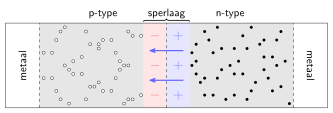

# De diode: een p-n-overgang

In het introductie-experiment meten we de $I,U$-karakteristiek van een LED, een lichtgevende diode. In dit hoofdstuk gaan we iets dieper in op het aspect _diode_.

Uiteindelijk is een diode een eenrichtingsweg voor stroom. Dat wil zeggen: er kan maar in één richting stroom door de diode lopen. De diode heeft een lage weerstand, maar als de polariteit wordt omgedraaid dan is de weerstand plots zeer groot en loopt er nauwelijks stroom. Diodes kunnen bijvoorbeeld gebruikt worden als _gelijkrichter_ waarbij een wisselspanning met een stelsel diodes wordt omgezet in een gelijkspanning. Ook zijn er dus diodes die licht geven. Het fysisch principe achter een diode zorgt ervoor dat er, in sommige gevallen, zeer energiezuinig licht geproduceerd kan worden.

## Halfgeleiders

Metalen zijn _geleiders_. Ze hebben in de buitenste schil één of enkele valentie-elektronen die vrij kunnen bewegen in het kristalrooster. Een potentiaalverschil (veroorzaakt door bijvoorbeeld een batterij) zorgt voor een stroom van elektronen. Bij een _isolator_ zitten alle elektronen vast in het rooster. Bij een _halfgeleider_ is dat eigenlijk ook zo &mdash; de valentie-elektronen zijn nodig voor de bindingen tussen de atomen &mdash; maar door trillingen in het rooster is het relatief eenvoudig om af en toe een _elektron-gat-paar_ te creëren: een elektron ontsnapt en kan door het kristalrooster bewegen, maar de achtergebleven atomen missen nu een bindingselektron (het _gat_). Naburige elektronen kunnen heel eenvoudig in dit gat springen, maar laten dan weer een gat achter. Op deze manier kunnen gaten _ook_ vrij door het rooster reizen. Een gat heeft effectief een _positieve lading_.

## p-type en n-type halfgeleiders

Halfgeleiders kunnen _gedoteerd_ worden met andere stoffen. Feitelijk worden onzuiverheden in het kristalrooster ingebracht. Als je elementen uit de stikstofgroep (vijf valentie-elektronen) toevoegt aan de halfgeleider silicium (vier valentie-elektronen) dan worden de vreemde atomen in het kristalrooster gedwongen tot het aangaan van vier covalente bindingen met naburige siliciumatomen. Hierdoor blijft een elektron over. Dit elektron kan vrij door het rooster bewegen en op deze manier zijn er dus veel extra vrije elektronen aan het materiaal toegevoegd. Dit is een _n-type_ halfgeleider omdat de ladingsdragers negatief geladen zijn.

Op eenzelfde manier kunnen elementen uit de boorgroep (drie valentie-elektronen) worden toegevoegd aan silicium. Het is alleen niet mogelijk om vier covalente bindingen aan te gaan en er ontstaat plaatselijk een gat, een positieve ladingsdrager. Dit wordt dus een _p-type_ halfgeleider genoemd. Hoewel gaten zich vrij door het rooster kunnen bewegen gaat dit wel trager dan bij elektronen.

Merk op dat hoewel n-type en p-type halfgeleiders beschikken over respectievelijk negatieve en positieve ladingsdragers ze als geheel neutraal zijn. De onzuiverheden in het rooster blijven wel achter als ion als er geen vrije ladingsdrager in de buurt is. Immers, stikstof is neutraal met vijf valentie-elektronen dus als het vijfde elektron vrij door het rooster is gaan bewegen blijft een positief ion achter. Een booratoom blijft achter als een negatief ion als het gat vertrokken is (en een extra elektron de binding heeft opgevuld).

## p-n-overgangen

Wanneer een p-type en een n-type halfgeleider elektrisch contact maken[^halfgeleiders] dan kunnen de elektronen en de gaten elkaar in het midden tegenkomen. Immers, door diffusie verplaatsen de elektronen en gaten zich willekeurig door het materiaal.

 [^halfgeleiders]: In de praktijk worden er geen twee losse halfgeleiders aan elkaar verbonden maar wordt een enkel siliciumkristal zeer selectief plaatselijk verontreinigd: de ene helft om een p-type te maken, de andere helft om een n-type te maken.

Elektronen (zwart) en gaten (wit) zijn de vrije ladingsdragers in respectievelijk n-type en p-type halfgeleiders. Wanneer beide typen elektrisch contact maken kunnen elektronen en gaten de grenslaag oversteken en _recombineren_.

Het extra elektron kan een tekort aanvullen en alle naburige atomen kunnen zo vier covalente bindingen aangaan. Het elektron en het gat heffen elkaar dus op _recombinatie_. Dit is energetisch voordelig, maar er ontstaat in het midden een _sperlaag_[^depletion] waar geen vrije ladingsdragers meer aanwezig zijn. Dit betekent echter wel dat de onzuiverheden (ionen!) ervoor zorgen dat het materiaal niet langer neutraal is, maar elektrisch geladen. Waar de elektronen verdwenen zijn blijven positieve ionen achter en omgekeerd voor de gaten. Er ontstaat zo een elektrisch veld dat de elektronen en gaten tegenhoudt. Buiten de sperlaag is er geen elektrisch veld, net als bij een condensator.[^veld] Elektronen en gaten kunnen niet langer de sperlaag oversteken.

[^depletion]: Engels: _depletion zone_.
[^veld]: Zie o.a. Giancoli[@Giancoli] voor een beschrijving van het veld van twee vlakke en tegengesteld geladen schijven.

Na recombinatie van elektronen (zwart) en gaten (wit) ontstaat er een _sperlaag_ waar geen vrije ladingsdragers meer aanwezig zijn. De gedoteerde atomen vormen ionen in het rooster en er onstaat een postief geladen gebied en een negatief geladen gebied. Buiten de sperlaag is geen veld aanwezig, net als bij een condensator. Het resulterende elektrisch veld remt eerst en stopt uiteindelijk de diffusie van de elektronen en gaten. Er ontstaat een evenwicht waarbij vrije ladingsdragers de grenslaag niet meer kunnen oversteken.

### Sperrichting

Wanneer een diode wordt verbonden met een elektrisch circuit is de richting van het potentiaalverschil van belang. Wanneer het p-type halfgeleider verbonden wordt met de negatieve pool en het n-type met de positieve pool dan ontstaat er een elektrisch veld in de zelfde richting als dat van de sperlaag. Hierdoor wordt het veld sterker en zullen vrije ladingsdragers de sperlaag _zeker_ niet kunnen oversteken. De diode staat in sperrichting en er zal nauwelijks[^roostertrillingen] stroom lopen. Een andere manier om dit in te zien is dat de gaten naar de negatieve pool worden getrokken en het gebied rond de sperlaag verlaten. Daar blijven nu dus _nog meer_ negatieve ionen achter; de sperlaag wordt dikker. Idem aan de andere zijde van de sperlaag.

[^roostertrillingen]: Bedenk dat in een niet-gedoteerde halfgeleider door roostertrillingen elektron-gat-paren worden gevormd waardoor de halfgeleider een beetje geleidt. Dit gebeurt óók in een gedoteerde halfgeleider. In n-type komen dus ook (weinig) gaten voor, en in p-type ook (weinig) elektronen. Deze kunnen de sperlaag _wel_ oversteken en er zal dus toch een zeer kleine stroom kunnen lopen.

### Doorlaatrichting

Wanneer we de polariteit omdraaien en de p-typezijde verbinden aan de _positieve_ pool en de n-typezijde aan de _negatieve_ pool dan ontstaat er een elektrisch veld van p-type naar n-type, tegengesteld aan het sperveld. Wanneer het potentiaalverschil op de diode &mdash; ten gevolge van een externe spanningsbron &mdash; lager is dan het potentiaalverschil over de sperlaag, dan zal er nog steeds geen stroom kunnen lopen. De sperlaag wordt echter wel dunner. Wanneer het externe potentiaalverschil groter is, dan keert het _netto_ elektrisch veld in de sperlaag om en kunnen gaten en elektronen de grenslaag oversteken. Er loopt een stroom, maar wel anders dan in een geleider. De gaten en elektronen recombineren in het gebied van de grenslaag, terwijl er aan de metaal/halfgeleider grenzen nieuwe elektron-gatparen worden gevormd. Er stromen aan de zijde van de n-type halfgeleider dus continu elektronen vanuit het metaal naar de grenslaag en aan de zijde van de p-type halfgeleider stromen continu gaten van het metaal naar de grenslaag. Aan de grenslaag metaal/p-type halfgeleider verlaten elektronen de halfgeleider (en zo ontstaan de gaten). Voor de vrije ladingsdragers is de weerstand in de halfgeleider vrij laag waardoor de stroomsterkte flink kan oplopen. Een diode geleidt dus in de doorlaatrichting, maar pas boven een minimale _doorlaatspanning_.

### Lichtgevende diode

Wanneer een elektron en een gat elkaar tegenkomen is het energetisch gunstiger om te recombineren. Het elektron bindt zich aan de atomen in het rooster. Hierbij komt dus energie vrij. Meestal is dit in de vorm van roostertrillingen (warmte). Wanneer de materialen goed gekozen worden is het mogelijk om het energieverlies niet dominant via roostertrillingen te laten verlopen, maar via emissie van licht. Bij een doorzichtige halfgeleider kan het licht de grenslaag verlaten en uitgestraald worden. De LEDs die wij gebruiken bestaan uit een heel klein stukje halfgeleidermateriaal in een kegelvormige reflector om het licht naar boven te richten. Het geheel is ter bescherming in kunststof gegoten en de bolvorm zorgt voor een lenseffect om zoveel mogelijk licht in één richting uit te stralen.

### De _I,U_-karakteristiek van een diode

Shockley, één van de uitvinders van de transistor, ontwikkelde een model voor p-n-overgangen. Volgens dat model[@Shockley] wordt de stroomsterkte gegeven door

\begin{equation}
  I = I_\mathrm{S} \left(e^\frac{V_\mathrm{D}}{nV_\mathrm{T}} - 1 \right),
\end{equation}
met $I$ de diodestroom, $I_\mathrm{S}$ de diodelekstroom, $V_\mathrm{D}$ de spanning over de diode, $n$ de _kwaliteitsfactor_ van de diode en $V_\mathrm{T}$ de _thermal voltage_ gegeven door
\begin{equation}
  V_\mathrm{T} = \frac{kT}{q},
\end{equation}
met $k$ de constante van Boltzmann, $T$ de temperatuur van het materiaal en $q$ de elementaire lading. De diodelekstroom is de stroomsterkte ten gevolge van de minderheidsladingsdragers[^minority] &mdash; het kleine aantal vrije elektronen in p-type halfgeleider en het kleine aantal gaten in n-type halfgeleider.

[^minority]: Engels: _minority charge carriers._ 

De stroom door een diode ten gevolge van de spanning over de diode.