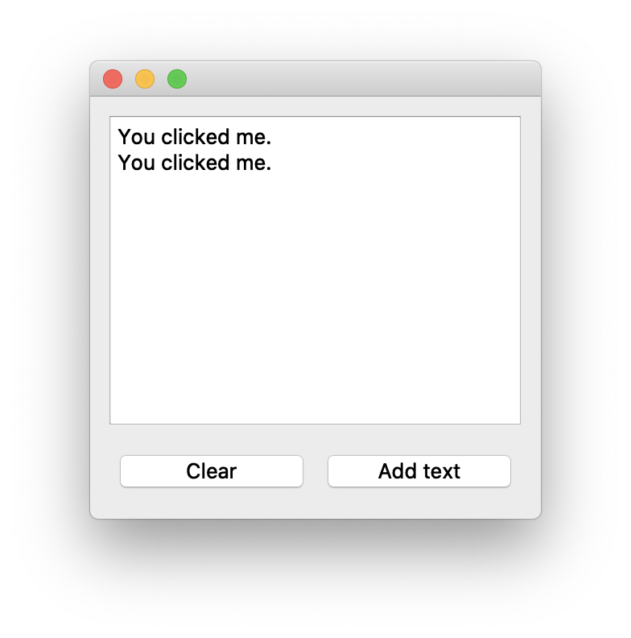
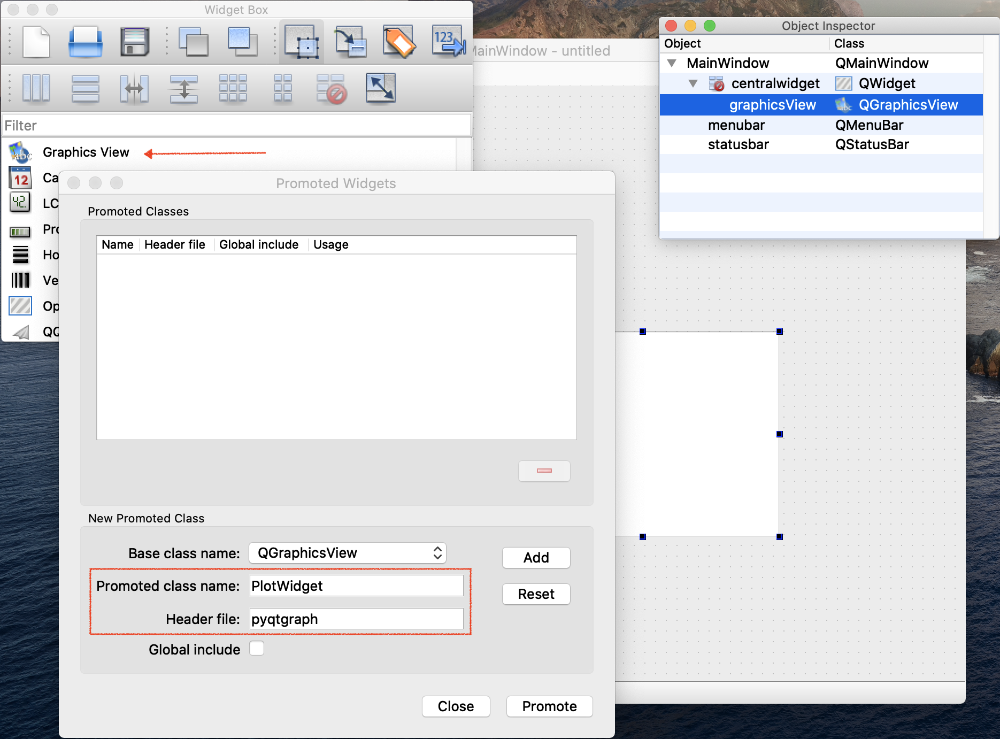

# Graphical user interfaces

## Grafische interfaces met PySide

Als je een grafische applicatie schrijft roep je functies aan van het besturingssysteem om vensters, knoppen, menu's e.d. te laten tekenen en te reageren op muisklikken en het toetsenbord. Het lastige daaraan is dat een applicatie voor MacOS heel anders geschreven moet worden dan één voor Linux of Windows. Om die reden zijn er verschillende _cross-platform_ bibliotheken ontwikkeld die als het ware tussen het besturingssysteem en je applicatie komen te staan. Je kunt dezelfde applicatie maken voor alle besturingssystemen en de bibliotheek kiest welke functies aangeroepen moeten worden om een venster te tekenen. Het voordeel is duidelijk: je hoeft maar één applicatie te schrijven die overal werkt. Het nadeel is dat je niet écht gebruik kunt maken van alle functies en opties die het besturingssysteem biedt. Hier kiezen we voor de voordelen en gaan we gebruik maken van misschien wel de meest populaire optie: Qt.[^uitspraak-Qt] De bibliotheek `PySide6` is de officiële Pythonbibliotheek.

[^uitspraak-Qt]: Uitspraak: het Engelse _cute_.
<div id="info:test-qt"></div>
!!! info
    Maak voor de oefeningen een nieuw conda environment `test-qt` met:
    ``` ps1 title="Terminal"
    conda create --name test-qt python=3.12
    conda activate test-qt
    pip install pyside6 pyqtgraph
    ```
    Selecteer het nieuwe `test-qt` conda environment in Visual Studio Code en sluit alle <q>oude</q> terminals met het {{trash}} -icoon.[^kill-terminals]

 [^kill-terminals]: Of in één keer met **View > Command Palette > Terminal: Kill All Terminals**

Een minimale Qt-applicatie ziet er als volgt uit:
<div id="code:minimal"></div>

``` py linenums="1"
import sys

from PySide6 import QtWidgets


class UserInterface(QtWidgets.QMainWindow):
    pass


def main():
    app = QtWidgets.QApplication(sys.argv)
    ui = UserInterface()
    ui.show()
    sys.exit(app.exec())


if __name__ == "__main__":
    main()  
```
Eerst importeren we een paar bibliotheken. Het draait uiteindelijk om de `#!py UserInterface` class. De naam mag je zelf kiezen, zolang je maar aangeeft dat de class een subclass is van `#!py QtWidgets.QMainWindow`, het hoofdvenster van je applicatie (voor meer informatie zie [paragraaf subclasses](classes.md#subclasses)). In het hoofdgedeelte van het programma (gedefinieerd in de functie `#!py main()`) maak je eerst een instance van `#!py QtWidgets.QApplication`.[^sys-argv-Qt] Ook maken we een instance van onze eigen class en we roepen de `#!py show()` method aan. Die hebben we niet zelf geprogrammeerd; die zit in de parent class `#!py QMainWindow`. Als laatste roepen we de `#!py exec()` method aan van onze `#!py QApplication` en de uitvoer daarvan (een _exit code_) geven we mee aan de functie `#!py sys.exit()`. Dat betekent dat als het programma afsluit met een foutmelding, dat een foutcode wordt meegegeven aan het besturingssysteem. Iemand anders die een script schrijft kan die code afvangen en daar iets mee doen.

[^sys-argv-Qt]: Die kun je eventuele command-line arguments meegeven die door Python in `#!py sys.argv` bewaard worden. Meestal zijn die leeg, maar we geven ze gewoon door aan Qt.

Een aantal elementen uit dit programma (`#!py sys.argv`, `#!py sys.exit()`) zijn strikt genomen niet noodzakelijk, maar wel _good practice_. Ook het schrijven van een `#!py main()` functie is niet strikt noodzakelijk, maar het maakt het wel makkelijk om straks een zogeheten _entry point_ te hebben als we weer een applicatie willen schrijven. In de {{file}}`pyproject.toml` geven we dan aan dat we de `#!py main()` functie willen aanroepen. Dat komt later.

<div id="opd:minimal-gui"></div>
!!! opdracht-basis-thuis "Minimale GUI"
    === "opdracht"

        <div class="grid-tree" markdown>
            <div>
            Je gaat de gegeven Python code voor een een minimale GUI testen. In de map {{folder}}`ECPC` maak je een {{new_file}}`example-gui.py` aan en zet daarin de Python code. Je activeert de `test-qt` conda environment {{lightbulb}} en runt het bestand {{new_file}}`example-gui.py`. Er verschijnt een leeg venster in beeld met als venstertitel `python` en drie knoppen. Een streepje (minimize), een vierkant (maximize) en een kruis (close). Je drukt op het kruisje en het venster sluit. 
            </div>
            <div>
            {{folder}} `ECPC`  
            {{T}} {{github}} `pythondaq`  
            {{T}} {{github}} `oefenopdrachten`    
            {{tab}} {{T}} {{new_file}} `example-gui.py`  
            {{tab}} {{L}} {{dots}}  
            {{L}} {{dots}}  
            </div>
        </div>

    === "code"
        **Pseudo-code**
        ``` py
        import sys

        from PySide6 import QtWidgets

        # create subclass of QtWidgets.QMainWindow

        def main():
            # create instance of QtWidgets.QApplication with arguments from sys.argv
            # create instance of subclass
            # call show method of subclass
            # get exit code with exec method of QApplication instance and give exit code to sys.exit()

        # when run this script:
            # run main function  
        ```        
    === "check"
        **Checkpunten:**

        - [ ] Het juiste conda environment is geactiveerd
        - [ ] De code is volledig overgenomen
        - [ ] Er verschijnt een leeg venster

        **Projecttraject:**

        - [x] Minimale GUI
        - [ ] Parent class initialiseren
        - [ ] Central widget toevoegen    
        - [ ] textbox toevoegen
        - [ ] knoppen toevoegen
        - [ ] Slots en signals toevoegen
        - [ ] 'Hello world' en Quit knoppen toevoegen
    

Elke keer als je een nieuwe Qt applicatie gaat schrijven kun je bovenstaand stukje code copy/pasten. Als we dit programma draaien hebben we echter een klein leeg venster op het scherm, zonder elementen. Die elementen kunnen we op twee manieren toevoegen: door ze te programmeren of door het gebruik van een visueel ontwerp met Qt Designer. Beide zullen in de volgende secties toegelicht worden.


### De interface programmeren

We gaan de eenvoudige interface programmeren die hieronder is weergegeven:

<div id="fig:screenshot-ui-prog"></div>
{: style="width:75%"}

We doen dat door de class `#!py UserInterface` uit te breiden met widgets uit de `#!py QtWidgets` bibliotheek.

Het definiëren van layouts gebeurt in veruit de meeste opmaaksystemen met rechthoeken (_Engels: boxes_) die op verschillende manieren gestapeld worden &mdash; naast elkaar, boven elkaar, of op een rechthoekig grid bijvoorbeeld. Zulke systemen zijn ook _hiërarchisch_: je stopt boxes in andere boxes.

De layout van bovenstaande screenshot is als volgt opgebouwd. Het hoofdelement van de grafische interface is de `central widget`:

<div id="fig:layout-centerwidget"></div>
{: style="width:40%"}

De `central widget` krijgt een verticale layout die we `vbox` noemen:

<div id="fig:layout-vbox"></div>
{: style="width:40%"}

In de verticale layout plaatsen we een `textbox` en een horizontale layout die we `hbox` noemen:

<div id="fig:layout-text-hbox"></div>
{: style="width:40%"}

In de horizontale layout plaatsen we twee `button`s:

<div id="fig:layout-buttons"></div>
{: style="width:40%"}

Het stuk programma om bovenstaande layout op te bouwen geven we hieronder weer. We bespreken straks de code regel voor regel.
<div id="code:layout"></div>

``` py linenums="4" hl_lines="1"
from PySide6.QtCore import Slot


class UserInterface(QtWidgets.QMainWindow):
    def __init__(self):
        # roep de __init__() aan van de parent class
        super().__init__()

        # elk QMainWindow moet een central widget hebben
        # hierbinnen maak je een layout en hang je andere widgets
        central_widget = QtWidgets.QWidget()
        self.setCentralWidget(central_widget)

        # geef de central widget een verticale layout
        vbox = QtWidgets.QVBoxLayout()
        central_widget.setLayout(vbox)

        # voeg geneste layouts en widgets toe
        self.textedit = QtWidgets.QTextEdit()
        vbox.addWidget(self.textedit)
        hbox = QtWidgets.QHBoxLayout()
        vbox.addLayout(hbox)

        clear_button = QtWidgets.QPushButton("Clear")
        hbox.addWidget(clear_button)
        add_text_button = QtWidgets.QPushButton("Add text")
        hbox.addWidget(add_text_button)

        # Slots and signals
        clear_button.clicked.connect(self.textedit.clear)
        add_text_button.clicked.connect(self.add_text_button_clicked)

    @Slot()
    def add_text_button_clicked(self):
        self.textedit.append("You clicked me.")
```
Allereerst definiëren we een `__init__()`. Helaas gaat dat niet zomaar. We schrijven namelijk _niet_ helemaal zelf een nieuwe class (`#!py class UserInterface`), maar breiden de `#!py QMainWindow`-class uit (`#!py class UserInterface(QtWidgets.QMainWindow)`). Door dat te doen zijn er heel veel methods al voor ons gedefinieerd. Daar hoeven we verder niet over na te denken, onze interface <q>werkt gewoon</q>. Het gaat mis als wij zelf nieuwe methods gaan schrijven die dezelfde naam hebben. Stel dat de _parent class_ `#!py QMainWindow` een method `#!py click_this_button()` heeft. Als onze class _ook_ een method `#!py click_this_button()` heeft, dan zal _die_ worden aangeroepen in plaats van de method uit de parent class. Dat is handig als je de parent method wilt vervangen maar niet zo handig als je de parent method wilt _aanvullen_, zoals nodig is bij `__init__()`. Immers, we willen onze eigen class initialiseren, maar we willen ook dat de parent class volledig wordt geïnitialiseerd.

De oplossing is gelukkig vrij eenvoudig: we kunnen de `__init__()` van de parent class gewoon aanroepen en daarna ons eigen ding doen. De Pythonfunctie `#!py super()` verwijst altijd naar de parent class, dus met `#!py super().__init__()` wordt de parent class volledig geïnitialiseerd. Dat is dus het eerste dat we doen in regel 10. Kijk voor meer informatie over `#!py super().__init__()` in de [paragraaf subclasses](classes.md#subclasses).

In de volgende opdrachten ga je zelf de hele applicatie opbouwen, zodat je precies weet wat in de code hierboven staat. 

!!! opdracht-basis-thuis "Parent class initialiseren"
    === "opdracht"
        Je hebt geleerd hoe je widgets aan de applicatie kunt toevoegen. Omdat het veel stappen in een keer zijn ga je de instructies stap voor stap volgen en steeds tussendoor testen. Je begint met het maken van een `#!py __init__()` method voor de `#!py class UserInterface` en zorgt ervoor dat de parent class (`#!py QtWidgets.QMainWindow`) volledig wordt geïnitialiseerd. Je runt {{file}}`example-gui.py` en ziet dat er nog steeds een leeg venster wordt gestart. Je bent benieuwd of het initialiseren écht nodig is, daarom haal je de `#!py super()`-aanroep weg en kijkt wat er gebeurd als je {{file}}`example-gui.py` runt. Je zet `#!py super()`-aanroep heel gauw weer terug.

    === "code"
        **Pseudo-code**
        ``` py hl_lines="6 7"
        import sys

        from PySide6 import QtWidgets

        # create subclass of QtWidgets.QMainWindow
            # def __init__()
                # initialise the parent class Qtwidgets.QMainWindow

        def main():
            # create instance of QtWidgets.QApplication with arguments from sys.argv
            # create instance of subclass
            # call show method of subclass
            # get exit code with exec method of QApplication instance and give exit code to sys.exit()

        # when run this script:
            # run main function  
        ```        
    === "check"
        **Checkpunten:**

        - [ ] Er is een `#!py __init__()` method gemaakt voor de subclass `UserInterface`.
        - [ ] In de `#!py __init__()` method wordt de parent class geïnitialiseerd ([regel 10](#__codelineno-3-10)).
        - [ ] Er verschijnt een leeg venster.

        **Projecttraject:**

        - [x] Minimale GUI
        - [x] Parent class initialiseren
        - [ ] Central widget toevoegen    
        - [ ] textbox toevoegen
        - [ ] knoppen toevoegen
        - [ ] Slots en signals toevoegen
        - [ ] 'Hello world' en Quit knoppen toevoegen
    
Verder heeft iedere applicatie een centrale widget nodig. Niet-centrale widgets zijn bijvoorbeeld een menubalk, knoppenbalk of statusbalk.

!!! opdracht-basis-thuis "Central widget toevoegen"
    === "opdracht"
        Nu de parent class wordt geïnitialiseerd kan je een widget aanmaken met `#!py QtWidgets.QWidget()`, je noemt deze widget `#!py central_widget`. En stelt deze in als centrale widget met de method `#!py setCentralWidget()` van de class `#!py QtWidgets.QMainWindow`. Je runt {{file}}`example-gui.py` en ziet dat er nog steeds een leeg venster wordt gestart. 

    === "code"
        **Pseudo-code**
        ``` py hl_lines="8 9"
        import sys

        from PySide6 import QtWidgets

        # create subclass of QtWidgets.QMainWindow
            # def __init__()
                # initialise the parent class Qtwidgets.QMainWindow
                # create central widget with QtWidgets.QWidget()
                # set central widget

        def main():
            # create instance of QtWidgets.QApplication with arguments from sys.argv
            # create instance of subclass
            # call show method of subclass
            # get exit code with exec method of QApplication instance and give exit code to sys.exit()

        # when run this script:
            # run main function  
        ```        
    === "check"
        **Checkpunten:**

        - [ ] Er is een central widget gemaakt met `#!py QtWidgets.QWidget()` ([regel 14](#__codelineno-3-14)).
        - [ ] De widget wordt als centrale widget ingesteld met `#!py setCentralWidget()` ([regel 15](#__codelineno-3-15)).
        - [ ] De method `#!py setCentralWidget()` is afkomstig van de class `#!py QtWidgets.QMainWindow` welke geïnitialiseerd is, de method wordt daarom met `#!py self.setCentralWidget()` aangeroepen.
        - [ ] Er verschijnt een leeg venster.

        **Projecttraject:**

        - [x] Minimale GUI
        - [x] Parent class initialiseren
        - [x] Central widget toevoegen    
        - [ ] textbox toevoegen
        - [ ] knoppen toevoegen
        - [ ] Slots en signals toevoegen
        - [ ] 'Hello world' en Quit knoppen toevoegen    

Daarna gaan we layouts en widgets toevoegen. Layouts zorgen ervoor dat elementen netjes uitgelijnd worden. We willen het tekstvenster en de knoppen onder elkaar zetten en maken dus eerst een verticale layout. Aan die layout voegen we een textbox toe.

!!! opdracht-basis-thuis "textbox toevoegen"
    === "opdracht"
        Omdat je de textbox en de knoppen onder elkaar wilt uitlijnen voeg je een verticale layout toe aan de `central_widget`. Je maakt een textbox aan en voegt deze toe aan de verticale layout. Je runt {{file}}`example-gui.py`en ziet een venster met een textbox verschijnen, je typt een vrolijke tekst en sluit het venster. 

    === "code"
        **Pseudo-code**
        ``` py hl_lines="11 12 13 14"
        import sys

        from PySide6 import QtWidgets

        # create subclass of QtWidgets.QMainWindow
            # def __init__()
                # initialise the parent class Qtwidgets.QMainWindow
                # create central widget with QtWidgets.QWidget()
                # set central widget

                # create vertical layout
                # set layout of central widget as vertical layout
                # create textbox
                # add textbox to vertical layout

        def main():
            # create instance of QtWidgets.QApplication with arguments from sys.argv
            # create instance of subclass
            # call show method of subclass
            # get exit code with exec method of QApplication instance and give exit code to sys.exit()

        # when run this script:
            # run main function  
        ```        
    === "check"
        **Checkpunten:**

        - [ ] Er is een verticale layout gemaakt ([regel 18](#__codelineno-3-18)).
        - [ ] De `#!py central_widget` krijgt als layout een verticale layout ([regel 19](#__codelineno-3-19))
        - [ ] Er is een tekstbox gemaakt ([regel 22](#__codelineno-3-22)).
        - [ ] De tekstbox (`#!py QTextEdit`) is toegevoegd aan de verticale layout ([regel 23](#__codelineno-3-23)).
        - [ ] Er verschijnt een venster met textbox waar je in kan typen {{feesttoeter}}.

        **Projecttraject:**

        - [x] Minimale GUI
        - [x] Parent class initialiseren
        - [x] Central widget toevoegen    
        - [x] textbox toevoegen
        - [ ] knoppen toevoegen
        - [ ] Slots en signals toevoegen
        - [ ] 'Hello world' en Quit knoppen toevoegen
    
De knoppen zelf plaatsen we straks in een horizontale layout, dus die voegen we ook toe aan de `#!py vbox`. En we maken de layout compleet door knoppen toe te voegen aan de `#!py hbox`.

!!! opdracht-basis-thuis "Knoppen toevoegen"
    === "opdracht"
        Omdat de knoppen naast elkaar moeten komen te staan voeg je een horizontale layout toe aan de verticale layout. Je maakt een `clear button` en een `add button` en voegt deze toe aan de horizontale layout. Je runt {{file}}`example-gui.py`en ziet een venster met een textbox verschijnen met daaronder twee knoppen, je drukt verwoed op de knoppen maar er gebeurt niets[^knop-stuk]. 

        [^knop-stuk]: Waarom doen de knoppen niets als je er op klikt?
    === "code"
        **Pseudo-code**
        ``` py hl_lines="16-22"
        import sys

        from PySide6 import QtWidgets

        # create subclass of QtWidgets.QMainWindow
            # def __init__()
                # initialise the parent class Qtwidgets.QMainWindow
                # create central widget with QtWidgets.QWidget()
                # set central widget

                # create vertical layout
                # set layout of central widget as vertical layout
                # create textbox
                # add textbox to vertical layout

                # create horizontal layout
                # add horizontal layout to vertical layout

                # create clear_button
                # add clear button to horizontal layout
                # create add_text_button
                # add add_text_button to horizontal layout

        def main():
            # create instance of QtWidgets.QApplication with arguments from sys.argv
            # create instance of subclass
            # call show method of subclass
            # get exit code with exec method of QApplication instance and give exit code to sys.exit()

        # when run this script:
            # run main function  
        ```
    === "check"
        **Checkpunten:**
    
        - [ ] Er is een horizontale layout aangemaakt ([regel 24](#__codelineno-3-24)).
        - [ ] De horizontale layout is toegevoegd aan de verticale layout ([regel 25](#__codelineno-3-25)).
        - [ ] Er is een `clear_button` en `add_text_button` aan gemaakt met daarop de tekst "Clear" en "Add text" respectievelijk ([regels 27 en 29](#__codelineno-3-27)).
        - [ ] De buttons zijn toegevoegd aan de horizontale layout ([regel 28 en 30](#__codelineno-3-28)).
        - [ ] Als je op de knoppen drukt gebeurt er niets.

        **Projecttraject**
    
        - [x] Minimale GUI
        - [x] Parent class initialiseren
        - [x] Central widget toevoegen    
        - [x] textbox toevoegen
        - [x] knoppen toevoegen
        - [ ] Slots en signals toevoegen
        - [ ] 'Hello world' en Quit knoppen toevoegen

!!! info
    Widgets zoals knoppen voeg je toe met `#!py addWidget()`. Layouts voeg je toe aan andere layouts met `#!py addLayout()`.

De horizontale layout (voor de knoppen) moeten we expliciet toevoegen aan de verticale layout zodat hij netjes verticaal onder het tekstvenster verschijnt. 

Als laatste verbinden we de knoppen aan functies. Zodra je op een knop drukt wordt er een zogeheten _signal_ afgegeven. Die kun je verbinden met een _slot_. Er zijn ook verschillende soorten signalen. Het drukken op een knop zorgt voor een _clicked signal_, het veranderen van een getal in een keuzevenster geeft een _changed signal_. Wij verbinden één knop direct met een al bestaande method van het tekstvenster `#!py clear()` en de andere knop met een eigen method `#!py add_button_clicked()`. De naam is geheel vrij te kiezen, maar boven de functiedefinitie moet je wel de `#!py @Slot()`-decorator gebruiken (voor meer informatie over decorators zie [paragraaf Decorators](vervolg-python.md#decorators)). PySide kan dan net wat efficiënter werken.
   
!!! opdracht-basis-thuis "Slots en signals toevoegen"
    === "opdracht"
        Je gaat functionaliteit aan de knoppen verbinden. Je verbint de `clear_button` aan de `clear()` method van `textedit`. Je maakt een eigen `Slot` met de naam `add_text_button_clicked` die een tekst aan de textbox toegevoegd. Je vind de tekst "You clicked me." maar suf en bedenkt zelf een andere leuke tekst. Je runt {{file}}`example-gui.py`en ziet een venster met een textbox verschijnen met daaronder twee knoppen. Je drukt op "Add text" en er verschijnt tekst in de textbox, daarna druk je op "Clear" en de tekst verdwijnt.

        !!! info "() ontbreken bij `clear` en `add_text_button_clicked`"
            Bij het verbinden van het `#!py clicked`-signaal met `#!py clicked.connect()` geef je aan connect de methods `clear` en `add_text_button_clicked` mee _zonder_ deze aan te roepen (dat gebeurt later). Concreet betekent dit dat je de haakjes weglaat ([regel 33 en 34](#__codelineno-3-33)).
    === "code"
        **Pseudo-code**
        ``` py hl_lines="26 27 29 30 31"
        import sys

        from PySide6.QtCore import Slot

        from PySide6 import QtWidgets

        # create subclass of QtWidgets.QMainWindow
            # def __init__()
                # initialise the parent class Qtwidgets.QMainWindow
                # create central widget with QtWidgets.QWidget()
                # set central widget

                # create vertical layout
                # set layout of central widget as vertical layout
                # create textbox
                # add textbox to vertical layout

                # create horizontal layout
                # add horizontal layout to vertical layout

                # create clear_button
                # add clear button to horizontal layout
                # create add_text_button
                # add add_text_button to horizontal layout

                # connect clear_button to clear method of textedit
                # connect add_text_button to add_text_button_clicked

            # decorate method with Slot function
            # def add_text_button_clicked
                # add text to textedit

        def main():
            # create instance of QtWidgets.QApplication with arguments from sys.argv
            # create instance of subclass
            # call show method of subclass
            # get exit code with exec method of QApplication instance and give exit code to sys.exit()

        # when run this script:
            # run main function  
        ```
    === "check"
        **Checkpunten:**
        
        - [ ] Het `clicked` signaal van `clear_button` is met `connect` verbonden met de `clear()`method van `textedit` ([regel 33](#__codelineno-3-33)). 
        - [ ] Het clicked signaal van `add_text_button` is met `connect` verbonden met een eigen method `add_text_button_clicked` ([regel 34](#__codelineno-3-34)). 
        - [ ] De method `add_text_button_clicked` is voorzien van een decorator `@Slot()` met Slot met een hoofdletter en ronde haakjes erachter omdat Slot een functie is ([regel 36](#__codelineno-3-36)).
        - [ ] De `Slot` functie is geïmporteerd vanuit de `#!py PySide6.QtCore`.
        - [ ] De method `add_text_button_clicked` voegt met `append` een tekst toe aan `textedit` ([regel 38](#__codelineno-3-38)). 
        - [ ] Druk op de knop "Add text" zorgt voor het verschijnen van tekst in de textbox.
        - [ ] Druk op de knop "Clear" zorgt ervoor dat alle tekst in de textbox verdwijnt.

        **Projecttraject**
    
        - [x] Minimale GUI
        - [x] Parent class initialiseren
        - [x] Central widget toevoegen    
        - [x] textbox toevoegen
        - [x] knoppen toevoegen
        - [x] Slots en signals toevoegen
        - [ ] 'Hello world' en Quit knoppen toevoegen

Er zijn veel verschillende widgets met eigen methods en signals. Je vindt de lijst in de [Qt for Python-documentatie](https://doc.qt.io/qtforpython/PySide6/QtWidgets/index.html#list-of-classes). Qt zelf bestaat uit C++ code en PySide6 vertaalt alle methods e.d. letterlijk naar Python. Vandaar ook de methodnaam `#!py addWidget()` in plaats van `#!py add_widget()`. In C++ en Java is het wel gebruikelijk om functies `CamelCase` namen te geven als `#!py kijkDitIsEenMooieFunctie()`, maar in Python zijn we `snake_case` gewend, als in `#!py kijk_dit_is_een_mooie_functie()`.

???+ opdracht-meer "Volgorde layout aanpassen"
    De volgorde waarin je layout en widgets toevoegt bepaalt het uiterlijk van de grafische interface. Verander de code om de layout aan te passen (zet bijvoorbeeld de knoppen boven de textbox of zet de knoppen onder elkaar en naast de textbox).

!!! opdracht-basis-thuis "'Hello world' en Quit knoppen toevoegen"
    === "opdracht"
        Nu de minimale GUI werkt wil je meer knoppen toevoegen. Je begint met een knop `Hello, world` die de tekst "Hello, world" aan de textbox toevoegd. Je runt {{file}}`example-gui.py` en ziet dat de knop werkt. Daarna voeg je een `Quit`-knop toe die _onder_ de andere knoppen staat. Het signaal van deze knop verbind je met de method `#!py self.close()` zodat de applicatie wordt afgesloten. Je runt {{file}}`example-gui.py` drukt nog een paar keer op de `Hello, world`-knop en daarna op de knop  `Quit`, het venster is gesloten de opdracht is voltooid {{feesttoeter}}.
    === "code"
        **Pseudo-code**
        ``` py
        # create hello_world button and add to layout
        # create Quit button and add to layout

        # connect hello_world button to add_hello_world_clicked method
        # connect Quit button to self.close()
        
        # decorate with Slot
        # def add_hello_world_clicked
            # add Hello World to textbox        
        ```
    === "check"
        **Checkpunten:**
        
        - [ ] De 'Add Text' en 'Clear' knoppen werken nog zoals verwacht.
        - [ ] Druk op de `Hello World` knop voegt de text "Hello World" toe aan de textbox.
        - [ ] De `Quit` knop staat _ onder_ de andere knoppen.
        - [ ] Druk op de `Quit` knop sluit het venster.

        **Projecttraject**
    
        - [x] Minimale GUI
        - [x] Parent class initialiseren
        - [x] Central widget toevoegen    
        - [x] textbox toevoegen
        - [x] knoppen toevoegen
        - [x] Slots en signals toevoegen
        - [x] 'Hello world' en Quit knoppen toevoegen
    

### De interface ontwerpen met Qt Designer

!!! info
    Druk in de video's op het vierkant rechtsboven om ze in volledig scherm te bekijken.


!!! opdracht-basis "Designer: opstarten"
    === "opdracht"
        <iframe src="https://drive.google.com/file/d/16MJDQXXHG0KjVa3AIXC_pP__7zI73vXL/preview" width="620" height="349" style="border:none;"></iframe>

        Bekijk de bovenstaande video. Activeer het conda environment `test-qt` die je [eerder hebt aangemaakt](#info:test-qt) {{lightbulb}} en start designer op. Open een template voor een `#!py MainWindow` en ontrolleer dat bij jou in de `object inspector` dezelfde widgets staan als in het filmpje hierboven.
    === "code"
        **Test-code**
        <pre><code>(test-qt) > pyside6-designer <button type="button" name="pyside6-designer_start" onclick="runScript('pyside6-designer_start')">{{ enter }}</button><button type="button" name="pyside6-designer_start" onclick="runScript('pyside6-designer_start')" class="invisible">{{ reload }}</button>
        <span class="invisible" name="pyside6-designer_start">start Designer app</span>
        </code></pre>
        
    === "check"
        **Checkpunten:**
        
        - [ ] De MainWindow bevat een centralwidget, menubar en statusbar.

        **Projecttraject**
    
        - [x] Designer: opstarten
        - [ ] Designer: layout toevoegen aan centralwidget
        - [ ] Designer: eigenschappen widgets aanpassen
        - [ ] Designer: De .ui vertalen naar .py
        - [ ] Designer: ontwerp importeren
        - [ ] Designer: slots en signals toevoegen

Laten we kijken hoe we widgets toevoegen en de centralwidget een layout geven in Designer:

!!! opdracht-basis "Designer: layout toevoegen aan centralwidget"
    === "opdracht"
        <iframe src="https://drive.google.com/file/d/1cEzuZU069ArgAc9rmMuRA1hBz2HwJ87Z/preview" width="620" height="349" style="border:none;"></iframe>

        Bekijk de bovenstaande video. Voeg zelf ook een `TextEdit` toe geef de `central widget` een verticale layout. Voeg _onder_ de `TextEdit` een horizontale layout toe.
    === "check"
        **Checkpunten:**
        
        - [ ] In de object inspector heeft de `centralwidget` _geen_ rood rondje in het icoon ervoor staan.
        - [ ] Er is een `TextEdit` en een horizontale layout aan de `centralwidget` toegevoegd.
        - [ ] In het ontwerp staat de horizontale layout _onder_ de `TextEdit`.

        **Projecttraject**
    
        - [x] Designer: opstarten
        - [x] Designer: layout toevoegen aan centralwidget
        - [ ] Designer: eigenschappen widgets aanpassen
        - [ ] Designer: De .ui vertalen naar .py
        - [ ] Designer: ontwerp importeren
        - [ ] Designer: slots en signals toevoegen

In het volgende filmpje kun je zien hoe je gemakkelijk een widget aan de horizontale layout toevoegd en hoe je de eigenschappen van de widgets aanpast.

!!! opdracht-basis "Designer: eigenschappen widgets aanpassen"
    === "opdracht"
        <iframe src="https://drive.google.com/file/d/1u57a2wILXmXewVYjCDTSqxG6dD2B42vl/preview" width="620" height="349" style="border:none;"></iframe>

        Bekijk de bovenstaande video. Voeg zelf ook een `PushButton` en een `SpinBox` toe aan de horizontale layout. Pas de tekst op de `PushButton` aan naar `add value`. Zorg dat de `SpinBox` alleen waardes tussen 0 en 20 laat zien. Pas de `objectName` aan van de `TextEdit` naar `textedit`, van `PushButton` naar `add_value_button` en van `SpinBox` naar `value`. 
    === "check"
        **Checkpunten:**
        
        - [ ] In het ontwerp staan de PushButton en de SpinBox _onder_ het tekstveld en _naast_ elkaar.
        - [ ] Op de `PushButton` staat de tekst `add value`.
        - [ ] De minimale waarde van de SpinBox staat ingesteld op 1, de maximale waarde op 19.
        - [ ] De `objectName` van de `TextEdit` is `textedit`, met kleine letters.
        - [ ] De `objectName` van de `PushButton` is `add_value_button`.
        - [ ] De `objectName` van de `SpinBox` is `value`.


        **Projecttraject**
    
        - [x] Designer: opstarten
        - [x] Designer: layout toevoegen aan centralwidget
        - [x] Designer: eigenschappen widgets aanpassen
        - [ ] Designer: De .ui vertalen naar .py
        - [ ] Designer: ontwerp importeren
        - [ ] Designer: slots en signals toevoegen

Om het ontwerp te kunnen gebruiken moet je het ontwerp opslaan en vertalen naar een Pythonbestand met een class die je importeert in je eigen programma.

!!! opdracht-basis "Designer: De .ui vertalen naar .py"
    === "opdracht"
        <iframe src="https://drive.google.com/file/d/1cMTtI9-mgCRjYCvZYSsZ9lsZfU5KpOE2/preview" width="620" height="349" style="border:none;"></iframe>
        <div class="grid-tree" markdown>
            <div>
            Bekijk de bovenstaande video. Sla het ontwerp op als {{new_file_lines}}`simple_app.ui`. In een terminal in Visual Studio Code, navigeer naar dezelfde map waarin {{file_lines}}`simple_app.ui` staat.[^overleg-navigeren] Gebruik de optie `--output` van `pyside6-uic` om het bestand {{file_lines}}`simple_app.ui` om te zetten naar het bestand {{file_lines}}`ui_simple_app.py`.
            </div>
            <div>
            {{folder}} `ECPC`  
            {{T}} {{github}} `oefenopdrachten`  
            {{tab}} {{T}} {{file}} `example-gui.py`  
            {{tab}} {{T}} {{new_file_lines}} `simple_app.ui`  
            {{tab}} {{L}} {{dots}}  
            {{L}} {{dots}} 
            </div>
        </div>
        !!! info "Wijzigingen in het ontwerp"
            Het omzetten van het .ui-bestand naar een .py bestand moet je doen elke keer als je in Designer iets wijzigt (en opslaat). Gebruik de ++up++-toets om oude commando's terug te halen. Dat scheelt typewerk. Later, met Poetry, zullen we dit eenvoudiger maken.
        [^overleg-navigeren]: Overleg met elkaar of met de assistent als je niet weet hoe dat moet.
    === "code"
        **Test-code**
        <pre><code>(ecpc) > pyside6-uic simple_app.ui --output ui_simple_app.py <button type="button" name="pyside6-uic simple_app.ui --output ui_simple_app.py" onclick="runScript('pyside6-uic simple_app.ui --output ui_simple_app.py')">{{ enter }}</button><button type="button" name="pyside6-uic simple_app.ui --output ui_simple_app.py" onclick="runScript('pyside6-uic simple_app.ui --output ui_simple_app.py')" class="invisible">{{ reload }}</button>
        </code><span class="invisible" name="pyside6-uic simple_app.ui --output ui_simple_app.py">
        {{folder}} `ECPC`
        {{T}} {{github}} `oefenopdrachten`
        &nbsp;&nbsp;&nbsp; {{T}} {{file}} `example-gui.py`
        &nbsp;&nbsp;&nbsp; {{T}} {{file_lines}} `simple_app.ui`
        &nbsp;&nbsp;&nbsp; {{T}} {{new_file}} `ui_simple_app.py`
        &nbsp;&nbsp;&nbsp; {{L}} {{dots}}
        {{L}} {{dots}}
        </span>
        </pre>
    === "check"
        **Checkpunten:**
        
        - [ ] Er is een bestand {{file}}`ui_simple_app.py` bijgekomen.
        - [ ] In het bestand {{file}}`ui_simple_app.py` staat een class `#!py Ui_MainWindow`

        **Projecttraject**
    
        - [x] Designer: opstarten
        - [x] Designer: layout toevoegen aan centralwidget
        - [x] Designer: eigenschappen widgets aanpassen
        - [x] Designer: De .ui vertalen naar .py
        - [ ] Designer: ontwerp importeren
        - [ ] Designer: slots en signals toevoegen

!!! opdracht-basis "Designer: ontwerp importeren"
    === "opdracht"
        Maak een nieuw pythonbestand {{new_file}}`example-gui-designer.py`, kopieer de code van het [vorige voorbeeld](#code:layout) en vervang de volledige class door:

        <div id="code:designer"></div>

        ``` py hl_lines="1"
        from ui_simple_app import Ui_MainWindow


        class UserInterface(QtWidgets.QMainWindow):
            def __init__(self):
                super().__init__()

                self.ui = Ui_MainWindow()
                self.ui.setupUi(self)

                self.ui.add_value_button.clicked.connect(self.add_button_clicked)

            @Slot()
            def add_button_clicked(self):
                self.ui.textedit.append("You clicked me.")
        ```
        In deze code definiëren we niet `#!py self.ui.add_value_button`; die naam hebben we in Designer aan de knop gegeven. De namen van alle objecten in Designer zijn daarna beschikbaar in onze code om bijvoorbeeld de signalen te koppelen.

        !!! info "self.add_value_button wordt self.ui.add_value_button"
            Merk op dat we nu niet meer `#!py self.add_value_button` gebruiken maar `#!py self.ui.add_value_button`. Alle widgets komen op deze manier onder een `#!py .ui`-object te hangen.

    === "code"
        **Pseudo-code**
        ``` py hl_lines="7 13 14 16 18-20"
        import sys

        from PySide6.QtCore import Slot

        from PySide6 import QtWidgets

        from ui_simple_app import Ui_MainWindow

        # create subclass of QtWidgets.QMainWindow
            # def __init__()
                # initialise the parent class Qtwidgets.QMainWindow

                # create an instance of the class Ui_MainWindow
                # Setup the UI with the method setupUi(self) from the class Ui_MainWindow

                # connect add_value_button to add_button_clicked

            # decorate method with Slot function
            # def add_button_clicked
                # add text to textedit

        def main():
            # create instance of QtWidgets.QApplication with arguments from sys.argv
            # create instance of subclass
            # call show method of subclass
            # get exit code with exec method of QApplication instance and give exit code to sys.exit()

        # when run this script:
            # run main function  
        ```
    === "check"
        **Checkpunten:**
        
        - [ ] De class `#!py Ui_MainWindow` wordt geimporteerd uit {{file}}`ui_simple_app.py`
        - [ ] De widgets worden aangeroepen met `#!py self.ui` ervoor.

        **Projecttraject**
    
        - [x] Designer: opstarten
        - [x] Designer: layout toevoegen aan centralwidget
        - [x] Designer: eigenschappen widgets aanpassen
        - [x] Designer: De .ui vertalen naar .py
        - [x] Designer: ontwerp importeren
        - [ ] Designer: slots en signals toevoegen

!!! opdracht-basis "Designer: slots en signals toevoegen"
    === "opdracht"
        Pas de code aan zodat de waarde van de SpinBox aan de textedit wordt toegevoegd in plaats van de tekst "You clicked me." Voeg daarna in Designer een knop `Quit` toe onder de SpinBox en de PushButton. Zorg dat het venster sluit wanneer je op de knop `Quit` drukt.

    === "code"
        **Pseudo-code**
        ``` py hl_lines="17 21"
        import sys

        from PySide6.QtCore import Slot

        from PySide6 import QtWidgets

        from ui_simple_app import Ui_MainWindow

        # create subclass of QtWidgets.QMainWindow
            # def __init__()
                # initialise the parent class Qtwidgets.QMainWindow

                # create an instance of the class Ui_MainWindow
                # Setup the UI with the method setupUi(self) from the class Ui_MainWindow

                # connect add_value_button to add_button_clicked
                # connect Quit button to self.close()

            # decorate method with Slot function
            # def add_button_clicked
                # add value to textedit

        def main():
            # create instance of QtWidgets.QApplication with arguments from sys.argv
            # create instance of subclass
            # call show method of subclass
            # get exit code with exec method of QApplication instance and give exit code to sys.exit()

        # when run this script:
            # run main function  
        ```
    === "check"
        **Checkpunten:**
        
        - [ ] Wanneer je op de knop `add value` drukt wordt de waarde uit de SpinBox aan de textedit toegevoegd.
        - [ ] Wanneer je het getal in de SpinBox veranderd naar 14 en daarna op `add value` drukt wordt het getal 14 toegevoegd aan de textedit.
        - [ ] Onder de SpinBox en de knop `add value` staat een knop `Quit`.
        - [ ] Wanneer je op de knop `Quit` drukt sluit de applicatie.

        **Projecttraject**
    
        - [x] Designer: opstarten
        - [x] Designer: layout toevoegen aan centralwidget
        - [x] Designer: eigenschappen widgets aanpassen
        - [x] Designer: De .ui vertalen naar .py
        - [x] Designer: ontwerp importeren
        - [x] Designer: slots en signals toevoegen


<div id="info:PySide6CD"></div>
## Compacte PySide6 documentatie
De documentatie van PySide6[^officialPySide6Doc] is niet super-intuïtief. Daarom hebben we speciaal voor jullie een [Compacte PySide6 documentatie📄](https://natuurkundepracticumamsterdam.github.io/PySide6-compact-documentation/) geschreven. Daarin kan je een lijst van widgets vinden met de meest handige methods en signals. De documentatie is dus niet compleet maar genoeg voor een simpele GUI. Een overzicht van alle classes gedocumenteerd in de compacte documentatie vind je hieronder.

[^officialPySide6Doc]: https://doc.qt.io/qtforpython-6/PySide6/QtWidgets/index.html#list-of-classes

**Subclasses van `QLayout`:**

- `QHBoxLayout`: Beheert een horizontale indeling van widgets. [Meer info.](https://natuurkundepracticumamsterdam.github.io/PySide6-compact-documentation/QtWidgets/QHBoxLayout/)

- `QVBoxLayout`: Beheert een verticale indeling van widgets. [Meer info.](https://natuurkundepracticumamsterdam.github.io/PySide6-compact-documentation/QtWidgets/QVBoxLayout/)

- `QFormLayout`: Beheert een indeling waarbij de ruimte wordt verdeeld in een linker kolom met labels en een rechter kolom met widgets. [Meer info.](https://natuurkundepracticumamsterdam.github.io/PySide6-compact-documentation/QtWidgets/QFormLayout/)
<br>

**Subclasses van `QWidgets`:**

- `QApplication`: Beheert de controleflow en hoofdinstellingen van de GUI-applicatie. [Meer info.](https://natuurkundepracticumamsterdam.github.io/PySide6-compact-documentation/QtWidgets/QApplication/)

- `QMainWindow`: Biedt een framework voor het bouwen van de gebruikersinterface van een applicatie. [Meer info.](https://natuurkundepracticumamsterdam.github.io/PySide6-compact-documentation/QtWidgets/QMainWindow/)

- `QGroupBox`: Biedt een frame, een titel erboven, en kan verschillende andere widgets binnen zichzelf weergeven. [Meer info.](https://natuurkundepracticumamsterdam.github.io/PySide6-compact-documentation/QtWidgets/QGroupBox/)

- `QTextEdit`: Geeft tekst weer en stelt de gebruiker in staat om deze te bewerken. [Meer info.](https://natuurkundepracticumamsterdam.github.io/PySide6-compact-documentation/QtWidgets/QTextEdit/)

- `QCheckBox`: Schakelknop met een checkbox-indicator. [Meer info.](https://natuurkundepracticumamsterdam.github.io/PySide6-compact-documentation/QtWidgets/QCheckBox/)

- `QLabel`: Een widget die tekst weergeeft. [Meer info.](https://natuurkundepracticumamsterdam.github.io/PySide6-compact-documentation/QtWidgets/QLabel/)

- `QComboBox`: Een widget waarmee de gebruiker een keuze kan maken uit een lijst met opties. [Meer info.](https://natuurkundepracticumamsterdam.github.io/PySide6-compact-documentation/QtWidgets/QComboBox/)

- `QSpinBox`: Een widget waarmee de gebruiker een geheel nummer kan kiezen uit een bereik. [Meer info.](https://natuurkundepracticumamsterdam.github.io/PySide6-compact-documentation/QtWidgets/QSpinBox/)

- `QDoubleSpinBox`: Een widget waarmee de gebruiker een komma getal kan kiezen uit een bereik. [Meer info.](https://natuurkundepracticumamsterdam.github.io/PySide6-compact-documentation/QtWidgets/QDoubleSpinBox/)

- `QPushButton`: Een knop die door de gebruiker kan worden ingedrukt. [Meer info.](https://natuurkundepracticumamsterdam.github.io/PySide6-compact-documentation/QtWidgets/QPushButton/)

- `QLineEdit`: Een widget waarmee de gebruiker een enkele regel platte tekst kan invoeren en bewerken. [Meer info.](https://natuurkundepracticumamsterdam.github.io/PySide6-compact-documentation/QtWidgets/QLineEdit/)

- `QFileDialog`: Biedt een dialoogvenster waarmee de gebruiker bestanden of mappen kan selecteren. [Meer info.](https://natuurkundepracticumamsterdam.github.io/PySide6-compact-documentation/QtWidgets/QFileDialog/)

## Functieplotter

Je hebt nu twee manieren gezien om een interface te bouwen: programmeren of Designer gebruiken. Let er wel op dat er dus een subtiel verschil is in het benaderen van de widgets. Je kunt bij zelf programmeren bijvoorbeeld `#!py self.add_button` gebruiken, maar als je Designer gebruikt moet dat `#!py self.ui.add_button` zijn.

In de eindopracht willen we data weergeven op een scherm. We zullen dus nog moeten plotten. In de volgende opdrachten gaan we daarmee aan de slag. {: id="easterEggImage" style="width:1.5%" data-message="Pssst als je een stukje code selecteert en op 'CTRL' + 'd' drukt, selecteert VS Code automatisch het volgende dezelfde stukje code. Zo kun je meerdere cursors tegelijk aanmaken en op meerdere plekken tegelijk iets wijzigen. Superhandig voor snelle aanpassingen! Probeer maar eens!"}

Je bent bekend met matplotlib en dat kan ook ingebouwd worden in Qt-applicaties. Helaas is matplotlib voor het gebruik in interactieve interfaces nogal traag zodra we te maken krijgen met meer data. We kiezen daarom voor een populair alternatief: PyQtGraph. Eén nadeel: [de documentatie](https://pyqtgraph.readthedocs.io/en/latest/) is niet fantastisch. Het geeft dus niets als je ergens niet uitkomt en je hulp nodig hebt van de assistent of een staflid.

### De plotter als script

Om PyQtGraph te importeren en globale opties in te stellen moeten we bovenaan ons programma het volgende schrijven:

``` py
import pyqtgraph as pg


# PyQtGraph global options
pg.setConfigOption("background", "w")
pg.setConfigOption("foreground", "k")
```
Dit geeft zwarte letters op een witte achtergrond. Je kunt de opties weglaten en dan krijg je de standaardinstelling: grijze letters op een zwarte achtergrond. Het is maar wat je fijn vindt.

!!! info
    __Als je je GUI het liefst programmeert__, gebruik dan de volgende regel om een plot widget te krijgen in de `#!py __init__()`:
    ``` py
    self.plot_widget = pg.PlotWidget()
    ```
    __Als je je GUI het liefst ontwerpt met Designer__ voegen we als volgt een plot widget toe:

    1. Voeg aan je interface een _Graphics View_ toe;
    1. Klik er op om hem te selecteren en klik daarna op de rechtermuistoets;
    1. Kies voor _Promote To ..._;
    1. Bij _Promoted class name_ vul je in `PlotWidget` en bij _Header file_ vul je in `pyqtgraph` (zonder `.h` aan het eind);
    1. Dan klik je op _Add_ en vervolgens op _Promote_.
    
    De stappen zijn weergegeven in onderstaand screenshot. Bij de rode pijl vind je _Graphics View_ en in het rode kader staat wat je moet invullen om te promoten:

    
    
    Nu je dit een keer gedaan hebt kun je voortaan op een Graphics View meteen kiezen voor **Promote to > PlotWidget** en hoef je niets meer in te typen. Vergeet niet je widget nog even een handige naam te geven, bijvoorbeeld `plot_widget`.


Om daadwerkelijk een functie te plotten kun je deze code aanpassen:

``` py
import numpy as np

class UserInterface(QtWidgets.QMainWindow):

    ...

    def plot(self):
        x = np.linspace(-pi, pi, 100)
        self.plot_widget.plot(x, np.sin(x), symbol=None, pen={"color": "m", "width": 5})
        self.plot_widget.setLabel("left", "y-axis [units]")
        self.plot_widget.setLabel("bottom", "x-axis [units]")
```
Je kunt uiteraard spelen met de instellingen zoals `#!py symbol` en `#!py pen` om te zien wat ze doen. Leeg maken kan met `#!py self.plot_widget.clear()`.

!!! opdracht-inlever "Functionplotter: plot"
    === "opdracht"

        <div class="grid-tree" markdown>
            <div>
            We gaan een nieuwe repository aanmaken in de {{folder}}`ECPC` map (zie hiernaast). Maak een Poetry project {{github}}`functionplotter`, voeg die toe aan GitHub Desktop {{lightbulb}} en open hem in Visual Studio Code. Bekijk {{file_lines}}`pyproject.toml` en zorg dat er een commando is aangemaakt om de applicatie te starten. Je maakt een nieuw conda environment aan met alleen Python daarin {{lightbulb}}. Gebruik `poetry install` om het project te installeren {{lightbulb}} en voer het commando uit om de applicatie te starten. Als je applicatie af is verschijnt er een scherm met een plot waarin de functie $\sin(x)$ plot in het domein $(0, 2\pi)$ is weergegeven. Een golfje van trots gaat door je heen en je gaat door naar de volgende opdracht.
            </div>
            <div>
            {{folder}} `ECPC`  
            {{T}} {{github}} `pythondaq`  
            {{T}} {{github}} `functionplotter`  
            {{tab}} {{T}} {{new_file_lines}} `pyproject.toml`  
            {{tab}} {{L}} {{dots}}  
            {{L}} {{dots}}  
            </div>
        </div>

    === "code"
        **Pseudo-code**
        ```
        # import statements

        # class UserInterface(QtWidgets.QMainWindow):
            ...
            # when app starts plot sin function

        # create application
        # show UserInterface
        # close properly
        ```
    === "check"
        **Checkpunten:**
    
        - [ ] Er is een repository {{github}}`functionplotter`
        - [ ] Er is een commando om de applicatie te starten
        - [ ] De applicatie laat een $\sin(x)$ plot zien in het domein $(0, 2\pi)$
        - [ ] De applicatie werkt ook na `poetry install` in een nieuwe conda environment.

        **Projecttraject**
    
        - [x] Functionplotter: plot
        - [ ] Functionplotter: widgets

!!! opdracht-inlever "Functionplotter: widgets"
    === "opdracht"
        Voer opnieuw het commando uit om de applicatie `functionplotter` te starten. Dit keer zorg je dat de applicatie de mogelijkheid krijgt om het domein van de plot aan te passen. Je ziet dan de sinusplot veranderen wanneer je de startwaarde verhoogd. Je kunt de startwaarde ook naar beneden aanpassen. Hetzelfde geldt voor de stopwaarde. Dan maak je nog een widget om het aantal punten (`num`) te kiezen waarmee de sinus wordt geplot. Speel eens met de widget en zie de sinus van hoekig naar mooi glad veranderen. Steeds als je een waarde aanpast moet de functie automatisch opnieuw geplot geworden.
    === "code"
        **Pseudo-code**
        ```
        # import statements

        # class UserInterface(QtWidgets.QMainWindow):
            ...
            # when app starts plot sin function

            # create widgets for start, stop and num in designer or in the script
            # connect widgets to methods

            # methods for start stop and num

        # create application
        # show UserInterface
        # close properly
        ```
    === "check"
        **Checkpunten:**
    
        - [ ] Het is mogelijk om de start waarde aan te passen.
        - [ ] Het is mogelijk om de stop waarde aan te passen.
        - [ ] Het is mogelijk om het aantal punten te kiezen waarmee de sinus functie wordt geplot.
        - [ ] Na het aanpassen van een waarde wordt de plot automatisch opnieuw geplot.

        **Projecttraject**
    
        - [x] Functionplotter: plot
        - [x] Functionplotter: widgets

???+ opdracht-meer "Functieplotter: functie kiezen drop-down menu"
    Gebruik een `#!py QComboBox` om de functie te kunnen kiezen. Je moet hem _leeg_ toevoegen aan je interface en vult hem vanuit je programma. Zoek de widget op in de documentatie om uit te zoeken welke functie je moet gebruiken om keuzemogelijkheden toe te voegen en welk signaal je moet koppelen om te zorgen dat de plot opnieuw wordt uitgevoerd als je de functie aanpast. Geef de gebruiker de keuzes $\sin(x)$, $\cos(x)$, $\tan(x)$ en $\exp(x)$.


???+ opdracht-meer "Functieplotter: meer functies"
    Voeg aan de functiekiezer de functies $x$, $x^2$, $x^3$, en $\frac{1}{x}$ toe. Je kunt daarvoor _lambda functions_ gebruiken, maar dat is niet per se nodig.


???+ opdracht-meer "Functieplotter: functies typen"
    Vervang de functiekiezer door een tekstveld waarin de gebruiker zelf functies kan typen zoals `x ** 2`, `sin(x)` of `1 / sqrt(x + 1)`. Gebruik daarvoor het `asteval` package.[@asteval] Documentatie vind je op [https://newville.github.io/asteval/](https://newville.github.io/asteval/).

    !!! waarschuwing 
        Gebruik _nooit_ zomaar `#!py eval()` op een string die iemand anders aanlevert. Anders kan iemand met typen in een tekstveld of het inlezen van een tekstbestand je computer wissen bijvoorbeeld, of malware installeren. Als je `#!py eval()` wilt gebruiken, lees dan de sectie _Minimizing the Security Issues of eval()_ in _Python eval(): Evaluate Expressions Dynamically_.[@eval] Maar _veel makkelijker_ is om `asteval` te gebruiken.

## Een grafische interface voor ons experiment

In het vorige hoofdstuk hebben we een _tekst_-interface geschreven voor ons experiment. We gaan nu een _grafische_ interface schrijven voor hetzelfde experiment.

We hebben tot nu toe veel moeite gedaan om onze code te splitsen volgens het MVC-model: werken in laagjes, goed nadenken over wat waar hoort. Als dat netjes gelukt is kunnen we relatief makkelijk één van die laagjes vervangen. We kunnen de `#!py ArduinoVISADevice` vervangen door een `#!py RaspberryPiDevice` of een `#!py PicoScopeDevice` [^nieuwe-controller]. Ook kunnen we een nieuwe applicatie schrijven voor ons bestaande experiment. We hoeven dan alleen een extra view te schrijven (de interface met de gebruiker) en de rest kunnen we hergebruiken. Misschien dat we hier en daar iets willen aanpassen maar zorg er dan voor dat je oude applicatie nog steeds werkt!

[^nieuwe-controller]: Je moet dan wel eerst nieuwe controllers schrijven (of krijgen van een collega) om deze nieuwe instrumenten aan te sturen. Maar als je die hebt kun je vrij eenvoudig wisselen.

We gaan nu &mdash; in stapjes &mdash; een grafische applicatie schrijven voor ons experiment.

!!! info
    Je mag zelf kiezen of je de grafische interface gaat ontwerpen met Designer of dat je hem volledig programmeert.

!!! info
    Als je Designer gaat gebruiken voor de grafische interface dan is het lastig dat je steeds `pyside-uic` moet aanroepen en moet zorgen dat je in de goede directory staat. We kunnen met Poetry taken aanmaken die je met een eenvoudig commando kunt laten uitvoeren. Die taken zijn alleen beschikbaar tijdens het ontwikkelen van je applicatie. Doe dit als volgt:

    1. Installeer _Poe the Poet_ &mdash; een zogeheten _task runner_ &mdash; als _development dependency_ met:
        ``` ps1 title="Terminal"
        poetry add --group dev poethepoet
        ```
        We geven hiermee aan dat we dit package nodig hebben voor de ontwikkeling van onze applicatie, maar dat deze niet meegeleverd hoeft te worden als we de applicatie gaan delen met anderen.
    1. Voeg aan je {{file}}`pyproject.toml` het volgende toe &mdash; uitgaande van de mappenstructuur in de `pythondaq` package en {{file_lines}}`mainwindow.ui` als naam van je `.ui`-bestand:
        ``` toml
        [tool.poe.tasks.compile]
        shell = """
        pyside6-uic src/pythondaq/mainwindow.ui --output src/pythondaq/ui_mainwindow.py
        """
        interpreter = ["posix", "powershell"]
        ```
        Je kunt binnen de driedubbele aanhalingstekens meerdere regels toevoegen als je meerdere `.ui`-bestanden hebt &mdash; voor ieder bestand een regel.
    1. In bovenstaande regels is de naam _na_ `tool.poe.tasks` de naam van de taak &mdash; in dit geval dus `compile`. Je kunt die naam zelf kiezen en vervolgens gebruiken om de taak uit te voeren in de terminal:
        ``` ps1 title="Terminal"
        poe compile
        ```
        En dat gaat een stuk sneller dan die lange `pyside-uic`-regel onthouden en intypen!


!!! opdracht-inlever "Pythondaq: leeg venster"
    === "opdracht"

        <div class="grid-tree" markdown>
            <div>
            Je gaat in stapjes een GUI maken voor de `pythondaq` applicatie. Maak daarvoor een {{new_file}}`gui.py` waarin een leeg GUI venster wordt gemaakt. Zorg dat het lege venster ook wordt getoond zodra je een commando in de terminal intypt.
            </br></br>
            De gebruiker test de GUI met de volgende handelingen. De gebruiker maakt een nieuwe conda environment aan met Python daarin {{lightbulb}}. De gebruiker installeert de `Pythondaq` package met Poetry {{lightbulb}}. De gebruiker kijkt in de {{file_lines}}`pyproject.toml` wat het commando is om de GUI op te starten. De gebruiker typte het commando in de terminal en ziet een leeg venster verschijnen. 
            </div>
            <div>
            {{folder}} `ECPC`  
            {{T}} {{github}} `pythondaq`  
            {{tab}} {{T}} {{folder}} `src`  
            {{tab}} {{tab}} {{L}} {{folder}} `pythondaq`  
            {{tab}} {{tab}} {{tab}} {{T}} {{new_file}} `gui.py`  
            {{tab}} {{tab}} {{tab}} {{L}} {{dots}}  
            {{tab}} {{L}} {{dots}}  
            {{L}} {{dots}}  
            </div>
        </div>

    === "code"
        **Pseudo-code**
        ``` title='gui.py'
        # create empty window
        ```
    === "check"
        **Checkpunten:**
    
        - [ ] Het uitvoeren van een commando zorgt ervoor dat een leeg venster wordt getoond. 
        - [ ] De GUI werkt ook na het installeren van de package `pythondaq` met Poetry in een nieuwe conda environment met Python. 

        **Projecttraject**
    
        - [x] Pythondaq: leeg venster
        - [ ] Pythondaq: plot scan
        - [ ] Pythondaq: widgets
        - [ ] Pythondaq: save 
        - [ ] Pythondaq: selecteer Arduino 


!!! opdracht-inlever "Pythondaq: plot scan"
    === "opdracht"
        Pas de GUI aan zodat de applicatie een scan uitvoerd en de metingen in een plot laat zien binnen het venster. Voor het gemak mag je de poortnaam, start- en stopwaardes e.d. <q>hard coded</q> in je script zetten. Later ga je ervoor zorgen dat de gebruiker alles kan instellen en zelf een scan kan starten, maar dat komt straks wel. 
        </br></br>
        De gebruiker test de GUI met de volgende handelingen. De gebruiker maakt een nieuwe conda environment aan met Python daarin {{lightbulb}}. De gebruiker installeert de `Pythondaq` package met Poetry {{lightbulb}}. De gebruiker kijkt in de {{file_lines}}`pyproject.toml` wat het commando is om de GUI op te starten. De gebruiker typte het commando in de terminal en ziet dat het LEDje gaat branden. Niet veel later ziet de gebruiker een grafiek met metingen verschijnen in de GUI. 

        !!! info "Foutenvlaggen plotten"

            Foutenvlaggen toevoegen aan een pyqtgraph is helaas iets minder intuitief dan bij matplotlib. Met _breedte_ en _hoogte_ geef je aan hoe groot de vlaggen zijn, de vlag is 2 keer zo hoog of breed als de onzekerheid. Samen met de $x$ en $y$ data maak je dan een `ErrorBarItem` aan die je expliciet toevoegt aan de plot. **Let op:** `x`, `y`, `x_err` en `y_err` *moeten* NumPy arrays zijn *of*, en dat geldt alleen voor de errors, een vast getal. Gewone lijsten werken helaas *niet*.

            ``` py linenums="1" hl_lines="20 22"
            def plot(self):
                """Clear the plot widget and display experimental data."""

                # Genereer wat data als demo.
                # **Let op:** `x`, `y`, `x_err` en `y_err` *moeten* NumPy arrays zijn *of*,
                # en dat geldt alleen voor de errors, een vast getal.
                x = np.linspace(0, 2 * np.pi, 20)
                y = np.sin(x)
                x_err = 0.1
                y_err = np.random.normal(0, 0.2, size=len(x))

                # Maak eerst een scatterplot
                self.plot_widget.plot(x, y, symbol="o", symbolSize=5, pen=None)

                # nu de foutvlaggen, met 'breedte' en 'hoogte' in plaats van x errors en y
                # errors.
                error_bars = pg.ErrorBarItem(x=x, y=y, width=2 * x_err, height=2 * y_err)
                # we moeten de error_bars expliciet toevoegen aan de plot
                self.plot_widget.addItem(error_bars)
            ```
    === "code"
        **Pseudo-code**
        ```
        # when application starts
            # ask model to do scan
            # plot results in application window
        ```
    === "check"
        **Checkpunten:**
    
        - [ ] Het uitvoeren van het commando zorgt ervoor dat een scan wordt gestart.
        - [ ] Het LED lampje gaat branden.
        - [ ] De resultaten van de meting worden geplot in het venster.

        **Projecttraject**
    
        - [x] Pythondaq: leeg venster
        - [x] Pythondaq: plot scan
        - [ ] Pythondaq: widgets
        - [ ] Pythondaq: save 
        - [ ] Pythondaq: selecteer Arduino

!!! opdracht-inlever "Pythondaq: widgets"
    === "opdracht"
        Pas de GUI aan zodat de applicatie opstart met een lege plot en widgets om de start- en stopwaardes, en het aantal metingen aan te passen en een startknop waarmee een (nieuwe) meting wordt uitgevoerd.
        </br></br>
        De gebruiker test de GUI met de volgende handelingen. De gebruiker typte het commando in de terminal en er verschijnt een GUI met daarin een lege plot. De gebruiker vult verschillende waardes in voor de start- en stopwaardes en het aantal metingen en drukt op de startknop. De gebruiker ziet dat het LEDje gaat branden. Niet veel later ziet de gebruiker een grafiek met metingen verschijnen in de GUI.
    === "code"
        **Pseudo-code**
        ```
        # create widgets in designer or in the script
        # for start, stop, measurements and start scan
        
        # connect widgets to methods

        # methods for start, stop, measurements and start scan
        ```
    === "check"
        **Checkpunten:**
    
        - [ ] De applicatie start op met een lege plot.
        - [ ] In de applicatie kan de startwaarde in volt worden aangepast.
        - [ ] In de applicatie kan de stopwaarde in volt worden aangepast.
        - [ ] In de applicatie kan het aantal metingen worden aangepast.
        - [ ] Druk op de startknop laat een meting starten.

        **Projecttraject**
    
        - [x] Pythondaq: leeg venster
        - [x] Pythondaq: plot scan
        - [x] Pythondaq: widgets
        - [ ] Pythondaq: save 
        - [ ] Pythondaq: selecteer Arduino 

### Bewaren van meetgegevens

Je zou na iedere meting de gegevens automatisch kunnen wegschrijven naar bestanden zonder dat de gebruiker nog iets kan kiezen, maar je kunt ook gebruik maken van een `Save`-knop en dialoogvensters. Je kunt de knop koppelen aan een method `#!py save_data()` en daarin de volgende regel opnemen:

``` py
filename, _ = QtWidgets.QFileDialog.getSaveFileName(filter="CSV files (*.csv)")
```

De functie `#!py getSaveFileName()` opent een dialoogvenster om een bestand op te slaan. Vanwege het filter argument geeft het venster (op sommige besturingssystemen) alleen CSV-bestanden weer. In elk geval geldt op alle besturingssystemen dat als de gebruiker als naam `metingen` intypt, dat het filterargument ervoor zorgt dat er automatisch `.csv` achter geplakt wordt.[^csv-extensie] De functie geeft twee variabelen terug: `filename` en `filter`, die je zelf hebt meegegeven in bovenstaande aanroep. Die laatste kenden we dus al en gooien we weg met behulp van de weggooivariabele `#!py _`.

[^csv-extensie]: Het eerste deel van het argument (`CSV files`) is vrij te kiezen en geeft alleen informatie aan de gebruiker. Het deel tussen haakjes (`*.csv`) is het gedeelte dat echt van belang is. Het geeft de extensie die achter alle bestandsnamen geplakt wordt.

Het enige dat het dialoogvenster doet is de gebruiker laten kiezen waar en onder welke naam het bestand moet worden opgeslagen. Je krijgt echt alleen een pad en bestandsnaam terug, de data is _niet_ opgeslagen en het bestand is _niet_ aangemaakt. De variabele `filename` is echt niets anders dan een bestandsnaam, bijvoorbeeld: `/Users/david/LED-rood.csv`. Nadat je die bestandsnaam gekregen hebt moet je dus zelf nog code schrijven zodat het CSV-bestand wordt opgeslagen onder die naam.

!!! opdracht-inlever "Pythondaq: save"
    === "opdracht"
        Pas de GUI aan zodat de applicatie de metingen kan wegschrijven naar een csv-bestand.
        </br></br>
        De gebruiker test de GUI met de volgende handelingen. De gebruiker typte het commando in de terminal en er verschijnt een GUI met daarin een lege plot. De gebruiker vult verschillende waardes in voor de start- en stopwaardes en het aantal metingen en drukt op de startknop. De gebruiker ziet dat het LEDje gaat branden. Niet veel later ziet de gebruiker een grafiek met metingen verschijnen in de GUI. De gebruiker ziet in de GUI een `Save`-knop en klikt daarop. Er vershijnt een dialoogvenster. De gebruiker kiest een locatie en typt een bestandsnaam en klikt op `Save` (of `Opslaan`). De gebruiker gaat op de computer naar de locatie waar het bestand opgeslagen zou zijn. De gebruiker opent het bestand en ziet de metingen staan. 
    === "code"
        **Pseudo-code**
        ```
        # create widget for save in designer or in the script
        
        # connect widget to method

        # methods save
            # open dialog
            # save measurements as csv in given filename
        ```
    === "check"
        **Checkpunten:**
    
        - [ ] Druk op de knop `Save` opent een dialoogvenster.
        - [ ] De metingen worden opgeslagen als csv-bestand op de gegeven locatie en onder de gegeven bestandsnaam.

        **Projecttraject**
    
        - [x] Pythondaq: leeg venster
        - [x] Pythondaq: plot scan
        - [x] Pythondaq: widgets
        - [x] Pythondaq: save 
        - [ ] Pythondaq: selecteer Arduino 

???+ meer-leren "Menu's, taak- en statusbalken"
    
    ### Menu's, taak- en statusbalken

    Je kunt je grafische applicatie volledig optuigen met menu's of taakbalken. Ook kun je onderin je applicatie met een statusbalk weergeven wat de status is: gereed, aan het meten, foutcode, etc. Dat valt buiten het bestek van deze cursus, maar een mooie referentie is _PySide6 Toolbars & Menus — QAction_.[@qtmenus] Als je vaker grafische applicaties wilt gaan maken dan moet je dat zeker eens doornemen!

    !!! opdracht-meer "Pythondaq: statusbalk"
        Maak een statusbalk die aangeeft wat de identificatiestring is van het device dat geselecteerd is. Maak ook een menu waarmee je een CSV-bestand kunt opslaan en een nieuwe meting kunt starten. Let op: je hebt dan een menu-item én een knop die dezelfde method aanroepen. Je hoeft geen dubbele code te schrijven, maar moet de `#!py save_data()`-method wel twee keer verbinden.


### Selecteer de Arduino

Je hebt nu waarschijnlijk nog de poortnaam van de Arduino in je code gedefinieerd als vaste waarde. Dat betekent dat als je de code deelt met iemand anders &mdash; bijvoorbeeld wanneer je de code inlevert op Canvas of wanneer je je experiment op een labcomputer wilt draaien &mdash; je het risico loopt dat je applicatie crasht omdat de Arduino aan een andere poort hangt. Zeker bij de overstap van Windows naar MacOS of Linux, of andersom! Je kunt dit op twee manieren oplossen:

1. Je maakt een keuzemenu waarmee de gebruiker de Arduino kan selecteren;
1. Je probeert de Arduino te detecteren op één van de poorten. De gebruiker hoeft dan niet te weten welke poort dat zou kunnen zijn. Het werkt dan vanzelf!

Je kunt je voorstellen dat mogelijkheid 2 de voorkeur heeft! Helaas is dit moeilijker dan gedacht. Zodra je andere devices gaat openen en commando's gaat sturen om te ontdekken wat voor apparaat het is kunnen er gekke dingen gebeuren. Onder MacOS bijvoorbeeld kunnen Bluetooth luidsprekers en koptelefoons opeens ontkoppelen. _We gaan dus toch voor keuze 1._ Bijkomend voordeel van deze keuze is dat je meerdere Arduino's aan je computer kunt hangen en kunt schakelen &mdash; vooral handig als je meerdere experimenten vanaf één computer wilt aansturen.

!!! opdracht-inlever "Pythondaq: selecteer Arduino"
    === "opdracht"
         Pas de GUI aan zodat het mogelijk is om een device te selecteren.
        </br></br>
        De gebruiker test de GUI met de volgende handelingen. De gebruiker typte het commando in de terminal en er verschijnt een GUI met daarin een lege plot. De gebruiker ziet ook een keuzemenu (`#!py QComboBox`), de gebruiker klikt op het keuzemenu en ziet een lijstje van poorten verschijnen. De gebruiker selecteert de poort waarop de Arduino is aangesloten. De gebruiker start een meting en ziet het LEDje branden.
        </br></br>
        De gebruiker leent een (of twee, of drie) Arduino('s) bij de buren en sluit deze aan op de computer en start opnieuw de applicatie. Ditmaal ziet de gebruiker veel meer poorten in het keuzemenu staan. De gebruiker kiest een Arduino, start een meting en ziet een lampje branden. De gebruiker selecteert daarna een andere Arduino, start een meting en ziet een ander lampje branden, hoe leuk {{feesttoeter}}.

        !!! meer-leren "Arduino afsluiten"
            Als je met meerdere Arduino's werkt kan het handig zijn om na afloop van de scan de communicatie met de Arduino weer te sluiten. In de [_opdracht Pyvisa in terminal_](communicatie.md#opd:pyvisaterminal) heb je al eens gewerkt met het commando `close`. Dit werkt ook voor pyvisa in een script. Je hebt in de controller de communicatie geopend met `#!py self.device = rm.open_resource(port, read_termination="\r\n", write_termination="\n")`, je kunt de communicatie met `self.device` in de controller sluiten met `self.device.close()`. Je kunt een method in de controller toevoegen die de communicatie sluit. Via het model kun je deze method aanroepen in de gui.

    === "code"
        **Pseudo-code**
        ```
        # create widget for select Arduino
        
        # method start scan
            # open communication with selected Arduino
            # start scan
        ```
    === "check"
        **Checkpunten:**
    
        - [ ] In de applicatie kan een Arduino geselecteerd worden.
        - [ ] De gekozen Arduino wordt gebruikt tijdens het uitvoeren van een scan

        **Projecttraject**
    
        - [x] Pythondaq: leeg venster
        - [x] Pythondaq: plot scan
        - [x] Pythondaq: widgets
        - [x] Pythondaq: save 
        - [x] Pythondaq: selecteer Arduino

<!-- 
???+ opdracht-meer "Pythondaq: Exceptions"
    Het is natuurlijk niet zo mooi wanneer je de verkeerde poort kiest en het programma crasht. Vang de exception af en geef een melding (gebruik bijvoorbeeld `#!py QDialog`) dat het device geen Arduino VISA device is. De gebruiker kan daarna een andere poort proberen. -->

???+ meer-leren "Threads"

    ## Meerdere dingen tegelijkertijd: threads

    Afhankelijk van de instellingen die we gekozen hebben kan een meting best lang duren. In ieder geval moeten we even wachten tot de meting afgelopen is en pas daarna krijgen we de resultaten te zien in een plot. Als een meting langer duurt dan een paar seconden kan het besturingssysteem zelfs aangeven dat onze applicatie niet meer reageert. En inderdaad, als we ondertussen op knoppen proberen te drukken dan reageert hij nergens op. Onze applicatie kan helaas niet twee dingen tegelijk. Kon hij dat wel, dan zouden we zien hoe de grafiek langzaam opbouwt tot het eindresultaat.

    De manier waarop besturingssystemen meerdere dingen tegelijk doen is gebaseerd op _processes_ en _threads_. Een _process_ is, eenvoudig gezegd, een programma. Als je meerdere applicaties opstart zijn dat allemaal processen. Besturingssystemen regelen dat ieder proces een stuk geheugen krijgt en tijd van de processor krijgt toegewezen om zijn werk te doen. Processen zijn mooi gescheiden en kunnen dus eenvoudig naast elkaar draaien. Het wordt iets lastiger als een _proces_ meerdere dingen tegelijk wil doen. Dat kan wel, met _threads_. Het besturingssysteem zorgt dat meerdere threads naast elkaar draaien.[^threads-parallel]

    [^threads-parallel]: Er is een subtiliteit. In Python draaien threads _niet_ tegelijk, maar om de beurt. In de praktijk merk je daar niet veel van: threads worden zó vaak per seconde gewisseld dat het _lijkt_ alsof ze tegelijk draaien. Terwijl de ene thread steeds even tijd krijgt voor een meting kan de andere thread steeds even de plot verversen. In het geval van zwaar rekenwerk schiet het alleen niet op. Er draait maar één berekening tegelijkertijd dus threads of niet, het is even snel. Wil je _echt_ parallel rekenen, dan moet je kijken naar de `multiprocessing` module om meerdere processen te starten in plaats van threads.

    Threads geven vaak problemen omdat ze in zekere zin onvoorspelbaar zijn. Je weet niet precies hoe <q>snel</q> een thread draait, dus je weet niet zeker wat er in welke volgorde gebeurt. Dit kan leiden tot problemen waarvan de oorzaak maar lastig te vinden is. Google maar eens op `thread problems in programming`. We moeten dus voorzichtig zijn! Ook is het ombouwen van code zonder threads naar code met threads een klus waar makkelijk iets fout gaat. Het is dus belangrijk dat je _in kleine stapjes_ je code aanpast en _vaak test_ of het nog werkt.

    !!! info
        We gaan in het volgende stuk een kleine applicatie ombouwen van <q>no-threads</q> naar <q>threads</q>. We raden je ten zeerste aan om de code te copy/pasten en dan stapje voor stapje aan te passen zoals in de handleiding gebeurt. _Probeer alle stappen dus zelf!_ Pas _na stap 4_ ga je aan de slag om je eigen code om te bouwen. Samenvattend: doorloop dit stuk handleiding _twee keer_. De eerste keer doe je de opdrachten met het demoscript, de tweede keer met je eigen code voor {{github}}`pythondaq`.

    === "view.py"

        ```py linenums="1"
        import sys

        import numpy as np

        from PySide6 import QtWidgets
        import pyqtgraph as pg

        from model import Experiment


        class UserInterface(QtWidgets.QMainWindow):
            def __init__(self):
                super().__init__()

                central_widget = QtWidgets.QWidget()
                self.setCentralWidget(central_widget)

                vbox = QtWidgets.QVBoxLayout()
                central_widget.setLayout(vbox)
                self.plot_widget = pg.PlotWidget()
                vbox.addWidget(self.plot_widget)
                start_button = QtWidgets.QPushButton("Start")
                vbox.addWidget(start_button)

                start_button.clicked.connect(self.plot)

                # Maak een instance aan van Experiment
                self.experiment = Experiment()

            def plot(self):
                """ Clear the plot widget and display experimental data. """
                self.plot_widget.clear()
                x, y = self.experiment.scan(0, np.pi, 50)
                self.plot_widget.plot(x, y, symbol="o", symbolSize=5, pen=None)

        def main():
            app = QtWidgets.QApplication(sys.argv)
            ui = UserInterface()
            ui.show()
            sys.exit(app.exec())


        if __name__ == "__main__":
            main()   
        ```

    === "model.py"

        ``` py linenums="1"
        import time
        import numpy as np

        class Experiment:
            def scan(self, start, stop, steps):
                """ Perform a scan over a range with specified steps and return the scanned values. """
                x = np.linspace(start, stop, steps)
                y = []
                for u in x:
                    y.append(np.sin(u))
                    time.sleep(0.1)
                return x, y
        ```

    In regels 15--24 bouwen we een kleine user interface op met een plot widget en een startknop. We koppelen die knop aan de `#!py plot()`-method. In regel 27 maken we ons experiment (het model) aan en bewaren die. In regels 30--34 maken we de plot schoon, voeren we een scan uit en plotten het resultaat. {{file}}`model.py` vormt ons experiment. Eerst wordt een rij $x$-waardes klaargezet en dan, in een loop, wordt punt voor punt de sinus uitgerekend en toegevoegd aan een lijst met $y$-waardes. De `#!py time.sleep(.1)` wacht steeds 0.1 s en zorgt hiermee voor de simulatie van _trage_ metingen. En inderdaad, als we deze code draaien dan moeten we zo'n vijf seconden wachten voordat de plot verschijnt.

    In de volgende opdrachten gaan we de code stap voor stap ombouwen naar threads. Als we daarmee klaar zijn worden de metingen gedaan binnen de `#!py scan()`-method van de `#!py Experiment()`-class en verversen we ondertussen af en toe de plot. De `#!py plot()`-method van onze user interface wordt regelmatig aangeroepen terwijl de meting nog loopt en moet dus de hele tijd de huidige metingen uit kunnen lezen. Dat kan, als de metingen worden bewaard in _instance attributes_.[^instance-attributes]

    [^instance-attributes]: Variabelen die we in een class definiëren door ze aan te maken met `#!py self.` ervoor zijn _instance attributes_.

    !!! opdracht-meer "Threads 0"
        Neem {{file}}`view.py` en {{file}}`model.py` over en test de applicatie.


    ### Stap 1: de meetgegevens altijd beschikbaar maken

    We maken in de `#!py scan()`-method lege lijsten `#!py self.x` en `#!py self.y`. Hier komen de meetgegevens in en die staan dus los van de lijst met $x$-waardes die je klaarzet. Met andere woorden: de variabele `#!py x` is _niet hetzelfde_ als de variabele `#!py self.x`:

    === "model.py"

        ``` py linenums="1" hl_lines="4-5 7-8 10"
        class Experiment:
            def scan(self, start, stop, steps):
                x = np.linspace(start, stop, steps)
                self.x = []
                self.y = []
                for u in x:
                    self.x.append(u)
                    self.y.append(np.sin(u))
                    time.sleep(0.1)
                return self.x, self.y
        ```
    We zorgen er zo voor dat de lijst met meetgegevens voor zowel de $x$- als de $y$-waardes steeds even lang zijn. Dit is nodig voor het plotten: hij kan geen grafiek maken van 50 $x$-waardes en maar 10 $y$-waardes.[^threads-problemen] Ook moeten we er voor zorgen dat er _altijd_ (lege) meetgegevens beschikbaar zijn &mdash; ook als de meting nog niet gestart is. Anders krijgen we voordat we een meting hebben kunnen doen een foutmelding dat `#!py self.x` niet bestaat. We doen dat in de `#!py __init__()`:

    [^threads-problemen]: Hier zie je een probleem met threads. Het kán &mdash; in uitzonderlijke situaties &mdash; voorkomen dat de plot-functie nét wil gaan plotten als de $x$-waardes al langer gemaakt zijn, maar de $y$-waardes nog niet. Die kans is heel klein en wij accepteren het risico. Schrijf je software voor een complex experiment dat drie dagen draait, dan is dit iets waar je echt rekening mee moet houden. Je moet dan gebruik gaan maken van zogeheten _locks_ of _semaphores_ maar dat valt buiten het bestek van deze cursus.

    === "model.py"

        ``` py linenums="1" hl_lines="2-4"
        class Experiment:
            def __init__(self):
                self.x = []
                self.y = []

            ...
        ```

    We laten `#!py self.x = []` (en idem voor `#!py self.y`) _ook_ staan in de `#!py scan()`-methode zodat bij iedere nieuwe scan de oude meetgegevens worden leeggemaakt.

    !!! opdracht-meer "Threads I"
        Pas de code aan zodat de meetgegevens altijd beschikbaar zijn. _Test je code,_ de applicatie moet nog steeds werken.


    ### Stap 2: plot de meetgegevens vanuit het experiment

    Nu we de meetgegevens bewaren als instance attributes van de `#!py Experiment`-class kunnen we die ook plotten. We geven ze nog steeds terug als return value vanuit de `#!py scan()`-method voor <q>ouderwetse</q> code,[^cli-gui-tegelijkertijd] maar wij gaan nu de <q>nieuwerwetse</q> instance attributes gebruiken:

    [^cli-gui-tegelijkertijd]: Door een beetje ons best te doen kunnen we ervoor zorgen dat zowel de command-line interface als de grafische interface allebei gebruikt kunnen worden.

    === "view.py"

        ``` py linenums="1" hl_lines="8-11"
        class UserInterface(QtWidgets.QMainWindow):

            ...

            def plot(self):
                """ Clear the plot widget and display experimental data. """
                self.plot_widget.clear()
                self.experiment.scan(0, np.pi, 50)
                self.plot_widget.plot(
                    self.experiment.x, self.experiment.y, symbol="o", symbolSize=5, pen=None
                )
        ```

    De code wordt hier niet sneller van &mdash; hij maakt nog steeds pas een grafiek als de meting helemaal is afgelopen &mdash; maar we bereiden de code wel voor op het gebruik van de instance attributes.

    !!! opdracht-meer "Threads II"
        Pas de code aan zodat je instance attributes gebruikt voor het plotten. _Test je code,_ het moet nog steeds werken als vanouds.


    ### Stap 3: threads

    We gaan nu met threads werken. Je importeert daarvoor de `#!py threading` module en maakt voor iedere thread een `#!py threading.Thread()` instance. Deze heeft twee belangrijke parameters: `#!py target` waarmee je de functie (of method) aangeeft die in de thread moet worden uitgevoerd, en `#!py args` waarmee je argumenten meegeeft voor die functie of method. We maken een _nieuwe_ method `#!py start_scan()` waarmee we een nieuwe thread starten om een scan uit te voeren. We doen dit als volgt:

    === "model.py"

        ``` py linenums="1" hl_lines="4-9"
        import threading

        class Experiment:
            def start_scan(self, start, stop, steps):
                """Start a new thread to execute a scan."""
                self._scan_thread = threading.Thread(
                    target=self.scan, args=(start, stop, steps)
                )
                self._scan_thread.start()

            def scan(self, start, stop, steps):
                """ Perform a scan over a range with specified steps and return the scanned values. """
                x = np.linspace(start, stop, steps)
                self.x = []
                self.y = []
                for u in x:
                    self.x.append(u)
                    self.y.append(np.sin(u))
                    time.sleep(0.1)
                return self.x, self.y
        ```

    In plaats van dat onze plotfunctie de `#!py scan()`-method aanroept, moeten we nu de `#!py start_scan()`-method aanroepen. Maar: die method start een scan en sluit meteen af, terwijl de daadwerkelijke meting op de achtergrond wordt uitgevoerd. De plotfunctie moet &mdash; in deze stap nog even &mdash; wachten tot de scan klaar is. Er is een manier om op een thread te wachten. Je moet daartoe de `#!py join()` method van de thread aanroepen. In bovenstaande code hebben we de thread bewaard in de variabele `#!py _scan_thread`, dus hij is voor ons beschikbaar:

    === "view.py"

        ``` py linenums="1" hl_lines="8-9"
        class UserInterface(QtWidgets.QMainWindow):

            ...

            def plot(self):
                """ Clear the plot widget and display experimental data. """
                self.plot_widget.clear()
                self.experiment.start_scan(0, np.pi, 50)
                self.experiment._scan_thread.join()
                self.plot_widget.plot(
                    self.experiment.x, self.experiment.y, symbol="o", symbolSize=5, pen=None
                )
        ```

    !!! opdracht-meer "Threads III"
        * Pas de code aan zodat je een thread opstart om de scan op de achtergrond uit te voeren. Roep in je plotfunctie de goede method aan en wacht tot de thread klaar is. _Test je code._ Wederom moet het werken als vanouds. 
        * Kijk ook eens wat er gebeurt als je _niet_ wacht tot de metingen klaar zijn door de regel `#!py self.experiment._scan_thread.join()` uit te commentariëren (hekje ervoor). Niet vergeten het hekje weer weg te halen.


    ### Stap 4: plotten op de achtergrond

    We zijn er nu bijna. We gebruiken threads om de metingen op de achtergrond uit te voeren maar we wachten nog steeds tot de metingen klaar zijn voordat we &mdash; eenmalig &mdash; de grafiek plotten. In deze laatste stap doen we dat niet meer. Als je straks op de startknop drukt dan start de meting op de achtergrond. Ondertussen wordt er regelmatig geplot. Je ziet dan tijdens de metingen de plot opbouwen. We doen dat door het scannen en plotten van elkaar los te koppelen &mdash; niet meer samen in één functie &mdash; en door met een `#!py QTimer` de plotfunctie periodiek aan te roepen. Kijk de code goed door.

    === "view.py"

        ``` py linenums="1" hl_lines="1 9 13-17 19-20 26"
        from PySide6 import QtWidgets, QtCore

        class UserInterface(QtWidgets.QMainWindow):
            def __init__(self):
                super().__init__()

                ...

                start_button.clicked.connect(self.start_scan)

                ...            
                
                # Plot timer
                self.plot_timer = QtCore.QTimer()
                # Roep iedere 100 ms de plotfunctie aan
                self.plot_timer.timeout.connect(self.plot)
                self.plot_timer.start(100)

            def start_scan(self):
                """Starts a scanning process with specified parameters."""
                self.experiment.start_scan(0, np.pi, 50)

            def plot(self):
                """ Clear the plot widget and display experimental data. """
                self.plot_widget.clear()
                # Twee regels code zijn verwijderd
                self.plot_widget.plot(
                    self.experiment.x, self.experiment.y, symbol="o", symbolSize=5, pen=None
                )
        ```

    Hiermee zijn we klaar met de implementatie van threads. De gebruiker hoeft niet langer in spanning te wachten maar krijgt onmiddelijke feedback.

    !!! opdracht-meer "Threads IV"
        Pas de code op dezelfde manier aan zodat de metingen op de achergrond worden uitgevoerd terwijl je de plot ziet opbouwen. De code werkt nu _niet_ als vanouds, en _voelt_ veel sneller!

    !!! opdracht-meer "Pythondaq: threads in je eigen code"
        Doorloop nu opnieuw stappen 1 t/m 4 maar dan voor je eigen `pythondaq`-applicatie.


    ???+ meer-leren "Events"
    
        ### Stap 5: puntjes op de <q>i</q>: _events_

        Wanneer je op de startknop drukt, even wacht en dan wéér op de startknop drukt, dan kun je zien dat er _twee_ metingen tegelijk worden uitgevoerd op de achtergrond. Dat wil je voorkomen. Ook is het wel aardig om metingen tussentijds te kunnen stoppen. Dat is vooral handig als je merkt dat een meting veel te lang gaat duren. Verder is het ook nog zo dat we er nu met onze timer voor gezorgd hebben dat de plotfunctie meerdere keren per seconde wordt uitgevoerd &mdash; of er nu een meting loopt of niet.

        Je kunt dit oplossen met `#!py threading.Event()` objecten. Dit zijn objecten met `#!py set()`, `#!py clear()` en `#!py wait()` methods om gebeurtenissen aan te geven of er op te wachten. Zo kun je een event `#!py is_scanning` aanmaken die je `#!py set()` zodra een meting begint en `#!py clear()` zodra de meting is afgelopen. Je controleert bij de start van de meting dan bijvoorbeeld eerst of de meting al loopt met `#!py is_scanning.is_set()` en start alleen een meting als dat nog niet zo is.

        Ook kun je in de grafische interface na het starten van een meting de startknop onbeschikbaar maken met `#!py start_button.setEnabled(False)` en weer beschikbaar maken met `#!py start_button.setEnabled(True)`. De knop wordt dan tussendoor grijs. Dat kan handig zijn om duidelijk te maken dat een meting al loopt en dat je niet nogmaals op de startknop kunt drukken.

        !!! opdracht-meer "Vergrendelen"
                Pas je code aan zodat je niet meerdere metingen tegelijk kunt starten. Zorg er ook voor dat de grafiek alleen geplot wordt tijdens de metingen (of tot kort daarna), maar niet de hele tijd.