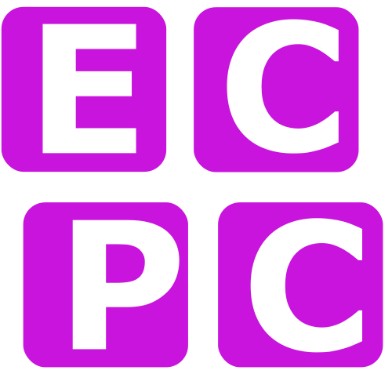

# Model-View-Controller

## MVC en het gebruik van packages

MVC staat voor _Model-View-Controller_ en is een belangrijk, maar wat diffuus concept in software engineering en is vooral van toepassing op gebruikersinterfaces. Het belangrijkste idee is dat een programma zoveel mogelijk wordt opgesplitst in onderdelen. Het _model_ bevat de onderliggende data en concepten van het programma (een database, meetgegevens, berekeningen, etc.); de _controller_ praat met de fysieke omgeving en reageert bijvoorbeeld op invoer van een gebruiker en past het model aan; de _view_ is een weergave van de data uit het model en vormt de gebruikersinterface zelf. Vaak praten alle onderdelen met elkaar, maar een gelaagd model is makkelijker te overzien en dus eenvoudiger te programmeren. In het geval van een natuurkunde-experiment is dit vaak mogelijk. Daarmee krijgt MVC bij ons een andere betekenis dan bijvoorbeeld bij het bouwen van websites. Het gelaagd MVC-model dat wij gaan gebruiken is hieronder weergegeven:

<div id="fig:mvc-model"></div>
{: style="width:50%", align=left}

De _controllers_ communiceren met de apparatuur, bevat informatie en berekeningen die apparatuur afhankelijk zijn; het _model_ bevat de meetgegevens, berekeningen over - en de opzet van - het experiment; de _view_ zorgt voor een gebruikersinterface met weergave van de data.

Het scheiden van je programma in deze lagen kan enorm helpen om ervoor te zorgen dat je geen _spaghetticode_ schrijft &mdash; ongestructureerde en moeilijk te begrijpen code. Wanneer het drukken op een knop in de code van de grafische omgeving direct commando's stuurt naar de Arduino of dat de code voor het doen van een enkele meting meteen de $x$-as van een grafiek aanpast, sla je lagen over in ons model en knoop je delen van het programma aan elkaar die niet direct iets met elkaar te maken hebben. De knop moet een meting starten, ja, maar _hoe_ dat precies moet is niet de taak van de gebruikersinterface. En de meting zelf moet zich niet bemoeien met welke grafiek er precies getekend wordt. Je zult merken dat het heel lastig wordt om overzicht te houden en later aanpassingen te doen als je alles door elkaar laat lopen. Je zult dan door je hele code moeten zoeken als je óf de aansturing van de Arduino, óf de grafische interface wilt aanpassen. En dus gaan we alles netjes structureren.

De verschillende onderdelen in het model kunnen we voor ons experiment als volgt beschrijven:

__View__
: Het <q>startpunt</q> van je applicatie. Geeft de opdracht om een meting te starten en geeft na afloop de resultaten van de meting weer op het scherm.

__Model__
: De code die het experiment uitvoert door verschillende metingen te doen en instellingen aan te passen, zoals de spanning over de LED. Het model weet hoe het experiment in elkaar zit en dat er bijvoorbeeld een weerstand van 220 &Omega; aanwezig is. Geeft opdrachten aan de controller.

__Controller__
: De code die via pyvisa praat met de Arduino. Opdrachten worden omgezet in firmwarecommando's en doorgestuurd naar het apparaat.

Het opsplitsen van je programma _hoeft niet in één keer!_ Dit kan stapsgewijs. Je kunt starten met een eenvoudig script &mdash; zoals we hierboven gedaan hebben &mdash; en dat langzaam uitbreiden. {: id="easterEggImage" style="width:1.5%" data-message="Pssst met 'CTRL' + '/?' kun je stukken geselecteerde code uitcommentariëren en weer decommentariëren. Probeer maar eens!"} Je begint klein, verdeelt je code in lagen en bouwt vervolgens verder.

## Implementeren van MVC
Het opsplitsen van het {{file}}`diode-experiment.py` in MVC gaan we stapsgewijs doen. We gaan een class maken voor de aansturing van de Arduino, deze class valt in de categorie _controller_.

!!! opdracht-inlever "Pythondaq: open de repository"
    Open in GitHub Desktop de repository van {{github}}`pythondaq` en open de repository in Visual Studio Code. In de volgende opdrachten ga je het {{file}}`diode-experiment.py` uitbreiden en opsplitsen in MVC.

<div id="opd:meting-class"></div>
!!! opdracht-inlever "Pythondaq: controller bouwen"
    === "opdracht"
        Je schrijft een script waarmee je de Arduino aanstuurt. 
        </br></br>
        Een gebruiker test de door jou geschreven controller met de volgende handelingen. De gebruiker vraag een lijst met beschikbare poorten op met de functie `#!py list_resources()`. De gebruiker weet aan welke poort de Arduino hangt en gebruikt deze poortnaam om een instance aan te maken van de class `ArduinoVISADevice`. Met deze class kan de gebruiker met de Arduino communiceren. Met de method `#!py get_identification()` vraagt de gebruiker de identificatiestring op. De gebruiker zet met de method `#!py set_output_value()` om een waarde van 828 op het uitvoerkanaal 0, de gebruiker zit de LED branden en weet daarom dat de method werkt. De gebruiker vraag met de method `#!py get_input_value()` de spanning op kanaal 1 op, dit herhaald de gebruiker vervolgens voor kanaal 2. Met de method `#!py get_input_voltage()` vraagt de gebruiker de spanning op in volt. De gebruiker rekent de gegeven waarde van `#!py get_input_value()` op kanaal 1 om naar volt en ziet dat deze overeenkomt met de gegeven spanning door de method `#!py get_input_voltage()` op kanaal 1. 

    === "code"
        **Pseudo-code**
        ``` py title='test-controller.py'
        # def list_resources
        #    return list of available ports

        # class ArduinoVISADevice
        #    def init (ask port from user)
                ...
        #    def get_identification
        #       return identification string of connected device
        #
        #   def set_output_value
        #       set a value on the output channel
        #
        #   def get_output_value
        #       get the value of the output channel
        #      
        #   def get_input_value
        #       get input value from input channel
        #
        #   def get_input_voltage
        #       get input value from input channel in Volt
                
        ```
        **Testcode:**
        <div class="code-box"><button type="button" name="basisscript_controller" onclick="runScript('basisscript_controller')" class="run">{{ run }}</button><button type="button" name="basisscript_controller" onclick="runScript('basisscript_controller')" class="reload invisible">{{ reload }}</button> test-controller.py
        ``` py
        # get available ports
        print(list_resources())

        # create an instance for the Arduino on port "ASRL28::INSTR"
        device = ArduinoVISADevice(port="ASRL28::INSTR")

        # print identification string
        identification = device.get_identification()
        print(identification)

        # set OUTPUT voltage on channel 0, using ADC values (0 - 1023)
        device.set_output_value(value=828)

        # measure the voltage on INPUT channel 2 in ADC values (0 - 1023)
        ch2_value = device.get_input_value(channel=2)
        print(f"{ch2_value=}")

        # measure the voltage on INPUT channel 2 in volts (0 - 3.3 V)
        ch2_voltage = device.get_input_voltage(channel=2)
        print(f"{ch2_voltage=}")

        # get the previously set OUTPUT voltage in ADC values (0 - 1023)
        ch0_value = device.get_output_value()
        print(f"{ch0_value=}")
        ```
        <pre>
        <code>(ecpc) > python test-controller.py
        <span class="invisible" name="basisscript_controller">('ASRL28::INSTR', ) 
        Arduino VISA firmware v1.0.0
        ch2_value=224
        ch2_voltage=0.7774193548387097
        ch0_value=828</span>
        </code></pre></div>
        
    === "check"
        **Checkpunten:**

        - [ ] `#!py list_resources()` is een functie die buiten de class staat.
        - [ ] Aan de `#!py __init__()` method moet een poortnaam worden meegeven.
        - [ ] De `#!py __init__()` method opent de communicatie met de meegegeven poortnaam.
        - [ ] Er is een method `#!py get_identification()` die de identificatiestring teruggeeft.
        - [ ] De `set_output_value()` en `get_output_value()` communiceren standaard met kanaal 0.
        - [ ] Bij `get_input_value` en `get_input_voltage` moet een kanaal opgegeven worden.


        **Projecttraject:**

        - [x] Pythondaq: Repository
        - [x] Pythondaq: Start script
        - [x] Pythondaq: Quick 'n dirty meting
        - [x] Pythondaq: CSV
        - [x] Pythondaq: open de repository
        - [x] Pythondaq: Controller bouwen
        - [ ] Pythondaq: Controller implementeren
        - [ ] Pythondaq: Controller afsplitsen
        - [ ] Pythondaq: Model afsplitsen
        - [ ] Pythondaq: Onzekerheid


Je hebt nu een werkende controller, maar je gebruikt het nog niet in je experiment. 

!!! opdracht-inlever "Pythondaq: Controller implementeren"
    === "opdracht"
        Zet je controller code (zonder de testcode) in het bestand {{file}}`diode-experiment.py`. Pas de code die de meting uitvoert aan zodat deze gebruikt maakt van de class `#!py ArduinoVISADevice` en de bijbehorende methods. 
    === "code"
        **Pseudo-code**
        ``` py title='diode-experiment.py'
        # def list_resources
        #   ...

        # class ArduinoVISADevice
            ...

        # get list resources
        # connect to Arduino via ArduinoVISADevice
        
        # set output voltage from 0 to max
            # measure voltages
            # calculate LED voltage
            # calculate LED current

        # plot current vs voltage
        # create csv-file
        ```        
    === "check"
        **Checkpunten:**

        - [ ] In een script staan `#!py list_resources()`, `#!py ArduinoVISADevice()` en de code om de LED te laten branden, metingen te doen en het resultaat te laten zien.
        - [ ] Wanneer de class `#!py ArduinoVISADevice()` uit het script wordt geknipt, werkt {{file}}`diode-experiment.py` niet meer.
        - [ ] Er wordt een lijst gegeven van aangesloten instrumenten.
        - [ ] Er wordt een plot getoond van de spanning over en de stroomsterkte door de LED.
        - [ ] De spanning over en de stroomsterkte door de LED worden weggeschreven in een CSV-bestand.
        - [ ] De LED wordt uitgezet na de meting.


        **Projecttraject:**

        - [x] Pythondaq: Repository
        - [x] Pythondaq: Start script
        - [x] Pythondaq: Quick 'n dirty meting
        - [x] Pythondaq: CSV
        - [x] Pythondaq: open de repository
        - [x] Pythondaq: Controller bouwen
        - [x] Pythondaq: Controller implementeren
        - [ ] Pythondaq: Controller afsplitsen
        - [ ] Pythondaq: Model afsplitsen
        - [ ] Pythondaq: Onzekerheid

Als je de vorige opdracht succesvol hebt afgerond maakt het niet meer uit wat de precieze commando's zijn die je naar de hardware moet sturen. Als je de Arduino in de opstelling vervangt voor een ander meetinstrument moet je de class aanpassen, maar kan alle code die met het experiment zelf te maken heeft hetzelfde blijven.

Nu we de _controller_ hebben gemaakt die de Arduino aanstuurt, blijft er nog een stukje code over. Het laatste stuk waar de plot en het CSV-bestand gemaakt worden kunnen we beschouwen als een _view_ en de rest van de code &mdash; waar de metingen worden uitgevoerd en de stroomsterkte $I$ wordt berekend &mdash; is een _model_. We gaan de code nog wat verder opsplitsen om dat duidelijk te maken én onderbrengen in verschillende bestanden &mdash; dat is uiteindelijk beter voor het overzicht.

!!! opdracht-inlever "Pythondaq: Controller afsplitsen"
    === "opdracht"

        <div class="grid-tree" markdown>
            <div>
            In latere opdrachten ga je een command-line interface en een grafische user interface maken voor het experiment. Daarom is het handig om alvast overzicht creëren door de verschillende onderdelen in aparte scripts te zetten. Het bestand {{file}}`#!py arduino_device.py` bevat de class `#!py ArduinoVISADevice` en de functie `#!py list_resources()`. Deze class en functie importeer je in het bestand {{file}}`diode-experiment.py`.
            </div>
            <div>
            {{folder}} `ECPC`   
            {{T}} {{github}} `pythondaq`  
            {{tab}} {{T}} {{new_file}} `arduino_device.py`  
            {{tab}} {{T}} {{file}} `diode-experiment.py`  
            {{tab}} {{L}} {{dots}}  
            {{L}} {{dots}}  
            </div>
        </div>

        !!! info "error"
            Waarschijnlijk krijg je nog een of meerdere errors als je {{file}}`diode-experiment.py` runt. Lees het error bericht goed door, om welk bestand gaat het {{file}}`arduino_device.py` of {{file}}`diode-experiment.py`? Wat is er volgens het error bericht niet goed?
    === "code"
        **Pseudo-code**
        ``` py title="arduino_device.py"
        # def list_resources
        #   ...

        # class ArduinoVISADevice
            ...
        ```
        ``` py title="diode-experiment.py"
        from arduino_device import ArduinoVISADevice, list_resources
        
        # get list resources
        # connect to Arduino via ArduinoVISADevice
        
        # set output voltage from 0 to max
            # measure voltages
            # calculate LED voltage
            # calculate LED current

        # plot current vs voltage
        # create csv-file
        ```        
    === "check"
        **Checkpunten:**

        - [ ] Alle directe communicatie met de Arduino, firmwarecommando's en pyvisacommando's, staan in de controller.
        - [ ] Runnen van {{file}}`diode-experiment.py` zorgt ervoor dat een meting start.
        - [ ] Er wordt een lijst gegeven van aangesloten instrumenten.
        - [ ] Er wordt een plot getoond van de spanning over en de stroomsterkte door de LED.
        - [ ] De spanning over en de stroomsterkte door de LED worden weggeschreven in een CSV-bestand.
        - [ ] De LED wordt uitgezet na de meting.


        **Projecttraject:**

        - [x] Pythondaq: Repository
        - [x] Pythondaq: Start script
        - [x] Pythondaq: Quick 'n dirty meting
        - [x] Pythondaq: CSV
        - [x] Pythondaq: open de repository
        - [x] Pythondaq: Controller bouwen
        - [x] Pythondaq: Controller implementeren
        - [x] Pythondaq: Controller afsplitsen
        - [ ] Pythondaq: Model afsplitsen
        - [ ] Pythondaq: Onzekerheid

???+ opdracht-meer "`#!py if __name__ == '__main__'`"
    === "opdracht"
        Later wil je de functie `#!py list_resources()` netjes in het hele model-view-controller systeem vlechten zodat je als gebruiker de lijst kunt opvragen, maar voor nu wil je af en toe even zien aan welke poort de Arduino hangt. Wanneer je het script {{file}}`arduino_device.py` runt wordt er een lijst geprint met poorten. Dit gebeurt niet wanneer het bestand {{file}}`diode-experiment.py` wordt gerund. 

        !!! info "modules"
            Nog niet bekend met `#!py if __name__ == '__main__'`? kijk dan voor meer informatie in de [paragraaf modules](vervolg-python.md#modules).

    === "code"
        **Pseudo-code**
        ``` py title="arduino_device.py"
        # def list_resources
        #   ...

        # class ArduinoVISADevice
            ...
        
        # print list ports if arduino_device.py is the main script 
        # print list ports not if arduino_device.py is imported as a module in another script

        ```
        ``` py title="diode-experiment.py"
        from arduino_device import ArduinoVISADevice, list_resources
        
        # connect to Arduino via ArduinoVISADevice
        
        # set output voltage from 0 to max
            # measure voltages
            # calculate LED voltage
            # calculate LED current

        # plot current vs voltage
        # create csv-file
        ```     
    === "check"
        **Checkpunten:**

        - [ ] Er wordt een lijst met poorten geprint wanneer {{file}}`arduino_device.py` wordt gerund.
        - [ ] De lijst wordt _niet_ geprint wanneer {{file}}`diode-experiment.py` wordt gerund.

!!! opdracht-inlever "Pythondaq: Model afsplitsen"
    === "opdracht"
        <div class="grid-tree" markdown>
            <div>
            Omdat je in latere opdrachten een command-line interface en een grafische user interface gaat maken voor het experiment is het handig om alvast overzicht creëren door de verschillende onderdelen in aparte scripts te zetten. Maak een bestand {{file}}`run_experiment.py` waarin de gebruiker een paar dingen kan aanpassen.
            </br></br>
            De gebruiker test de door jou geschreven applicatie (view, model, controller) met de volgende handelingen. Het runnen van het bestand {{file}}`run_experiment.py` geeft een lijst van aangesloten instrumenten. De gebruiker past in het bestand {{file}}`run_experiment.py` de poortnaam aan naar een poort waarop een Arduino is aangesloten. De instance van de class `#!py DiodeExperiment` die uit het model wordt geïmporteerd gebruikt deze poortnaam om de communicatie met de Arduino te openen. De gebruiker roept de method `#!py scan()` aan van de class `#!py DiodeExperiment` waarna een meting wordt gestart. Om gegevens van het naar de Arduino te sturen maakt het model gebruik van de controller. De gegevens die het model terugkrijgt van de Arduino worden volgens de fysische relaties verwerkt tot de benodigde gegevens en doorgestuurd naar de view. De resultaten worden in een plot getoond en naar een CSV-bestand weggeschreven. De gebruiker past het bereik van de meting aan door door de start- en stopparameters, die aan de method `#!py scan()` worden meegegeven, aan te passen.
            </div>
            <div>
            {{folder}} `ECPC`   
            {{T}} {{github}} `pythondaq`  
            {{tab}} {{T}} {{file}} `arduino_device.py`  
            {{tab}} {{T}} {{file}} `diode_experiment.py`  
            {{tab}} {{T}} {{new_file}} `run_experiment.py`  
            {{tab}} {{L}} {{dots}}  
            {{L}} {{dots}}  
            </div>
        </div>
    
    === "code"
        **Pseudo-code**
        ``` py title="arduino_device.py"
        # def list_resources
        #   ...

        # class ArduinoVISADevice
            ...
        ```
        ``` py title="diode_experiment.py"
        from arduino_device import ArduinoVISADevice, list_resources
        
        # class DiodeExperiment
            ...
            # connect to Arduino via ArduinoVISADevice
            ...
            # def scan with start, stop
                # set output voltage from 0 to max
                    # measure voltages
                    # calculate LED voltage
                    # calculate LED current
                # return LED voltage, LED current
        ```      
        ``` py title="run_experiment.py"
        from diode_experiment import DiodeExperiment, list_resources
        
        # get list resources
        # connect to Arduino via DiodeExperiment

        # get current and voltage from scan(start, stop)

        # plot current vs voltage
        # create csv-file
        ```      
    === "check"
        **Checkpunten:**

        - [ ] Alle directe communicatie met de Arduino, firmwarecommando's en pyvisacommando's, staan in de controller
        - [ ] Alle communicatie met de controller staan in het model
        - [ ] Het model bevat een class `DiodeExperiment`
        - [ ] De view communiceert alleen met het model. 
        - [ ] Runnen van {{file}}`run_experiment.py` zorgt ervoor dat een meting start.
        - [ ] Er wordt een lijst gegeven van aangesloten instrumenten.
        - [ ] Er wordt een plot getoond van de spanning over en de stroomsterkte door de LED.
        - [ ] De spanning over en de stroomsterkte door de LED worden weggeschreven in een CSV-bestand.
        - [ ] De LED wordt uitgezet na de meting.
        - [ ] De bestanden bevatten alle code die nodig is en niet meer dan dat. 


        **Projecttraject:**

        - [x] Pythondaq: Repository
        - [x] Pythondaq: Start script
        - [x] Pythondaq: Quick 'n dirty meting
        - [x] Pythondaq: CSV
        - [x] Pythondaq: open de repository
        - [x] Pythondaq: Controller bouwen
        - [x] Pythondaq: Controller implementeren
        - [x] Pythondaq: Controller afsplitsen
        - [x] Pythondaq: Model afsplitsen
        - [ ] Pythondaq: Onzekerheid
    


Het oorspronkelijke script dat je gebruikte voor je meting is steeds leger geworden. Als het goed is gaat nu (vrijwel) het volledige script alleen maar over het starten van een meting en het weergeven en bewaren van de meetgegevens. In het <q>view</q> script komen verder geen berekeningen voor of details over welk kanaal van de Arduino op welke elektronische component is aangesloten. Ook staat hier niets over welke commando's de Arduino firmware begrijpt. Dit maakt het veel makkelijker om in de vervolghoofdstukken een gebruiksvriendelijke applicatie te ontwikkelen waarmee je snel en eenvoudig metingen kunt doen.

???+ opdracht-meer "User input"
    De gebruiker moet in de view het script aanpassen om een andere meting te doen. Kun je `#!py input()` gebruiken om van de gebruiker input te vragen voor de start, stop en aantal metingen?

???+ opdracht-meer "Error!"
    Als de gebruiker in de {{file}}`run_experiment.py` per ongeluk een negatieve startwaarde of negatieve aantal metingen invult gaat het niet goed. Gebruik [Exceptions](vervolg-python.md#exceptions) om dergelijke gevallen af te vangen en een duidelijke error af te geven. 
