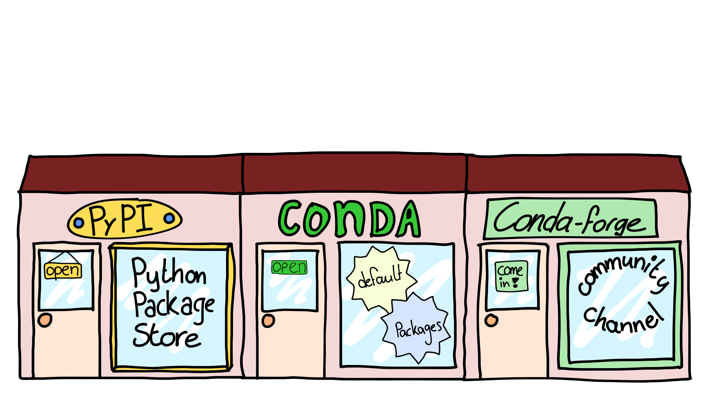

# Virtual environments

Een virtual environment is een map waarin packages staan. De virtual environment geef je een naam bijvoorbeeld `my_env`. Je kunt een virtual environment vergelijken met een gereedschapskist. Wanneer je een environment activeert kies je een gereedschapskist om de klus te klaren. welke gereedschapskist je kiest bepaald welke packages je tot je beschikking hebt.

{ width=500}
/// caption
Een virtual environment met de naam `my_env`. Een virtual environment is als een gereedschapskist met daarin packages.
///

### Lijst van bestaande environments bekijken
Door gebruik te maken van virtual environments kan je voorkomen dat er een package conflict ontstaat. Packages zijn vaak afhankelijk van andere packages en daarbij kan het uitmaken welke versie van het package je gebruikt. 

Stel package A heeft package B nodig met versie >= 1.1, maar package C heeft package B nodig met versie 1.0. Nu kunnen packages A en C dus niet tegelijkertijd geïnstalleerd worden.

Daarom is het handig om voor elke project de packages in een geïsoleerde omgeving te installeren. Een virtual environment is zo'n geïsoleerde omgeving. Je kan dan niet alleen verschillende packages en versies uit elkaar houden maar zelfs verschillende Python versies.

Je kunt een lijst met virtual environments opvragen met

<pre><code>(ecpc) > conda env list <button type="button" name="conda env list" onclick="runScript('conda env list')">{{ enter }}</button><button type="button" name="conda env list" onclick="runScript('conda env list')" class="invisible">{{ reload }}</button>
<span class="invisible" name="conda env list"># conda environments:
#base                     path\to\environment\with\name\base
#my_env                   path\to\environment\with\name\my_env
#project_a                path\to\environment\with\name\project_a
#project_b                path\to\environment\with\name\project_b</span>
    </code></pre>

{ width=500}
/// caption
Je kan meerdere virtual environments aanmaken. In elke environment zitten packages specifiek voor een project. Hier zijn 3 verschillende virtual environments weergegeven met elk een andere naam: `my_env`, `project_a` en `project_b`.
///

Zoals je ziet is `base` ook een virtual environment. Daarin zitten standaard een aantal handige packages in, maar wanneer je een package nodig hebt die er niet inzit is het handig om voor dat project een eigen virtual environment aan te maken. Daarmee voorkom je package conflicten in je base environment. 
Het kan natuurlijk gebeuren dat je alsnog een package conflict krijgt in je project environment of dat de packages ineens niet meer werken. Dan kun je heel gemakkelijk de virtual environment weggooien en een nieuwe aan schaffen. Om weer een werkende base environment te krijgen is het vaak nodig om heel Anaconda opnieuw te installeren. Gebruik de base daarom alleen voor de basis en maak een nieuw environment voor al je projecten!

### Activeren en deactiveren

Om aan te geven welke virtual environment je wilt gebruiken om je scripts uit te voeren moet je de virtual environment activeren. 

#### Terminal

Om een virtual environment te activeren in een terminal maak je gebruik van de onderstaande code. Je ziet daarna de naam van de geactiveerde environment tussen ronde haakjes staan. 

=== "conda"
    <pre><code>(ecpc) > conda activate my_env <button type="button" name="conda activate my_env_venv" onclick="runScript('conda activate my_env_venv')">{{ enter }}</button><button type="button" name="conda activate my_env_venv" onclick="runScript('conda activate my_env_venv')" class="invisible">{{ reload }}</button>
    <span class="invisible" name="conda activate my_env_venv">(my_env) > </span>
    </code></pre>
=== "uv"
    <pre><code>(ecpc) > .my_env\Scripts\activate <button type="button" name=".my_env\Scripts\activate_venv" onclick="runScript('.my_env\Scripts\activate_venv')">{{ enter }}</button><button type="button" name=".my_env\Scripts\activate_venv" onclick="runScript('.my_env\Scripts\activate_venv')" class="invisible">{{ reload }}</button>
    <span class="invisible" name=".my_env\Scripts\activate_venv">(my_env) > </span>
    </code></pre>

{ width=500}
/// caption
In een terminal wordt tussen ronde haakjes weergegeven welke virtual environment actief is.
///

Om een virtual environment te deactiveren in een terminal maak je gebruik van de onderstaande code. Je ziet daarna weer de naam van de base environment tussen ronde haakjes staan.

=== "Conda"
    <pre><code>(ecpc) > conda deactivate <button type="button" name="conda deactivate_venv" onclick="runScript('conda deactivate_venv')">{{ enter }}</button><button type="button" name="conda deactivate_venv" onclick="runScript('conda deactivate_venv')" class="invisible">{{ reload }}</button>
    <span class="invisible" name="conda deactivate_venv">(base) > </span>
    </code></pre>
    
=== "uv"
    <pre><code>(ecpc) > deactivate <button type="button" name="deactivate_venv" onclick="runScript('deactivate_venv')">{{ enter }}</button><button type="button" name="deactivate_venv" onclick="runScript('deactivate_venv')" class="invisible">{{ reload }}</button>
    <span class="invisible" name="deactivate_venv">?</span>
    </code></pre>

#### Visual Studio Code

In Visual Studio Code zit ook een terminal maar wanneer je een environment in deze terminal activeerd betekend dit niet dat Visual Studio Code ook van dat environment gebruik maakt. Om een environment in Visual Studio Code te activeren moet je een python bestand openen en daarna rechtsonder, in de statusbalk, kijken welke environment geactiveerd is. 


Het kan ook zijn dat er nog geen environment is geactiveerd dan staat er 'select Python interperter'. In beide gevallen kan je daarop klikken[^Python interpreter] er verschijnt dan bovenaan het scherm in het midden een lijst met Python environments.[^Python environment]  Kies de omgeving die je wilt gebruiken. _Let op:_ als je het environment net hebt aangemaakt dan staat hij er nog niet tussen. Klik dan rechtsbovenin eerst op het **{{arrow_rotate}} Refresh Interpeter list**-knopje.

[^Python interpreter]: Of: **View > Command Palette > Python: Select Interpreter**.

[^Python environment]: Visual Studio Code zoekt naar virtual environments waar Python in staat. Environments zonder Python staat waarschijnlijk niet in het lijstje.


### Virtual environment aanmaken

Om een nieuwe virtual environment aan te maken met de naam `my_env ` gebruik je onderstaande code. Er wordt aangegeven op welke locatie de environment wordt aangemaakt en welke packages erin worden geïnstaleerd. Als je tevreden bent met de locatie en inhoud druk je ++y+enter++ om door te gaan.

=== "conda"
    <pre><code>(ecpc) > conda create --name my_env <button type="button" name="conda create --name my_env_venv" onclick="runScript('conda create --name my_env_venv')">{{ enter }}</button><button type="button" name="conda create --name my_env_venv" onclick="runScript('conda create --name my_env_venv')" class="invisible">{{ reload }}</button>
    <span class="invisible" name="conda create --name my_env_venv">Retrieving notices: ...working... done
    Channels:
    - defaults
    Platform: osx-arm64
    Collecting package metadata (repodata.json): done
    Solving environment: done
    &nbsp;
    <span>## Package Plan ##</span>
    &nbsp;environment location: path\to\environment\with\name\my_env
    &nbsp;
    Proceed ([y]/n)?
    </span></code></pre>

=== "uv"
    <pre><code>(ecpc) > uv venv my_env <button type="button" name="uv venv my_env_venv" onclick="runScript('uv venv my_env_venv')">{{ enter }}</button><button type="button" name="uv venv my_env_venv" onclick="runScript('uv venv my_env_venv')" class="invisible">{{ reload }}</button>
    <span class="invisible" name="uv venv my_env_venv">?</span>
    </code></pre>
    

{ width=500}
/// caption
Een virtual environment is als een gereedschapskist met een label waarop de naam is weergegeven.  
///

### De inhoud van een virtual environment bekijken

Nadat je de environment hebt geactiveerd (zie [environment activeren](virtual_environments.md#activeren-en-deactiveren)) kun je met de onderstaande code zien wat er in zit.

=== "conda"
    <pre><code>(my_env) > conda list <button type="button" name="conda list_venv" onclick="runScript('conda list_venv')">{{ enter }}</button><button type="button" name="conda list_venv" onclick="runScript('conda list_venv')" class="invisible">{{ reload }}</button>
    <span class="invisible" name="conda list_venv"><span># packages in environment at path\to\environment\with\name\my_env:</span>
    <span>#</span>
    <span># Name                    Version                   Build  Channel</span>
    </span>
    </code></pre>

    Er staat daadwerkelijk niets, de environment is helemaal leeg. Om de environment te vullen met packages moet je [package installeren](#packages-installeren)
    
    { width=500}
    /// caption
    Wanneer je met conda een virtual environment aanmaakt en alleen de naam meegeeft, is de environment helemaal leeg.
    ///

=== "uv"
    <pre><code>(my_env) > uv pip list (?) <button type="button" name="uv pip list (?)_venv" onclick="runScript('uv pip list (?)_venv')">{{ enter }}</button><button type="button" name="uv pip list (?)_venv" onclick="runScript('uv pip list (?)_venv')" class="invisible">{{ reload }}</button>
    <span class="invisible" name="uv pip list (?)_venv">?</span>
    </code></pre>

    Er zit alleen python en pip in.
    
    { width=500}
    /// caption
    Wanneer je met venv een virtual environment aanmaakt en alleen de naam meegeeft, zit alleen Python en pip erin.
    ///

    of?

    { width=500}
    /// caption
    Wanneer je met venv een virtual environment aanmaakt en alleen de naam meegeeft, zit alleen pip erin.
    ///


### Packages installeren
Nadat je de environment hebt geactiveerd (zie [environment activeren](virtual_environments.md#activeren-en-deactiveren)) kun je packages in de virtual environment installeren, dit kun je met de onderstaande code doen. 

=== "conda"
    Merk op dat je meerdere packages tegelijk kunt installeren, in dit geval installeren we Python en SciPy tegelijkertijd. Ook is het mogelijk om een specifieke versie aan te geven, bijvoorbeeld Python=3.10
    <pre><code>(my_env) > conda install python=3.10 scipy <button type="button" name="conda install python scipy_venv" onclick="runScript('conda install python scipy_venv')">{{ enter }}</button><button type="button" name="conda install python scipy_venv" onclick="runScript('conda install python scipy_venv')" class="invisible">{{ reload }}</button>
    <span class="invisible" name="conda install python scipy_venv">Retrieving notices: ...working... done
    Channels:
    - defaults
    Platform: osx-arm64
    Collecting package metadata (repodata.json): done
    Solving environment: done
    &nbsp;
    <span>## Package Plan ##</span>
    &nbsp;
    environment location: path\to\environment\with\name\my_env
    &nbsp;
    added / updated specs:
        - python=3.10
        - scipy
    ...</span>
    </code></pre>
    
=== "uv"
    Merk op dat je meerdere packages tegelijk kunt installeren, in dit geval installeren we SciPy en Lmfit tegelijkertijd. 
    <pre><code>(my_env) > uv pip install scipy lmfit<button type="button" name="uv pip install scipy_venv" onclick="runScript('uv pip install scipy_venv')">{{ enter }}</button><button type="button" name="uv pip install scipy_venv" onclick="runScript('uv pip install scipy_venv')" class="invisible">{{ reload }}</button>
    <span class="invisible" name="uv pip install scipy_venv">????</span>
    </code></pre>
    
Je kan ook gelijk bij het [aanmaken van de virtual environment](#virtual-environment-aanmaken) aangeven welke packages je erin wilt hebben.

<pre><code>(ecpc) > conda create --name my_env python=3.10 numpy <button type="button" name="conda create --name my_env python=3.10 numpy_venv" onclick="runScript('conda create --name my_env python=3.10 numpy_venv')">{{ enter }}</button><button type="button" name="conda create --name my_env python=3.10 numpy_venv" onclick="runScript('conda create --name my_env python=3.10 numpy_venv')" class="invisible">{{ reload }}</button>
<span class="invisible" name="conda create --name my_env python=3.10 numpy_venv">Channels:
 - defaults
Platform: osx-arm64
Collecting package metadata (repodata.json): done
Solving environment: done
&nbsp;
<span>## Package Plan ##</span>
&nbsp;
  environment location: path\to\environment\with\name\my_env
&nbsp;
  added / updated specs:
    - numpy
    - python=3.10
...</span>
</code></pre>

Daarna kun je de nieuwe virtual [environment activeren](virtual_environments.md#activeren-en-deactiveren) om te gebruiken. 

Wanneer je nu opnieuw kijkt wat er [in de virtual environment zit](#de-inhoud-van-een-virtual-environment-bekijken) dan zie je dat er naast Python nog vanalles is meegenomen waaronder pip en andere dingen. 

{ width=500}
/// caption
Bij het installeren van Python met `conda` in een virtual environment komen er meerder package mee waaronder `pip`. 
///

#### Dependencies

Packages hebben vaak andere packages nodig om goed te werken, ze zijn dus afhankelijk van andere packages. Bij het installeren komen deze `depencies` mee en worden ze ook in de virtual environment geïnstalleerd. Als je bijvoorbeeld scipy installeerd komt NumPy mee. 

{ width=500}
/// caption
Bij het installeren van SciPy in een virtual environment komt onder andere NumPy mee.
///

Maar andersom komt SciPy niet mee met NumPy.

{ align=right width=500}
/// caption
Bij het installeren van NumPy in een virtual environment komt SciPy niet mee. 
///

Om je te laten weten welke packages precies worden geïnstalleerd laat Conda laat altijd een lijstje zien van dingen die geïnstalleerd worden. Vervolgens moet jij aangeven of je door wilt gaan. 

### Environment weggooien
Het kan gebeuren dat een environment niet goed lijkt te werken. Dan kan je een hele zoektoch starten om erachter te komen waardoor dat komt, maar vaak kun je het oplossen door het environment weg te gooien en een 'schone' aan te maken. Het weggooien doe je als volgt.

=== "conda"
    <pre><code>(ecpc) > conda env remove --name my_env <button type="button" name="conda env remove --name my_env_venv" onclick="runScript('conda env remove --name my_env_venv')">{{ enter }}</button><button type="button" name="conda env remove --name my_env_venv" onclick="runScript('conda env remove --name my_env_venv')" class="invisible">{{ reload }}</button>
    <span class="invisible" name="conda env remove --name my_env_venv">Remove all packages in environment path\to\environment\with\name\my_env:
    &nbsp;
    Everything found within the environment (path\to\environment\with\name\my_env), including any conda environment configurations and any non-conda files, will be deleted. Do you wish to continue?
    (y/[n])? </span>
    </code></pre>
=== "uv"

Je kan ook de oude environment overschrijven door een nieuwe aan te maken met dezelfde naam, dan komt er wel een waarschuwing dat er al een environment met dezelfde naam bestaat en of je die wilt overschrijven.
=== "conda"
    <pre><code>(ecpc) > conda create --name my_env <button type="button" name="conda create --name my_env_suffix" onclick="runScript('conda create --name my_env_suffix')">{{ enter }}</button><button type="button" name="conda create --name my_env_suffix" onclick="runScript('conda create --name my_env_suffix')" class="invisible">{{ reload }}</button>
    <span class="invisible" name="conda create --name my_env_suffix">WARNING: A conda environment already exists at 'path\to\environment\with\name\my_env'
    Remove existing environment (y/[n])? </span>
    </code></pre>
=== "uv"

### Package updaten
Heb je net gister een nieuwe virtual environment aangemaakt zie je dat er vandaag een update is uitgekomen met een functie die jij nu nodig hebt. Gelukkig hoef je dan niet gelijk de environment weg te gooien en een nieuwe aan te maken maar kan je ook de package updaten. Nadat je de environment hebt geactiveerd (zie [environment activeren](virtual_environments.md#activeren-en-deactiveren)) kun je een package in de virtual environment updaten met de onderstaande code doen.

=== "conda"
    In dit voorbeeld updaten we de package NumPy.
    <pre><code>(my_env) > conda update numpy <button type="button" name="conda update numpy_venv" onclick="runScript('conda update numpy_venv')">{{ enter }}</button><button type="button" name="conda update numpy_venv" onclick="runScript('conda update numpy_venv')" class="invisible">{{ reload }}</button>
    <span class="invisible" name="conda update numpy_venv">Channels:
    - defaults
    Platform: osx-arm64
    Collecting package metadata (repodata.json): done
    Solving environment: done
    &nbsp;
    <span>## Package Plan ##</span>
    &nbsp;
    environment location: path\to\environment\with\name\my_env
    &nbsp;
    added / updated specs:
        - numpy
    &nbsp;
    &nbsp;
    The following packages will be UPDATED:
    &nbsp;
    numpy                               2.0.2-py312h7f4fdc5_0 --> 2.2.4-py312hcef5695_0 
    numpy-base                          2.0.2-py312he047099_0 --> 2.2.4-py312hb71ad10_0 
    &nbsp;
    &nbsp;
    Proceed ([y]/n)?</span>
    </code></pre>
=== "uv"

## Pip vs Conda
De officiële Package Installer for Python is `pip`.

???+ meer-leren "pip"
    Je kunt met pip alle Python packages installeren die bestaan uit _Python_ code. NumPy bijvoorbeeld bevat echter ook veel code geschreven in C. Die code moet eerst gecompileerd worden. Dat kan `pip` óók doen, mits er een C compiler op je computer geïnstalleerd is. Via de Python package index kunnen gelukkig ook zogeheten _binary packages_ verspreid worden waarin de code al is gecompileerd. Er zijn dan losse packages voor Windows, MacOS en Linux. Meestal gaat dit goed, maar helaas niet altijd. Historisch waren NumPy maar vooral ook SciPy een flink probleem. Ook het gebruik van grafische bibliotheken ging vaak moeizaam. Dan was het package wel geïnstalleerd, maar riep hij dat hij systeembibliotheken niet kon vinden. Heel vervelend.

    Een ander probleem van `pip` is dat deze &mdash; tot voor kort &mdash; geen controle deed op de versies van al geïnstalleerde pakketten. Je kon dus packages installeren die nieuwe versies binnenhaalden van andere packages, waarna al _eerder_ geïnstalleerde packages soms stopten met werken.

Omdat pip wat beperkt werkte en vooral bij NumPy en SciPy problemen opleverde is `conda` ontwikkeld die vooral populair geworden is in de wetenschappelijke wereld. 

???+ meer-leren "conda"
    Conda installeert alleen binary packages, kan naast Python packages ook systeembibliotheken installeren als dat nodig is én doet een uitgebreide controle op alle versies van te installeren en al eerder geïnstalleerde packages zodat alles altijd blijft werken. Nadeel is dat die controle nogal lang kan duren als je al veel geïnstalleerd hebt. Omdat je met `conda` dus _wel_ heel makkelijk uitgebreide wetenschappelijke packages kon installeren met een mix van Python-, C-, of zelfs Fortrancode is `conda` (en Anaconda, de distributie) heel populair geworden in de wetenschappelijke wereld.

Pip installeerd packages uit de [Python Package Index (PyPI)](https:/pypi.org). Conda installeerd packages uit channels. Standaard haalt conda packages uit de `default channel`, maar je kan ook aangeven dat je packages uit een andere channel wilt halen bijvoorbeeld uit de `conda-forge` channel. 

Het installeren met behulp van pip of conda is te vergelijken met het winkelen bij verschillende winkelketens. Het assortiment is deels hetzelfde maar niet helemaal gelijk. Ook is de services verschillend, zo krijg je er bij Conda gratis systeembibliotheken bij. De conda-forge channel is een winkel die door een community beheerd wordt, een grote groep contributors bepalen samen welke packager er te halen zijn en welke dependencies je er gratis bij krijgt. 

???+ meer-leren "conda-forge"
    Conda installeert packages vanuit verschillende _channels_. De `defaults` channel bevat packages die af en toe door Anaconda worden getest en samengenomen tot een distributie (versie `2021.05` bijvoorbeeld). Er zijn weinig updates. De `conda-forge` channel bevat alle nieuwste versies van die packages en bevat ook software die (nog) niet in de `defaults` channel terecht is gekomen. De conda-forge channel is daarom erg populair, maar er gaat ook regelmatig iets stuk.

{ align=right width=500}
/// caption
PyPI (Python Package Index), conda default channel en conda-forge channel kun je zien als verschillende winkels waar je packages vandaan kunt halen. Het aanbod en de service verschilt per channel. `pip` haalt de packages altijd bij PyPI, bij conda kun je aangeven uit welke channel je de packages wilt installeren.
///

### Installeren uit een channel

Je kunt packages uit de conda-forge channel in je virtual environment installeren, nadat je de environment hebt geactiveerd (zie [environment activeren](virtual_environments.md#activeren-en-deactiveren)), door dit specifiek aan te geven. 

<pre><code>(my_env) > conda install --channel conda-forge lmfit <button type="button" name="conda install --channel conda-forge lmfit_venv" onclick="runScript('conda install --channel conda-forge lmfit_venv')">{{ enter }}</button><button type="button" name="conda install --channel conda-forge lmfit_venv" onclick="runScript('conda install --channel conda-forge lmfit_venv')" class="invisible">{{ reload }}</button>
<span class="invisible" name="conda install --channel conda-forge lmfit_venv">Channels:
 - conda-forge
 - defaults
Platform: osx-arm64
Collecting package metadata (repodata.json): done
Solving environment: done
&nbsp;
## Package Plan ##
...</span>
</code></pre>

Het is ook mogelijk om gelijk bij het aanmaken van een nieuwe virtual environment aan te geven uit welke channel je packages wilt installeren.

<pre><code>(ecpc) > conda create --name my_env --channel conda-forge pandas matplotlib lmfit <button type="button" name="conda create --name my_env --channel conda-forge pandas matplotlib lmfit_venv" onclick="runScript('conda create --name my_env --channel conda-forge pandas matplotlib lmfit_venv')">{{ enter }}</button><button type="button" name="conda create --name my_env --channel conda-forge pandas matplotlib lmfit_venv" onclick="runScript('conda create --name my_env --channel conda-forge pandas matplotlib lmfit_venv')" class="invisible">{{ reload }}</button>
<span class="invisible" name="conda create --name my_env --channel conda-forge pandas matplotlib lmfit_venv">Channels:
 - conda-forge
 - defaults
Platform: osx-arm64
Collecting package metadata (repodata.json): done
Solving environment: done
&nbsp;
## Package Plan ##
...</span>
</code></pre>

## Poetry
Als je Poetry gebruikt als dependencie manager (zie [hoofdstuk Poetry](projects.md)) dan moet je er rekening mee houden dat Poetry achter de schermen pip gebruikt om packages te installeren. 
Dus als je eerst met conda een virtual environment aanmaakt en alleen een naam opgeeft, dan zit er niets in de virtual environment. Ook pip zit er niet in, waardoor Poetry niets kan installeren. 

{ width=500}
/// caption
Wanneer je met conda een virtual environment aanmaakt en alleen de naam meegeeft, is de environment helemaal leeg. Er zit ook geen pip in de environment waardoor Poetry geen packages met pip kan installeren.
///

## Pipx
Sommige packages zijn niet meer een stukje gereedschap wat je gebruikt bij je eigen werk maar eerder een volledige applicatie die je opzich zelf kan gebruiken. Een voorbeeld hiervan is [gammaspotter](https://pypi.org/project/gammaspotter/) een applicatie gemaakt door studenten tijdens het [eindfeest](eindfeest.md). 

Je kan zelf een virtual environment aanmaken en de package daarin installeren. Maar omdat het meer een applicatie is zal je bij het gebruik ervan steeds de environment moeten activeren en daarna de applicatie aanroepen. Als je vervolgens een andere environment activeert is de applicatie niet meer beschikbaar. Ook kan het gebeuren dat je packages update of verwijdert waardoor de applicatie niet meer werkt. Met `pipx` is het mogelijk om dit soort applicaties in een _eigen_ virtual environment te installeren. Je loopt geen risico dat je ze stukmaakt _en_ ze zijn beschikbaar vanuit andere virtual environments.

{ align=right width=500}
/// caption
Wanneer je met `pipx` een Python applicatie instaleerd wordt deze in een eigen virtual environment geplaatst.
///


### Pipx installeren
Om Pipx te kunnen gebruiken moet je het eerst installeren met behulp van pip. 

<pre><code> > python -m pip install --user pipx <button type="button" name="python -m pip install --user pipx_venv" onclick="runScript('python -m pip install --user pipx_venv')">{{ enter }}</button><button type="button" name="python -m pip install --user pipx_venv" onclick="runScript('python -m pip install --user pipx_venv')" class="invisible">{{ reload }}</button>
<span class="invisible" name="python -m pip install --user pipx_venv">collecting pipx
...
Successfully installed argcomplete-3.6.2 click-8.1.8 colorama-0.4.6 packaging-24.2 pipx-1.7.1 platformdirs-4.3.7 userpath-1.9.2
</span>
</code></pre>

Zorg ervoor dat de map waarin pipx apps opslaat, is opgenomen in je PATH omgevingsvariabele. Dit zorgt ervoor dat je deze apps altijd vanuit de terminal kunt aanroepen. Dit doe je met onderstaande code.

<pre><code> > python -m pipx ensurepath <button type="button" name="python -m pipx ensurepath_venv" onclick="runScript('python -m pipx ensurepath_venv')">{{ enter }}</button><button type="button" name="python -m pipx ensurepath_venv" onclick="runScript('python -m pipx ensurepath_venv')" class="invisible">{{ reload }}</button>
<span class="invisible" name="python -m pipx ensurepath_venv">Success! Added C:\Path\to\.local\bin to the PATH environment variable.
Success! Added C:\Path\to\Python\Python313-arm64\Scripts to the PATH environment variable.
&nbsp;
Consider adding shell completions for pipx. Run 'pipx completions' for instructions.
&nbsp;
You will need to open a new terminal or re-login for the PATH changes to take effect. Alternatively, you can source your shell's config file with e.g. 'source ~/.bashrc'.
&nbsp;
Otherwise pipx is ready to go! ✨ 🌟 ✨</span>
</code></pre>

De laatste zin is opvallend <q>Otherwise pipx is ready to go! ✨ 🌟 ✨</q>, blijkbaar moet er nog iets gebeuren voordat we pipx kunnen gebruiken. Als we alle informatie doorlezen zien we een paar suggesties maar ook een dwingend advies <q>You will need to open a new terminal or re-login for the PATH changes to take effect.</q>

Herstart je terminal en test of het commando `pipx` werkt. Als je in een terminal in Visual Studio Code werkt moet je dat ook herstarten en als je VS Code gestart hebt vanuit GitHub Desktop moet je óók dat herstarten. Werkt het nog steeds niet, dan zul je volledig uit moeten loggen en weer in moeten loggen om de shellomgeving opnieuw te laden en/of vraag om hulp.

### Apps installeren met pipx
Wanneer een applicatie als package beschikbaar is op [PyPI](https:/pypi.org) kun je deze als volgt met pipx installeren:

``` ps1 title="Terminal"
pipx install PACKAGE
```

Raadpleeg de documentatie van de applicatie om erachter te komen hoe je de applicatie vanuit de temrinal kunt starten.

Je kunt een lijstje krijgen van alle applicaties die je met pipx hebt geïnstalleerd met

<pre><code> > pipx list <button type="button" name="pipx list_venv" onclick="runScript('pipx list_venv')">{{ enter }}</button><button type="button" name="pipx list_venv" onclick="runScript('pipx list_venv')" class="invisible">{{ reload }}</button>
<span class="invisible" name="pipx list_venv">venvs are in /Path/to/.local/pipx/venvs
apps are exposed on your $PATH at /Path/to/.local/bin
manual pages are exposed at /Path/to/.local/share/man
   package canvas-course-tools 0.10.3, installed using Python 3.13.0
    - canvas
   package ecpcgrading 1.3.0, installed using Python 3.13.0
    - ecpcgrading
   package feat-feedback-tool 1.0.0, installed using Python 3.12.4
    - ft.
   package poetry 1.8.4, installed using Python 3.13.0
    - poetry
   package prune-envs 1.1.0, installed using Python 3.13.0
    - prune-envs</span>
</code></pre>


Daar zie je ook meteen welke versie is geïnstalleerd. Wil je de nieuwste versie installeren gebruik dan:

``` ps1 title="Terminal"
pipx upgrade PACKAGE
```

