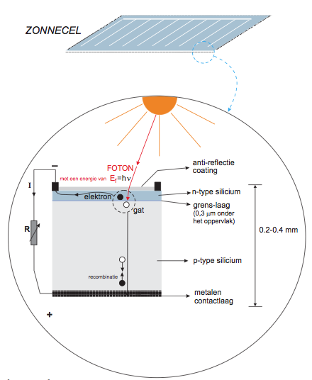
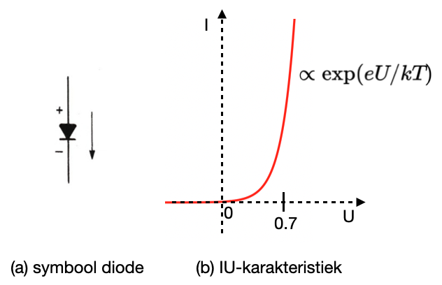
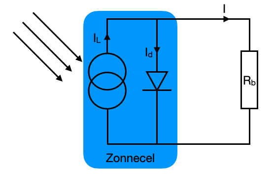

# Zonnecel

De toenemende behoefte aan energie heeft het zoeken naar nieuwe energiebronnen belangrijk gemaakt. Zonne-energie is één van de veelbelovende, niet conventionele bronnen. Zonne-energie is echter niet meteen bruikbaar en moet eerst omgezet worden naar warmte of elektrische energie. De omzetting van zonne-energie naar een bruikbare vorm van energie kan gedaan worden door een zonneboiler of een zonnecel. In de komende sessies staat de zonnecel centraal. Je gaat allerlei eigenschappen van zonnecellen onderzoeken en proberen te verklaren.

## De fotovoltaïsche zonnecel
Stralingsenergie van de zon is een vorm van energie die niet erg nuttig is voor de meeste toepassingen. Om de energie van de zon nuttig te kunnen gebruiken, moet de straling omgezet worden. Een mogelijkheid daartoe is de fotovolta\"ische zonnecel. In de zonnecel maken fotonen uit het zonlicht geladen (elektrische) deeltjes vrij die via metaalcontacten op de zonnecel door een extern circuit kunnen stromen om daar hun elektrische energie af te geven. Zolang er licht valt op de zonnecel gaat het proces van vrijmaken van elektronen door en wordt er een elektrische stroom geproduceerd.

### Werking

Werking van een zonnecel. Een foton met voldoende energie kan een elektron-gat-paar maken. Door de grenslaag tussen het n-type silicium en het p-type-silicium kan het elektron alleen linksom stromen, door het externe circuit, en het gat alleen rechtsom.

De werking van de zonnecel is schematisch weergegeven in de figuur hieronder. Een zonnecel bestaat uit twee soorten siliciumkristallen, een bovenlaag van het n-type silicium en een tweede, dikkere laag van het p-type silicium. In het n-type silicium kunnen elektronen gemakkelijk bewegen, terwijl in het p-type silicium de gaten (positieve lading) makkelijk kunnen bewegen. Tussen het p- en n-type silicium ontstaat een grenslaag, welke een barrière vormt voor zowel de elektronen als de gaten. Deze zogenoemde pn-junctie is de basis van de huidige elektronica en heeft vele toepassingen, zo ook in de zonnecel.

In een zonnecel is de n-laag zo dun dat het zonlicht de grenslaag kan bereiken. Als er nu een foton op de grenslaag valt, en het foton heeft voldoende energie, dan maakt dat foton een elektron-gat-paar. Kijkend naar figuur [fig:cel](#fig:cel) kunnen de elektronen door de grenslaag niet rechtsom bewegen en de gaten niet linksom.  Het elektron gaat nu linksom stromen en het gat rechtsom. Er ontstaat dus een elektrische stroom. Na doorlopen van het externe circuit recombineert het elektron weer met het gat in het p-type silicium. De maximale stroom die gaat lopen wordt bepaald door het aantal elektron-gat-paren dat gevormd wordt. De maximale spanning die over de zonnecel komt te staan wordt bepaald door de energie die daarvoor nodig is (bedenk dat [U] = J/C!).

Om een elektron-gat-paar in een silicium zonnecel te maken is een energie nodig van 1.12 eV (elektronvolt). De energie van een foton ($E_f$) is gelijk aan
\begin{equation}
  E_f = \frac{hc}{\lambda}
\end{equation}
waar $h$ staat voor de constante van Planck ($h \approx 4.136 \cdot 10^{-15} \text{ eV} \cdot \text{s}$), $c$ staat voor de snelheid waarmee licht zich voortplant ($c \approx 2.998 \cdot 10^8$ ms$^{-1}$) en $\lambda$ staat voor de golflengte van het licht. Dit betekent dat een foton met een golflengte van ongeveer
\begin{equation}
  \lambda = \frac{(4.136 \cdot 10^{-15} \text{ eV} \cdot \text{s}) \cdot (2.998 \cdot 10^8 \text{ ms}^{-1})}{1.12 \text{ eV}}\approx 1100 \  {\rm nm}
\end{equation}
in staat is om een elektron-gat-paar te maken. Fotonen met een golflengte groter dan 1100 nm hebben een lagere energie dan 1.12 eV en daarvoor is de zonnecel niet gevoelig. Fotonen met een kortere golflengte dan 1100 nm hebben een hogere energie dan nodig is. Zij maken wel een elektron-gat-paar, maar het overschot aan energie wordt niet omgezet in elektrische energie, deze energie gaat verloren als warmte.

Op YouTube staat de volgende video met uitleg over de werking van de zonnecel: [<q>How do solar cells work?</q>](https://www.youtube.com/watch?v=L_q6LRgKpTw).

### Vereenvoudigde modelbeschrijving
De werking van een zonnecel hangt sterk samen met de werking van een diode. Een diode heeft de bijzondere eigenschap dat afhankelijk van de polariteit over de diode het óf geen stroom door laat en dus een oneindige hoge weerstand heeft, óf alle stroom doorlaat en bij benadering een weerstand van 0 heeft. Preciezer gezegd: voor een diode geldt dat de stroom die doorgelaten wordt, afhangt van de spanning over de diode. De stroom door een diode, $I_d$, wordt (bij benadering) gegeven door

\begin{equation}
  I_d = I_0 \left( {\rm e}^{\frac{eU}{kT}} - 1 \right),
\end{equation}
waarbij $e$ de elektronlading is ($e \approx 1.602 \cdot 10^{-19}$ C), $U$ de spanning over de diode, $k$ de Boltzmannconstante ($k \approx {1.381} \cdot 10^{-23}$ JK$^{-1}$) en $T$ de temperatuur. $I_0$ is de lekstroom van de diode. Als de spanning over de diode negatief is, geldt dat $\exp \left( \frac{eU}{kT} \right) \ll 1$ en is $I_d \approx - I_0 \approx 5-7 \; \mu$A en dus bij benadering 0. Als de spanning over de diode positief is groeit de stroom exponentieel en is de weerstand van de diode bij benadering 0. Dit gedrag wordt geïllustreerd in de figuur hieronder.

Links het symbool waarmee een diode weergegeven wordt in een schakeling en rechts een $IU$-karakteristiek van een diode.

Een vereenvoudigde voorstelling van een zonnecel met daarop aangesloten een belastingsweerstand $R_b$. $I_L$ is de stroom opgewekt door elektron-gat-paren, $I_d$ is de stroom die door de diode loopt en $I$ is de stroom die door belastingsweerstand $R_b$ loopt, die aangesloten is op de zonnecel.

Voor een eerste benadering kun je een zonnecel voorstellen als een speciale stroombron, zoals weergegeven is in figuur [fig:zc](#fig:zc). In deze schakeling is ook de belastingsweerstand $R_b$ over de zonnecel getekend. De stroom die geleverd wordt door de zonnecel, $I$, hangt af van de stroom ten gevolge van het aantal elektron-gat-paren dat gemaakt wordt door het zonlicht, $I_{L}$, en de stroom door de diode, $I_d$. Dus:
\begin{equation}
  I = I_L - I_d.
\end{equation}
Met behulp van vergelijking [eqn:diode](#eqn:diode) kun je bovenstaande vergelijking verder uitschrijven. In de exponent voor de diode komt er echter nog een factor $n$ bij die samenhangt met de materiaaleigenschappen van de zonnecel. Waarden van $n$ liggen typisch tussen 1 en 5, afhankelijk van het type zonnecel. Voor het type zonnecel waarmee je in dit experiment zult werken is $n$ ongeveer 10-15. De stroom die de zonnecel levert wordt nu bij benadering gegeven door

\begin{equation}
  I = I_{L} - I_d = I_{L} - I_0 \left( {\rm e}^{ \frac{e U}{nkT}} - 1 \right).
\end{equation}

### I,U-karakteristiek

In de praktijk zul je altijd metingen doen aan zonnepanelen, waarbij zonnecellen in het paneel samengebracht zijn. De spanning die over een zonnepaneel staat hangt onder andere af van het aantal zonnecellen dat in serie geschakeld is. De stroom dat een zonnepaneel kan leveren wordt bepaald door het aantal elektron-gat-paren dat gemaakt wordt of, anders gezegd, door het aantal fotonen dat geabsorbeerd wordt. Het is echter niet zo dat je zonder meer kunt stellen dat wanneer er zonlicht op een zonnepaneel valt er een maximale spanning over het paneel staat en dat de stroom toeneemt als de lichtintensiteit toeneemt.

Het is daarom zinvol om, voordat je aan een experiment begint, het gedrag van een zonnepaneel te onderzoeken. In eerste instantie doe je dit door te kijken naar de $IU$-karakteristiek van het zonnepaneel. Zo'n karakteristiek is weergegeven in [fig:I,U-zonnecel](#fig:I,U-zonnecel).

Als je naar de $IU$-karakteristiek kijkt, zie je dat het zonnepaneel bij lage spanningen zich gedraagt als een niet-ideale stroombron. Als je rond de maximale spanning kijkt, zie je dat het zonnepaneel zich daar vrijwel gedraagt als een niet-ideale spanningsbron.

De stroom die geleverd kan worden door een zonnecel uitgezet tegen de spanning $U_\text{PV}$ geleverd door de zonnecel. Hier staat PV voor _PhotoVoltaic cell_.

### P,R~b~-karakteristiek

Het is bij zonnepanelen natuurlijk interessant om naar het elektrisch vermogen te kijken dat een zonnepaneel kan leveren. Het geleverd vermogen door een zonnepaneel hangt af van de materiaaleigenschappen van het paneel. Om een zo hoog mogelijk vermogen te kunnen leveren moet het zonnepaneel een zo hoog mogelijke stroom en spanning leveren. Belangrijk ook is dat het vermogen afhangt van de belasting door het circuit. Met andere woorden: bij verschillende weerstandswaardes wordt een ander vermogen geleverd. Ook is er een optimale weerstand waarbij het vermogen maximaal is ([fig:P,R-zonnecel](#fig:P,R-zonnecel)).

Het vermogen dat geleverd kan worden door een zonnecel uitgezet tegen de belasting (weerstand) van het circuit. Er is duidelijk een maximum in het vermogen bij een optimale weerstand.

### Fill factor
De kwaliteit van een zonnecel/-paneel wordt experimenteel vaak aangeduid met de fill factor $FF$. De fill factor wordt gegeven door
\begin{equation}
  FF = \frac{P_{max}}{P_{T_{max}}} = \frac{I_{max} \cdot U_{max}}{I_{sc} \cdot U_{oc}},
\end{equation}
waarbij $P_{max}$ het maximaal vermogen is wat een zonnecel/-paneel levert en $P_{T_{max}}$ het theoretisch maximaal vermogen is. $I_{sc}$ is de kortsluitstroom (bij een belastingsweerstand $R_b$ gelijk aan 0) en $U_{oc}$ de open klemspanning (wanneer het zonnepaneel niet belast wordt). $I_{max}$ en $U_{max}$ zijn de waarden voor respectievelijk de stroom en spanning waarbij het geleverd vermogen maximaal is.

### Maximum power point tracking

De optimale weerstand waarbij het vermogen dat geleverd wordt door een zonnecel maximaal is, is helaas geen constante. Deze weerstandswaarde is afhankelijk van verschillende condities waarbij de belangrijkste de lichtintensiteit op de zonnecel is. Dat betekent dat, zonder aanpassingen, het vermogen dat geleverd wordt door de zonnecel meestal veel lager is dan je zou wensen.

Voor zonnepanelen die elektriciteit leveren aan het lichtnet is dit een groot probleem. Allereerst wil je je investering zo snel mogelijk terugverdienen en ook daarna wil je dat de opbrengst maximaal is. Ten tweede is het zo dat de weerstand van het lichtnet bijzonder klein is. Het vermogen dat daardoor geleverd wordt is ook heel klein. Dit wordt opgelost door &mdash; envoudig gezegd &mdash; de verbinding tussen het zonnepaneel en het lichtnet vele malen per seconde aan en uit te schakelen. Hierdoor <q>voelt</q> het zonnepaneel als het ware een weerstand. Deze weerstand is afhankelijk van de hoeveelheid tijd dat het paneel niet aan het lichtnet is geschakeld. Door slim te schakelen kan de weerstand zó gekozen worden dat het geleverde vermogen maximaal is. Als de lichtintensiteit wijzigt kan ook de weerstand worden aangepast. Dit heet _maximum power point tracking_.